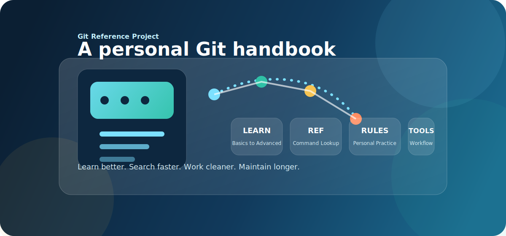
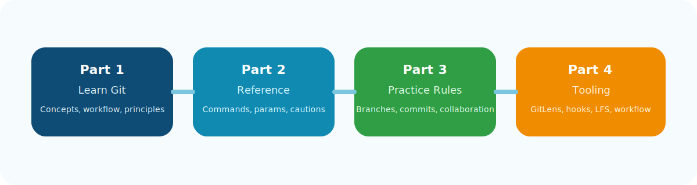

<div align="center">



<h1>个人 Git 学习与使用参考手册</h1>

<p>
  
</p>

<p>
  <a href="https://github.com/gggchang4/Git-Tutorial/stargazers">
    
  </a>
  <a href="https://github.com/gggchang4/Git-Tutorial/network/members">
    
  </a>
  <a href="./LICENSE">
    
  </a>
  
  
</p>

<p>
  一个面向个人开发者的 <strong>Git 系统化参考项目</strong>。<br />
  把 <strong>学习</strong>、<strong>查询</strong>、<strong>规范</strong>、<strong>工具提效</strong> 整合成一套长期可维护的 Markdown 手册。
</p>

<p>
  <a href="https://github.com/gggchang4/Git-Tutorial/stargazers"><strong>⭐ 如果这个项目对你有帮助，欢迎点个 Star 支持一下</strong></a>
</p>

</div>

---

## ✨ 项目亮点

- 📘 不只讲命令，还覆盖 Git 的学习路径、行为规范和工具链落地。
- 🔎 Part 2 适合快速查命令，Part 3 适合养成更干净的 Git 习惯，Part 4 适合提升实际开发效率。
- 🧭 所有正文都围绕同一个目标展开：让 Git 从“会一点”变成“能长期稳定使用”。
- 🧱 仓库结构清晰，适合持续维护、扩写、做展示，也适合作为个人知识库长期迭代。

## 🗺️ 导航

| 模块 | 作用 | 当前状态 |
|------|------|----------|
| [Part 1 · Git学习手册](./docs/Git学习手册.md) | 从入门到进阶的学习路径，覆盖概念、流程、原理和常见问题 | 已完成全量初稿 |
| [Part 2 · Git Reference手册](./docs/Git%20Reference手册.md) | 面向日常查询的命令速查与参数说明 | 已完成全量详细参考初稿 |
| [Part 3 · Git个人使用规范](./docs/Git个人使用规范.md) | 面向个人项目与小型协作的 Git 行为规范 | 已完成全量初稿 |
| [Part 4 · Git实用拓展手册](./docs/Git实用拓展手册.md) | GUI、GitLens、Hooks、LFS、敏感信息防护与高频技巧 | 已完成全量初稿 |
| [TODO 台账](./TODO.md) | 项目当前进度、后续任务、维护记录 | 持续更新中 |

## 🚀 这个仓库适合谁

- 想系统学习 Git，但不想只停留在“背命令”的开发者。
- 已经会一些基础命令，但缺少整体知识结构的人。
- 想把自己的 Git 使用习惯整理成一套长期可执行规范的人。
- 想把 GitHub / VS Code / GitLens / Hooks / LFS 等工具链也一起补齐的人。
- 想做求职展示、个人技术积累或开源文档项目的人。

## 🧩 四个 Part 怎么配合

<div align="center">
  
</div>

### Part 1 · 学会

从 Git 简介、安装配置、本地仓库、远程交互、分支协作、回滚恢复、冲突解决、标签版本到 Git 原理，帮你建立完整认知。

### Part 2 · 查得快

把高频命令按职责拆分成统一结构的 Reference，适合遇到问题时快速定位写法、参数和注意事项。

### Part 3 · 用得稳

把个人开发和小型协作里的分支模型、提交规则、发布习惯、冲突处理和敏感信息边界固定下来。

### Part 4 · 用得顺手

围绕 Git GUI、VS Code 内置 Git、GitLens、命令行增强、Hooks、`pre-commit`、Husky、Git LFS、Gitleaks 等内容补齐效率工具链。

## 📚 推荐阅读顺序

### 你是 Git 初学者

1. 先看 [Part 1 · Git学习手册](./docs/Git学习手册.md)
2. 再用 [Part 2 · Git Reference手册](./docs/Git%20Reference手册.md) 做命令查阅
3. 最后用 [Part 3 · Git个人使用规范](./docs/Git个人使用规范.md) 固化习惯

### 你已经会基础命令

1. 先看 [Part 3 · Git个人使用规范](./docs/Git个人使用规范.md)
2. 再把 [Part 2 · Git Reference手册](./docs/Git%20Reference手册.md) 当工作中的速查表
3. 最后看 [Part 4 · Git实用拓展手册](./docs/Git实用拓展手册.md) 补工具链

### 你想提升实际开发效率

1. 先看 [Part 4 · Git实用拓展手册](./docs/Git实用拓展手册.md)
2. 再回到 [Part 3 · Git个人使用规范](./docs/Git个人使用规范.md) 固化行为
3. 遇到命令细节问题时回查 [Part 2 · Git Reference手册](./docs/Git%20Reference手册.md)

## 📦 当前项目状态

> 当前仓库已完成四个 Part 的全量初稿或详细参考初稿，接下来重点转向统一术语、优化交叉引用、持续核验公开资料链接，以及增强展示与维护体验。

### 当前已完成

- ✅ Part 1 全量初稿
- ✅ Part 2 全量详细参考初稿
- ✅ Part 3 全量初稿
- ✅ Part 4 全量初稿
- ✅ GitLens 已纳入 Part 4，作为 VS Code 场景下的重要增强工具

### 当前维护重点

- 🔧 统一四个 Part 的术语和表述风格
- 🔗 建立和完善跨文档交叉引用
- 🧪 核验公开资料链接有效性
- 🎨 优化 README、素材和开源展示体验

## 🛠️ 仓库结构

<details>
<summary><strong>点击展开目录结构</strong></summary>

```text
.
├─ README.md
├─ TODO.md
├─ LICENSE
├─ .gitignore
├─ assets/
│  ├─ README.md
│  ├─ diagrams/
│  ├─ images/
│  ├─ references/
│  └─ screenshots/
├─ docs/
│  ├─ Git学习手册.md
│  ├─ Git Reference手册.md
│  ├─ Git个人使用规范.md
│  └─ Git实用拓展手册.md
├─ 个人Git参考手册-开发方案.md
└─ 个人Git参考手册-开发skill.md
```

</details>

## 🧠 项目设计原则

- 以“能用、能查、能维护”为优先，而不是一味追求堆内容。
- 所有 Git 命令、参数与行为说明优先参考 Git 官方文档和 `git help`。
- 涉及 Google、腾讯、字节等实践时，只使用公开可验证资料，不伪造内部制度。
- 风险信息统一优先写成 `风险提示：`，并尽量交代风险级别、触发条件、可能后果与稳妥做法。
- 四个 Part 彼此配合，但不互相重复搬运正文。
- 优先产出长期可维护、半年后回来看仍然清楚的内容。

## 🎯 为什么值得 Star

- ⭐ 这是一个不只讲“命令怎么敲”，还讲“为什么这样做、如何长期保持好习惯”的 Git 项目。
- ⭐ 适合拿来系统补 Git，也适合拿来做个人技术文档项目模板。
- ⭐ 如果你也想把“学习 + 规范 + 工具链”做成一体化知识库，这个仓库会很适合持续关注。

<div align="center">
  <a href="https://github.com/gggchang4/Git-Tutorial/stargazers">
    
  </a>
</div>

## 📂 参考与驱动文件

当前项目由两份核心参考文件驱动：

- [个人Git参考手册-开发方案.md](./个人Git参考手册-开发方案.md)
- [个人Git参考手册-开发skill.md](./个人Git参考手册-开发skill.md)

它们分别负责：

- 定义项目做什么、做到什么程度、怎么拆结构。
- 约束 Codex 如何执行、如何校验、如何避免写偏。

## 🔍 素材目录说明

`assets/` 用于统一存放项目配图、图示、截图和参考素材，避免展示资源散落在仓库根目录。

- `assets/images/`：封面图、README 配图、插图素材
- `assets/screenshots/`：命令执行截图、界面截图、演示图
- `assets/diagrams/`：流程图、结构图、Mermaid 源图或草图
- `assets/references/`：外部参考素材、临时整理资料、待筛选资源

## 📌 后续维护方向

<details>
<summary><strong>点击展开近期维护路线</strong></summary>

- 统一四个 Part 的术语写法和风险提示风格
- 增补跨文档导航与交叉引用
- 逐步补充截图、插图和更强的开源展示素材
- 持续复审公开资料来源，避免内容随时间失真
- 让 README、正文、TODO 和 assets 形成更稳定的一致性

</details>

## 📄 License

本项目使用 [Apache 2.0 License](./LICENSE)。

---

<div align="center">
  <sub>Built for long-term Git learning, cleaner workflow, and better documentation practice.</sub>
</div>
