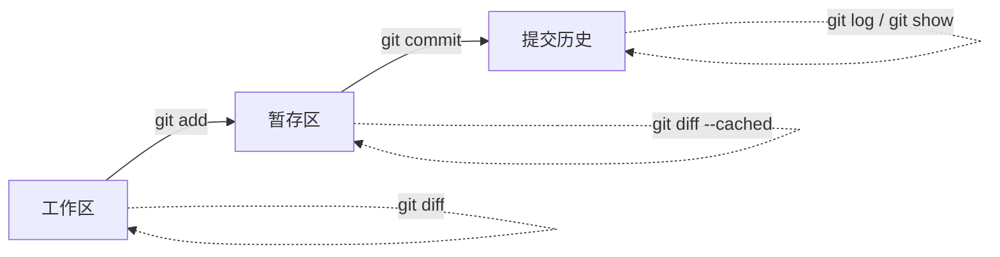
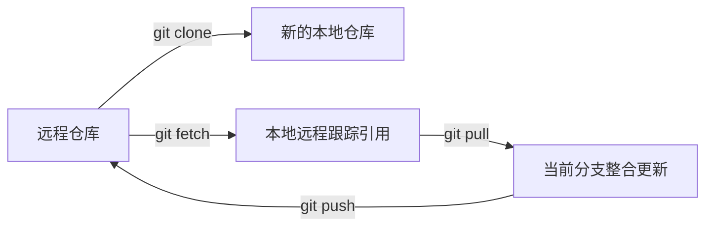
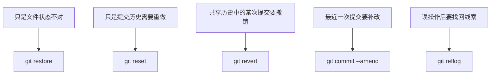
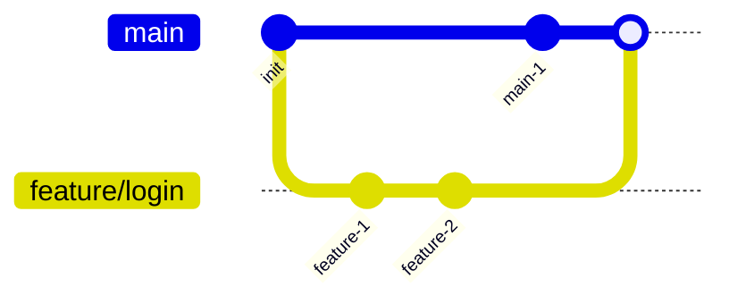
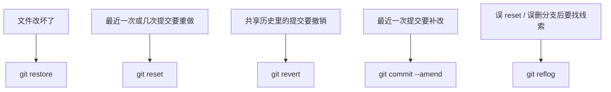

# Git Reference手册

## 文档定位

本手册面向 Git 命令查询，强调准确、稳定、结构统一。重点是把常用命令整理成适合日常速查的 Reference，而不是做成冗长的百科式手册。

## 使用说明

本手册与 Part 1 的职责不同：

- Part 1 负责帮助读者理解 Git 的概念、流程和使用场景
- Part 2 负责帮助读者快速查询某个命令怎么写、参数怎么选、使用时要注意什么

因此，本手册默认采用统一命令模板：

1. 命令用途
2. 语法格式
3. 常用参数
4. 使用示例
5. 注意事项
6. 官方文档链接

写作策略：

- 以中文说明为主，命令和参数保持英文原貌
- 优先覆盖高频参数，不追求完整翻译所有冷门选项
- 对高风险命令显式标注风险
- 对易混淆命令保留必要对比说明

## 术语约定

为与其他 Part 保持一致，本手册默认统一使用以下写法：

- `工作区`：必要时补充 `working tree / working directory`
- `暂存区`：必要时补充 `index / staging area`
- `本地仓库`、`远程仓库`：正文优先使用中文，不混写成 `repository`
- `提交`、`分支`：正文优先使用中文，只在命令、报错、对象模型和参数名中保留 `commit`、`branch`
- `切换分支`：正文优先这样表述；涉及 `git checkout` 时，再明确写“检出（checkout）”
- `拉取请求（Pull Request, PR）/ 合并请求（Merge Request, MR）`：跨平台协作场景按此写法引用

正文统一以中文解释概念，命令、参数、报错和 Git 官方对象名保持英文原貌。

## 代码块与命令示例格式

为统一四个 Part 的代码块风格，本手册默认采用以下约定：

1. 可直接执行的命令统一使用 `bash` 代码块
2. 输出示例、命名样例、流程骨架统一使用 `text` 代码块
3. 图示统一使用 `mermaid`
4. 多步命令统一用 `# 1)`、`# 2)` 注释标明步骤目的
5. 使用示例默认优先覆盖高频、真实、接近日常工作流的场景
6. 高风险命令示例后必须补充适用场景或风险提示，避免只给命令不解释后果

## 命令关系速览

下面几张图不是为了替代具体命令条目，而是为了帮助你先快速判断“当前问题属于哪一类命令”。

### 本地改动到提交的基本路径



### 远程同步命令关系



### 回滚与恢复命令关系



## 目录

- [1. 本地仓库命令](#1-本地仓库命令)
- [2. 远程仓库命令](#2-远程仓库命令)
- [3. 分支与合并命令](#3-分支与合并命令)
- [4. 回滚与恢复命令](#4-回滚与恢复命令)
- [5. 标签与发布相关命令](#5-标签与发布相关命令)
- [6. 配置与查看类命令](#6-配置与查看类命令)
- [7. 关键词索引](#7-关键词索引)

## 1. 本地仓库命令

### `git init`

#### 命令用途

初始化一个新的 Git 仓库。

#### 语法格式

```bash
git init [--bare] [-b <branch-name>] [<directory>]
```

#### 常用参数

- `-b <branch-name>`：指定初始化后的默认分支名
- `--bare`：创建裸仓库，常用于服务端或镜像场景

#### 使用示例

```bash
# 在当前目录初始化一个新仓库
git init
```

```bash
# 初始化仓库，并把默认分支直接设为 main
git init -b main
```

```bash
# 为共享仓库或镜像仓库初始化裸仓库
git init --bare
```

#### 注意事项

- `git init` 只负责初始化仓库，不会自动创建首个提交。
- `-b main` 只影响当前新仓库，不会改掉已有仓库的分支名。
- 裸仓库不用于直接编辑工作区文件。

#### 官方文档链接

- [git-init](https://git-scm.com/docs/git-init)

### `git add`

#### 命令用途

将工作区中的改动加入暂存区，为下一次提交做准备。

#### 语法格式

```bash
git add [<options>] [--] <pathspec>...
```

#### 常用参数

- `.`：把当前目录下的匹配改动加入暂存区
- `-A` / `--all`：添加所有已跟踪和未跟踪的变化
- `-u` / `--update`：只更新已跟踪文件
- `-p` / `--patch`：交互式选择部分改动加入暂存区

#### 使用示例

```bash
# 只把一个明确文件加入暂存区
git add README.md
```

```bash
# 把当前目录下相关改动整体加入暂存区
git add .
```

```bash
# 交互式选择部分代码片段进入暂存区
git add -p
```

#### 注意事项

- `git add .` 很方便，但容易把不想提交的文件一起加入暂存区。
- `git add` 不等于提交，它只是“放入暂存区”。
- 如果你想精细控制提交内容，`git add -p` 很有价值。

#### 官方文档链接

- [git-add](https://git-scm.com/docs/git-add)

### `git commit`

#### 命令用途

将暂存区内容记录为一次新的提交。

#### 语法格式

```bash
git commit [-m <msg>] [--amend] [<options>]
```

#### 常用参数

- `-m <msg>`：直接使用命令行中的提交信息
- `--amend`：修改最近一次提交
- `-a`：自动提交所有已跟踪文件的修改，不包含新文件

#### 使用示例

```bash
# 提交已经进入暂存区的改动
git commit -m "docs: add git basics notes"
```

```bash
# 自动提交已跟踪文件的改动，但不会带上新文件
git commit -a -m "fix: update tracked files"
```

```bash
# 在提交前先看一眼暂存区，再提交
git diff --cached
git commit -m "feat(auth): add login validation"
```

#### 注意事项

- `git commit` 默认只提交已经暂存的内容。
- `-a` 不会自动带上新创建但尚未跟踪的文件。
- 提交信息应准确描述本次改动的核心意图。

#### 官方文档链接

- [git-commit](https://git-scm.com/docs/git-commit)

### `git status`

#### 命令用途

查看工作区、暂存区和当前分支的状态。

#### 语法格式

```bash
git status [<options>]
```

#### 常用参数

- `-s` / `--short`：简短输出
- `-b` / `--branch`：显示分支信息

#### 使用示例

```bash
# 查看完整状态
git status
```

```bash
# 用简洁格式快速排障
git status -sb
```

#### 注意事项

- 遇到 Git 问题时，优先先看 `git status`。
- `status` 不修改仓库状态，是最安全的排查入口之一。

#### 官方文档链接

- [git-status](https://git-scm.com/docs/git-status)

### `git log`

#### 命令用途

查看提交历史。

#### 语法格式

```bash
git log [<options>] [<revision-range>]
```

#### 常用参数

- `--oneline`：单行显示提交
- `--graph`：图形化显示分支结构
- `--decorate`：显示分支和标签引用
- `-- <file>`：仅查看某个文件相关历史

#### 使用示例

```bash
git log --oneline --graph --decorate
```

```bash
git log -- README.md
```

#### 注意事项

- `git log` 输出很多时，建议配合 `--oneline --graph --decorate` 使用。
- 文件级查询很适合排查某个文件什么时候被改动过。

#### 官方文档链接

- [git-log](https://git-scm.com/docs/git-log)

### `git diff`

#### 命令用途

查看差异内容。

#### 语法格式

```bash
git diff [<options>] [<commit>] [--] [<path>...]
```

#### 常用参数

- `--cached`：查看暂存区与最近提交的差异
- `-- <file>`：只看指定文件

#### 使用示例

```bash
git diff
```

```bash
git diff --cached
```

```bash
git diff -- README.md
```

#### 注意事项

- `git diff` 默认查看工作区与暂存区之间的差异。
- `git diff --cached` 查看的是“已暂存但未提交”的差异。

#### 官方文档链接

- [git-diff](https://git-scm.com/docs/git-diff)

### `git clean`

#### 命令用途

清理未被 Git 跟踪的文件和目录。

#### 语法格式

```bash
git clean [-d] [-f] [-n] [-x | -X]
```

#### 常用参数

- `-n` / `--dry-run`：预演，不真正删除
- `-f` / `--force`：强制执行清理
- `-d`：连未跟踪目录一起清理
- `-x`：连被忽略文件也清理
- `-X`：只清理被忽略文件

#### 使用示例

```bash
git clean -n
```

```bash
git clean -fd
```

#### 注意事项

- `git clean` 风险很高，尤其是 `-fd` 和 `-x`。
- 强烈建议先用 `-n` 预演。
- 它主要处理未跟踪文件，不是撤销已跟踪文件修改的命令。

#### 官方文档链接

- [git-clean](https://git-scm.com/docs/git-clean)

### `git mv`

#### 命令用途

移动或重命名文件，并让 Git 跟踪这次路径变化。

#### 语法格式

```bash
git mv [<options>] <source>... <destination>
```

#### 常用参数

- `-f` / `--force`：目标存在时强制移动
- `-n` / `--dry-run`：预演

#### 使用示例

```bash
git mv old-name.md new-name.md
```

#### 注意事项

- `git mv` 本质上等价于“先移动文件，再加入暂存区”，但它能让意图更清晰。
- Git 对重命名的识别最终仍基于内容相似度，而不是只因为你使用了 `git mv`。

#### 官方文档链接

- [git-mv](https://git-scm.com/docs/git-mv)

### `git rm`

#### 命令用途

删除文件并从 Git 索引中移除它。

#### 语法格式

```bash
git rm [-f] [-r] [--cached] [--] <pathspec>...
```

#### 常用参数

- `--cached`：只从 Git 索引中移除，保留工作区文件
- `-r`：递归删除目录
- `-f` / `--force`：强制删除
- `-n` / `--dry-run`：预演

#### 使用示例

```bash
git rm old-file.txt
```

```bash
git rm --cached .env
```

#### 注意事项

- `git rm` 默认会删除工作区文件。
- 如果你只是想“停止跟踪，但保留本地文件”，应使用 `--cached`。
- 删除目录时通常需要加 `-r`。

#### 官方文档链接

- [git-rm](https://git-scm.com/docs/git-rm)

## 2. 远程仓库命令

### 远程命令速查对照

| 命令 | 典型问题 | 是否自动整合当前分支 |
|------|----------|----------------------|
| `git clone` | 我还没有本地仓库，先复制一份 | 不涉及 |
| `git fetch` | 我想先拿到远程更新，但先不合并 | 否 |
| `git pull` | 我想拿到远程更新并直接整合 | 是 |
| `git push` | 我想把本地提交同步到远程 | 不适用 |

### `git clone`

#### 命令用途

从远程仓库复制一个完整副本到本地。

#### 语法格式

```bash
git clone [<options>] [--] <repo> [<dir>]
```

#### 常用参数

- `-b <branch>`：克隆后检出指定分支
- `--depth <depth>`：浅克隆，限制历史深度
- `--single-branch`：只克隆单一分支

#### 使用示例

```bash
# 用 SSH 克隆一个完整仓库
git clone git@github.com:your-name/git-demo.git
```

```bash
# 只克隆 main 分支，减少无关分支噪音
git clone -b main --single-branch git@github.com:your-name/git-demo.git
```

```bash
# 浅克隆最近一层历史，适合快速拉起只读环境
git clone --depth 1 git@github.com:your-name/git-demo.git
```

#### 注意事项

- 浅克隆适合快速获取代码，但会限制部分历史操作。
- 克隆 URL 应固定使用一种协议，避免 HTTPS 和 SSH 混用造成排障混乱。

#### 官方文档链接

- [git-clone](https://git-scm.com/docs/git-clone)

### `git remote`

#### 命令用途

查看、添加、修改或删除远程仓库配置。

#### 语法格式

```bash
git remote [subcommand] [<options>]
```

#### 常用参数

- `-v`：查看远程地址详情
- `add <name> <url>`：添加远程
- `remove <name>`：删除远程
- `set-url <name> <newurl>`：修改远程地址

#### 使用示例

```bash
# 查看当前所有远程及地址
git remote -v
```

```bash
# 给本地仓库补一个默认远程 origin
git remote add origin git@github.com:your-name/git-demo.git
```

```bash
# 远程地址写错时，直接修改 origin 地址
git remote set-url origin git@github.com:your-name/git-demo.git
```

#### 注意事项

- `origin` 只是常见默认名，不是 Git 的强制规定。
- 远程地址问题是 `push/pull` 报错的常见原因之一。

#### 官方文档链接

- [git-remote](https://git-scm.com/docs/git-remote)

### `git fetch`

#### 命令用途

从远程获取更新到本地，但不自动合并到当前分支。

#### 语法格式

```bash
git fetch [<options>] [<repository> [<refspec>...]]
```

#### 常用参数

- `--all`：从所有远程获取
- `-p` / `--prune`：清理远程已删除的跟踪分支
- `-t` / `--tags`：拉取所有标签
- `--dry-run`：预演

#### 使用示例

```bash
# 拿远程更新，但先不自动整合
git fetch
```

```bash
# 同步远程状态，并清理失效的远程跟踪分支
git fetch --prune
```

```bash
# 只获取 origin/main 这条线的最新状态
git fetch origin main
```

#### 注意事项

- `fetch` 和 `pull` 的区别在于：`fetch` 不会自动整合到当前分支。
- 如果你只想先“看远程有没有更新”，`fetch` 通常比 `pull` 更稳。

#### 官方文档链接

- [git-fetch](https://git-scm.com/docs/git-fetch)

### `git pull`

#### 命令用途

拉取远程更新，并整合到当前分支。

#### 语法格式

```bash
git pull [<options>] [<repository> [<refspec>...]]
```

#### 常用参数

- `--rebase`：拉取后用 rebase 而不是 merge
- `--ff-only`：只允许快进更新
- `--no-rebase`：显式使用合并方式

#### 使用示例

```bash
# 拉取并按默认策略整合远程更新
git pull
```

```bash
# 拉取后使用 rebase，保持本地历史更线性
git pull --rebase
```

```bash
# 只接受快进更新，不自动生成 merge 结果
git pull --ff-only
```

#### 注意事项

- `pull` 本质上是“fetch + merge/rebase”。
- 它可能引发冲突，因此在复杂协作场景下要明确当前团队偏好的是 merge 还是 rebase。
- 如果你不想自动整合，先用 `fetch` 更安全。
- `pull --ff-only` 适合希望“只接受快进，不自动生成 merge 结果”的场景。

#### 官方文档链接

- [git-pull](https://git-scm.com/docs/git-pull)

### `git push`

#### 命令用途

将本地提交推送到远程仓库。

#### 语法格式

```bash
git push [<options>] [<repository> [<refspec>...]]
```

#### 常用参数

- `-u` / `--set-upstream`：设置上游分支
- `--force-with-lease`：更安全的强制推送
- `--tags`：推送所有标签

#### 使用示例

```bash
# 推送当前分支到默认上游
git push
```

```bash
# 首次推送 main，并建立上游关系
git push -u origin main
```

```bash
# 确认自己理解后，再用更安全的方式强推
git push --force-with-lease origin <branch-name>
```

#### 注意事项

- `push` 只推送已经提交的历史，不会带上未提交改动。
- 遇到 `rejected` 或 `non-fast-forward`，优先先判断是不是远程历史领先。
- 如确需重写公共分支历史，优先理解 `--force-with-lease`，不要默认直接强推。

#### 官方文档链接

- [git-push](https://git-scm.com/docs/git-push)

### `git fetch --prune`

#### 命令用途

拉取远程更新，并清理本地已经失效的远程跟踪分支。

#### 语法格式

```bash
git fetch --prune
```

#### 常用参数

- `--prune`：移除远程已删除但本地还残留的远程跟踪引用

#### 使用示例

```bash
git fetch --prune
```

#### 注意事项

- 这是 `git fetch` 的常见高频组合，用于保持远程分支列表干净。
- 它清理的是远程跟踪引用，不是直接删除你的本地工作分支。

#### 官方文档链接

- [git-fetch](https://git-scm.com/docs/git-fetch)

## 3. 分支与合并命令

### 分支命令速查对照

| 命令 | 更适合的场景 |
|------|--------------|
| `git branch` | 创建、查看、删除分支 |
| `git switch` | 纯分支切换，或创建并切换 |
| `git checkout` | 历史兼容写法；切换分支或恢复文件 |
| `git merge` | 保留分支汇合关系地整合历史 |
| `git rebase` | 让历史更线性地重放提交 |
| `git stash` | 临时保存未提交改动 |
| `git cherry-pick` | 只拿某一个提交，不整条分支 |

### 分支整合关系图



### `git branch`

#### 命令用途

创建、查看、删除、重命名分支。

#### 语法格式

```bash
git branch [<options>] [<branch-name>]
```

#### 常用参数

- `-a`：查看本地和远程跟踪分支
- `-d`：删除已合并分支
- `-D`：强制删除分支
- `--show-current`：显示当前分支名

#### 使用示例

```bash
# 查看本地分支列表
git branch
```

```bash
# 只看当前分支名
git branch --show-current
```

```bash
# 删除已经合并完成的分支
git branch -d feature/user-login
```

#### 注意事项

- `-d` 只删除已合并分支，风险更低。
- `-D` 更激进，只有在确认不再需要分支历史时才考虑。

#### 官方文档链接

- [git-branch](https://git-scm.com/docs/git-branch)

### `git switch`

#### 命令用途

切换分支，或创建并切换到新分支。

#### 语法格式

```bash
git switch [<options>] [<branch>]
```

#### 常用参数

- `-c <branch>`：创建并切换到新分支
- `-C <branch>`：强制创建或重置后切换
- `--detach`：进入 detached HEAD

#### 使用示例

```bash
# 切回主线分支
git switch main
```

```bash
# 创建并切换到功能分支
git switch -c feature/user-login
```

```bash
# 临时进入 detached HEAD 查看某个提交
git switch --detach <commit-hash>
```

#### 注意事项

- `switch` 是更适合新手理解的现代切换命令。
- 如果你只是想切换分支，优先考虑 `switch` 而不是 `checkout`。
- 如果你要恢复文件内容，应该优先看 `git restore`，而不是继续把 `switch` 和 `checkout` 混用。

#### 官方文档链接

- [git-switch](https://git-scm.com/docs/git-switch)

### `git checkout`

#### 命令用途

历史兼容型命令，可用于切换分支，也可用于恢复文件。

#### 语法格式

```bash
git checkout [<options>] <branch>
git checkout [<tree-ish>] -- <pathspec>...
```

#### 常用参数

- `-b <branch>`：创建并切换分支
- `-- <path>`：恢复指定文件

#### 使用示例

```bash
git checkout -b feature/user-login
```

```bash
git checkout -- README.md
```

#### 注意事项

- 现代 Git 中，分支切换更推荐 `git switch`，文件恢复更推荐 `git restore`。
- `checkout` 功能重叠较多，新手容易混淆其用途。

#### 官方文档链接

- [git-checkout](https://git-scm.com/docs/git-checkout)

### `git merge`

#### 命令用途

将一个分支的历史整合到当前分支。

#### 语法格式

```bash
git merge [<options>] [<commit>...]
```

#### 常用参数

- `--no-ff`：即使可快进也生成 merge commit
- `--ff-only`：只允许快进
- `--abort`：中止进行中的 merge

#### 使用示例

```bash
# 把功能分支整合进当前分支
git merge feature/user-login
```

```bash
# 即使可以快进，也保留一次显式合并提交
git merge --no-ff feature/user-login
```

```bash
# 合并过程出问题时，直接中止本次 merge
git merge --abort
```

#### 注意事项

- `merge` 可能触发冲突。
- `--ff-only` 适合想严格避免自动生成 merge commit 的场景。

#### 官方文档链接

- [git-merge](https://git-scm.com/docs/git-merge)

### `git rebase`

#### 命令用途

将当前分支的提交重新接到新的基底之后。

#### 语法格式

```bash
git rebase [<options>] [<upstream> [<branch>]]
```

#### 常用参数

- `-i` / `--interactive`：交互式 rebase
- `--continue`：解决冲突后继续
- `--abort`：中止 rebase

#### 使用示例

```bash
# 把当前分支重放到 main 之后
git rebase main
```

```bash
# 交互式整理最近 3 次提交
git rebase -i HEAD~3
```

```bash
# rebase 过程中如果发现不该继续，直接中止
git rebase --abort
```

#### 注意事项

- `rebase` 会改写提交历史。
- 已共享到公共分支的历史，通常不应随意 rebase。
- 与 `merge` 的关键区别是：`rebase` 追求更线性的历史。

#### 官方文档链接

- [git-rebase](https://git-scm.com/docs/git-rebase)

### `git stash`

#### 命令用途

临时保存当前未提交改动，以便切换上下文。

#### 语法格式

```bash
git stash [push [<options>]]
git stash pop
git stash apply
git stash list
```

#### 常用参数

- `push -m <message>`：带说明保存 stash
- `pop`：恢复并尝试删除最近一次 stash
- `apply`：恢复但不删除 stash
- `list`：查看 stash 列表

#### 使用示例

```bash
# 先把当前修改保存起来，并写清楚说明
git stash push -m "wip: login form"
```

```bash
# 查看 stash 列表
git stash list
```

```bash
# 恢复最近一次 stash，并尝试从列表里删除
git stash pop
```

```bash
# 包含未跟踪文件一起保存，更适合临时切去处理线上问题
git stash push -u -m "wip: release hotfix"
```

#### 注意事项

- `stash` 适合临时切换上下文，不适合长期堆积。
- `pop` 可能触发冲突。
- 如果你不确定是否要保留 stash 记录，先用 `apply` 更稳妥。

#### 官方文档链接

- [git-stash](https://git-scm.com/docs/git-stash)

### `git cherry-pick`

#### 命令用途

将某个指定提交的改动复制到当前分支。

#### 语法格式

```bash
git cherry-pick [<options>] <commit>...
```

#### 常用参数

- `-n` / `--no-commit`：应用改动但先不提交
- `-x`：在提交信息中附带原提交引用
- `--continue` / `--abort`：处理冲突流程

#### 使用示例

```bash
git cherry-pick <commit-hash>
```

```bash
git cherry-pick -x <commit-hash>
```

```bash
git cherry-pick --abort
```

#### 注意事项

- `cherry-pick` 适合“只要某个提交，不整条分支”的场景。
- 它可能触发冲突。
- 在长期协作中，频繁 cherry-pick 可能让历史关系变得更难理解。

#### 官方文档链接

- [git-cherry-pick](https://git-scm.com/docs/git-cherry-pick)

## 4. 回滚与恢复命令

### 回滚命令速查对照

| 命令 | 更适合的场景 | 是否改写已有历史 |
|------|--------------|------------------|
| `git restore` | 恢复文件或暂存区状态 | 否 |
| `git reset` | 本地重做提交或重置状态 | 是，可能改写 |
| `git revert` | 用新提交撤销旧提交 | 否，保留历史 |
| `git commit --amend` | 修改最近一次提交 | 是 |
| `git reflog` | 找回误操作线索 | 否 |

### 回滚关系图



### `git reset`

#### 命令用途

重置暂存区状态，或将当前分支回退到某个提交。

#### 语法格式

```bash
git reset [--soft | --mixed | --hard] [<commit>]
git reset [<tree-ish>] [--] <pathspec>...
```

#### 常用参数

- `--soft`：只移动 `HEAD`
- `--mixed`：移动 `HEAD` 并重置暂存区，默认模式
- `--hard`：移动 `HEAD` 并重置暂存区和工作区

#### 使用示例

```bash
# 回退一个提交，但保留改动在暂存区
git reset --soft HEAD~1
```

```bash
# 回退一个提交，并把改动退回工作区
git reset --mixed HEAD~1
```

```bash
# 高风险：直接丢弃工作区和暂存区改动
git reset --hard HEAD~1
```

#### 注意事项

- `reset --hard` 风险极高，会直接覆盖工作区改动。
- 本地未共享历史更适合考虑 `reset`。
- 如果历史已经共享，先考虑 `revert` 是否更合适。
- 如果你只是想恢复文件内容，优先看 `restore`，不要上来就用 `reset`。

#### 官方文档链接

- [git-reset](https://git-scm.com/docs/git-reset)

### `git revert`

#### 命令用途

用一个新的提交撤销某个已有提交的影响。

#### 语法格式

```bash
git revert [<options>] <commit>...
```

#### 常用参数

- `--no-commit`：先应用反向改动但不自动提交
- `--abort`：中止当前 revert 过程

#### 使用示例

```bash
# 用一个新提交撤销最近一次提交
git revert HEAD
```

```bash
# 先应用反向改动，确认后再统一提交
git revert --no-commit <commit-hash>
```

#### 注意事项

- `revert` 不会删除历史，而是追加一个反向提交。
- 已共享历史通常更适合 `revert` 而不是 `reset`。

#### 官方文档链接

- [git-revert](https://git-scm.com/docs/git-revert)

### `git restore`

#### 命令用途

恢复工作区或暂存区中的文件内容。

#### 语法格式

```bash
git restore [<options>] [--source=<branch>] <file>...
```

#### 常用参数

- `--staged`：恢复暂存区
- `--source=<tree-ish>`：从指定来源恢复
- `-p`：交互式恢复部分改动

#### 使用示例

```bash
# 恢复工作区文件内容
git restore README.md
```

```bash
# 把文件从暂存区拿出来，但保留工作区改动
git restore --staged README.md
```

```bash
# 从历史提交恢复指定文件版本
git restore --source=HEAD~1 README.md
```

#### 注意事项

- 恢复文件内容优先考虑 `restore`，不要默认回到 `checkout`。
- `restore` 更适合文件级恢复，不是处理提交历史的主命令。
- `--source=<tree-ish>` 很适合“从某个历史点恢复指定文件”，但要确认你恢复的是正确来源。

#### 官方文档链接

- [git-restore](https://git-scm.com/docs/git-restore)

### `git reflog`

#### 命令用途

查看 `HEAD` 和引用移动历史，用于辅助恢复误操作。

#### 语法格式

```bash
git reflog [show] [<ref>]
```

#### 常用参数

- `show`：查看 reflog 记录

#### 使用示例

```bash
# 查看 HEAD 的移动历史
git reflog
```

```bash
# 明确查看 HEAD 这条引用的 reflog
git reflog show HEAD
```

#### 注意事项

- `reflog` 对恢复误删分支、误 reset 等场景非常有用。
- 它是排障和恢复的强力工具，但不等于对外可见的正式提交历史。

#### 官方文档链接

- [git-reflog](https://git-scm.com/docs/git-reflog)

<a id="git-commit---amend"></a>
### `git commit --amend`

#### 命令用途

修改最近一次提交的内容或提交信息。

#### 语法格式

```bash
git commit --amend [<options>]
```

#### 常用参数

- `--no-edit`：保留原提交信息
- `-m <msg>`：直接指定新的提交信息

#### 使用示例

```bash
# 直接修改最近一次提交的信息
git commit --amend -m "docs: refine git notes"
```

```bash
# 先补暂存区内容，再把它并入最近一次提交
git add README.md
git commit --amend --no-edit
```

#### 注意事项

- `amend` 会改写最近一次提交。
- 如果最近一次提交已经推送到公共分支，要谨慎处理。

#### 官方文档链接

- [git-commit](https://git-scm.com/docs/git-commit)

## 5. 标签与发布相关命令

### `git tag`

#### 命令用途

查看、创建、删除标签。

#### 语法格式

```bash
git tag [<options>] [<tagname>]
git tag -d <tagname>
```

#### 常用参数

- `-a`：创建附注标签
- `-m <msg>`：指定标签说明
- `-d`：删除本地标签

#### 使用示例

```bash
# 查看本地标签列表
git tag
```

```bash
# 为正式发布创建附注标签
git tag -a v1.0.0 -m "Release version 1.0.0"
```

```bash
# 创建轻量标签，适合临时标记
git tag v1.0.0
```

```bash
# 删除本地标签
git tag -d v1.0.0
```

#### 注意事项

- 版本发布通常更推荐附注标签。
- 标签是贴在某次提交上的引用，不会自动移动。

#### 官方文档链接

- [git-tag](https://git-scm.com/docs/git-tag)

<a id="git-fetch---tags"></a>
### `git fetch --tags`

#### 命令用途

从远程拉取标签。

#### 语法格式

```bash
git fetch --tags
```

#### 常用参数

- `--tags`：抓取远程标签

#### 使用示例

```bash
git fetch --tags
```

#### 注意事项

- 适合本地想同步远程已创建的标签时使用。

#### 官方文档链接

- [git-fetch](https://git-scm.com/docs/git-fetch)

<a id="git-push-origin-tag"></a>
### `git push origin <tag>`

#### 命令用途

将指定标签推送到远程仓库。

#### 语法格式

```bash
git push origin <tag>
```

#### 常用参数

- `<tag>`：要推送的标签名

#### 使用示例

```bash
git push origin v1.0.0
```

#### 注意事项

- 标签不会因为普通 `git push` 一定自动同步，发布时要确认标签是否已推送。

#### 官方文档链接

- [git-push](https://git-scm.com/docs/git-push)

<a id="git-tag--d-tag"></a>
### `git tag -d <tag>`

#### 命令用途

删除本地标签。

#### 语法格式

```bash
git tag -d <tag>
```

#### 常用参数

- `<tag>`：要删除的标签名

#### 使用示例

```bash
git tag -d v1.0.0
```

#### 注意事项

- 删除本地标签不会自动删除远程标签。
- 已公开发布的标签不要随意重建。

#### 官方文档链接

- [git-tag](https://git-scm.com/docs/git-tag)

## 6. 配置与查看类命令

### 查看类命令速查对照

| 命令 | 更适合的场景 |
|------|--------------|
| `git config` | 查配置、设配置 |
| `git help` | 查本地帮助入口 |
| `git show` | 看某个提交或标签详情 |
| `git blame` | 看某一行最后是谁改的 |

### `git config`

#### 命令用途

查看和设置 Git 配置。

#### 语法格式

```bash
git config [<options>]
```

#### 常用参数

- `--global`：当前用户级配置
- `--list`：列出配置

#### 使用示例

```bash
git config --global user.name "Your Name"
```

```bash
git config --global --list
```

#### 注意事项

- `--global` 会影响当前用户下的所有仓库。
- 仓库级配置和全局配置可能同时存在，排障时要注意区分。

#### 官方文档链接

- [git-config](https://git-scm.com/docs/git-config)

### `git help`

#### 命令用途

查看 Git 命令帮助信息。

#### 语法格式

```bash
git help <command>
git <command> -h
```

#### 常用参数

- `<command>`：要查看帮助的命令名
- `-h`：查看简明帮助输出

#### 使用示例

```bash
git help commit
```

```bash
git commit -h
```

#### 注意事项

- 当前环境下如果 man 页面渲染不稳定，可优先使用 `git <command> -h`。
- 官方文档页面和本地帮助结合使用最稳妥。

#### 官方文档链接

- [git-help](https://git-scm.com/docs/git-help)

### `git show`

#### 命令用途

查看某个提交、标签或对象的详细内容。

#### 语法格式

```bash
git show [<options>] <object>
```

#### 常用参数

- `<object>`：提交 hash、标签名、`HEAD` 等
- `--stat`：查看改动摘要

#### 使用示例

```bash
git show HEAD
```

```bash
git show v1.0.0
```

#### 注意事项

- `show` 很适合查看某个具体对象的详情。
- 它既可用于提交，也可用于标签等其他对象。

#### 官方文档链接

- [git-show](https://git-scm.com/docs/git-show)

### `git blame`

#### 命令用途

查看文件中每一行最后一次由谁、在何时、在哪次提交中修改。

#### 语法格式

```bash
git blame [<options>] [<rev>] [--] <file>
```

#### 常用参数

- `-L <range>`：只查看指定行范围
- `-w`：忽略空白差异
- `-e`：显示作者邮箱

#### 使用示例

```bash
git blame README.md
```

```bash
git blame -L 1,20 README.md
```

#### 注意事项

- `blame` 适合排查“这段内容是谁改的”，但不应被误用为甩锅工具。
- 对于频繁格式化过的文件，可考虑 `-w`。

#### 官方文档链接

- [git-blame](https://git-scm.com/docs/git-blame)

## 7. 关键词索引

- [`git add`](#git-add)
- [`git blame`](#git-blame)
- [`git branch`](#git-branch)
- [`git checkout`](#git-checkout)
- [`git cherry-pick`](#git-cherry-pick)
- [`git clean`](#git-clean)
- [`git clone`](#git-clone)
- [`git commit`](#git-commit)
- [`git commit --amend`](#git-commit---amend)
- [`git config`](#git-config)
- [`git diff`](#git-diff)
- [`git fetch`](#git-fetch)
- [`git fetch --prune`](#git-fetch---prune)
- [`git fetch --tags`](#git-fetch---tags)
- [`git help`](#git-help)
- [`git init`](#git-init)
- [`git log`](#git-log)
- [`git merge`](#git-merge)
- [`git mv`](#git-mv)
- [`git pull`](#git-pull)
- [`git push`](#git-push)
- [`git push origin <tag>`](#git-push-origin-tag)
- [`git rebase`](#git-rebase)
- [`git reflog`](#git-reflog)
- [`git remote`](#git-remote)
- [`git reset`](#git-reset)
- [`git restore`](#git-restore)
- [`git revert`](#git-revert)
- [`git rm`](#git-rm)
- [`git show`](#git-show)
- [`git stash`](#git-stash)
- [`git status`](#git-status)
- [`git switch`](#git-switch)
- [`git tag`](#git-tag)
- [`git tag -d <tag>`](#git-tag--d-tag)

## 当前状态

- 当前已完成 Part 2 全量详细参考初稿
- 所有骨架中列出的命令已补齐独立条目
- 后续重点转向交叉引用、链接核验、局部参数补强与版式统一
