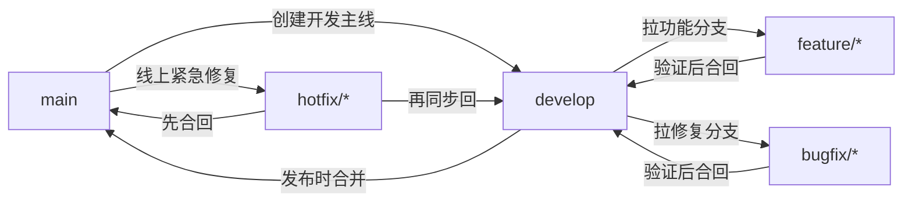
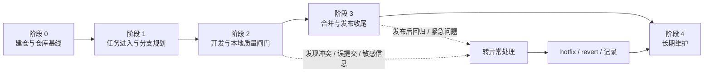
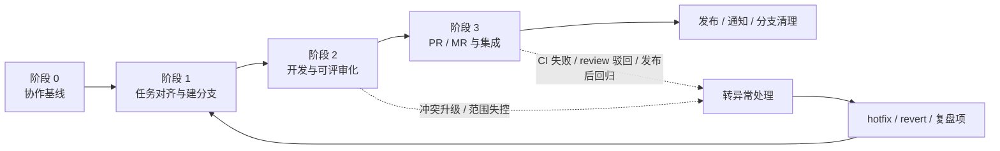
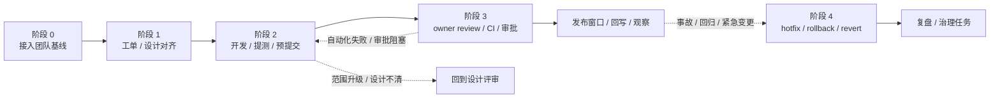

# Git个人使用规范

## 快速索引 🧭

- [📍 文档定位](#文档定位)
- [📐 规范说明](#规范说明)
- [🧠 术语约定](#术语约定)
- [💻 代码示例约定](#代码示例约定)
- [⚠️ 风险提示写法约定](#风险提示写法约定)
- [🔀 交叉阅读入口](#交叉阅读入口-)
- [🌿 分支管理规范](#分支管理规范)
- [✅ 提交规范](#提交规范)
- [🚶 单人开发流程](#单人开发流程)
- [🪜 SOP 使用导航](#sop-使用导航)
- [🧑 个人开发标准 SOP](#个人开发标准-sop)
- [🤝 小团队开发标准 SOP](#小团队开发标准-sop)
- [🏢 公司团队标准 SOP](#公司团队标准-sop)
- [🧯 冲突处理规范](#冲突处理规范)
- [🧩 配套规范](#配套规范)
- [🤝 小型协作规范](#小型协作规范)
- [📚 参考来源](#参考来源)
- [📌 当前状态](#当前状态)
- [🗂️ 返回 `docs/` 目录导航页](./README.md)

## 文档定位

本手册用于沉淀一套面向个人成长的 Git 使用规范。它的目标不是复刻腾讯、字节、谷歌等公司的未公开内部制度，而是基于公开可验证的官方文档、开源贡献指南和业界常见实践，整理出一套适合个人项目与小型协作长期坚持的 Git 行为规范。

这份规范重点解决三个问题：

- 让分支、提交、发布和协作行为更稳定，而不是想到哪做到哪
- 让自己的 Git 习惯更接近成熟工程团队的工作方式
- 让规范可以执行、可以检查、可以长期维护，而不是停留在口号

## 规范说明

### 1. 适用范围

本规范适用于以下场景：

- 个人长期维护的代码仓库
- 个人作品集、学习型项目、工具型项目
- 2 到 5 人左右的小型协作仓库
- 希望提前训练工程化 Git 习惯的开发者

本规范不追求覆盖以下场景：

- 大型企业内部权限流、代码冻结流、发布审批流
- 特定平台专属流程，如公司内部代码平台、内部机器人或内部制品系统
- 所有 Git 命令的完整说明

命令细节、参数说明和回滚命令的查阅，请优先回到 [Part 2《Git Reference手册》](./Git%20Reference手册.md)。

### 2. 规则分层

为避免“什么都重要，最后什么都落不下来”，本手册将规则分成三层：

- `硬性约束`：默认必须遵守，除非项目已有更明确的团队规则
- `推荐做法`：强烈建议长期坚持，用来培养更接近成熟团队的习惯
- `可选优化`：适合在你已经能稳定执行前两层规则后再引入

### 3. 来源边界

本手册中的规则来源分为三类：

- `官方公开依据`：例如 Git 官方文档、Google 官方公开文档
- `开源项目公开规范`：例如腾讯、字节开源项目公开的贡献指南
- `公开实践归纳`：基于多个公开来源抽象出的通用做法

如果某条规则找不到公开依据，就不会写成“腾讯/字节/谷歌都是这么做的”这种确定表述，而只会写成更保守的“适合个人训练的工程化做法”。

## 术语约定

为与其他 Part 保持一致，本手册默认统一使用以下写法：

- `工作区`：必要时补充 `working tree / working directory`
- `暂存区`：必要时补充 `index / staging area`
- `本地仓库`、`远程仓库`：正文优先使用中文，不混写成 `repository`
- `提交`、`分支`：正文优先使用中文，只在命令、报错、对象模型中保留 `commit`、`branch`
- `切换分支`：正文优先这样表述；涉及 `git checkout` 时，再明确写“检出（checkout）”
- `拉取请求（Pull Request, PR）/ 合并请求（Merge Request, MR）`：首次出现写全，后文可简写为 `PR / MR`

## 代码示例约定

为统一四个 Part 的代码块风格，本手册默认采用以下约定：

- 可直接执行的命令统一使用 `bash` 代码块
- 命名规范、提交信息模板、流程清单统一使用 `text` 代码块
- 流程图统一使用 `mermaid`
- 多步命令统一用 `# 1)`、`# 2)` 注释标明动作目的
- 示例优先覆盖真实协作场景，例如开发分支、发布、热修复、PR 自检，而不是只给最短命令

## 风险提示写法约定

为统一整份仓库的风险提示风格，本项目默认按下面的方式写风险信息：

- `说明：` 用来解释背景、边界、默认选择或为什么这样做
- `风险提示：` 只在存在误删、历史改写、共享分支影响、敏感信息泄漏、发布回归或不可逆后果时使用
- `风险提示：` 后优先按“风险级别 + 触发条件 + 可能后果 + 稳妥做法”组织，不只写一句“谨慎使用”
- 如果只是一般性的补充说明，不要滥用 `风险提示：`

建议模板：

```text
风险提示：
- 风险级别：低 / 中 / 高
- 触发条件：什么情况下会踩坑
- 可能后果：会影响什么
- 稳妥做法：在继续前应先做什么
```

## 交叉阅读入口 🔀

本手册回答的是“应该怎样做更稳妥”，如果你还需要概念解释、命令写法或工具选型，可以直接联动到对应 Part：

| 当前阅读主题 | 建议联动 |
|------|------|
| 分支管理规范 | [Part 1 分支管理与协作](./Git学习手册.md#4-分支管理与协作)、[Part 2 分支与合并命令](./Git%20Reference手册.md#3-分支与合并命令) |
| 提交规范 | [Part 1 本地仓库核心操作](./Git学习手册.md#2-本地仓库核心操作)、[Part 2 本地仓库命令](./Git%20Reference手册.md#1-本地仓库命令) |
| 单人开发流程 | [Part 1 远程仓库基础交互](./Git学习手册.md#3-远程仓库基础交互)、[Part 2 远程仓库命令](./Git%20Reference手册.md#2-远程仓库命令) |
| 冲突处理规范 | [Part 1 冲突解决](./Git学习手册.md#6-冲突解决)、[Part 2 回滚与恢复命令](./Git%20Reference手册.md#4-回滚与恢复命令) |
| 配套规范 | [Part 4 自动化工具与脚本](./Git实用拓展手册.md#3-自动化工具与脚本)、[Part 4 大文件与敏感信息防护](./Git实用拓展手册.md#4-大文件与敏感信息防护) |
| 小型协作规范 | [Part 1 远程仓库基础交互](./Git学习手册.md#3-远程仓库基础交互)、[Part 4 命令行增强工具](./Git实用拓展手册.md#2-命令行增强工具) |

## 分支管理规范

### 1. 默认分支模型

本手册默认采用更接近公开大厂开源协作习惯的五类分支模型：

- `main`：稳定主线或发布主线
- `develop`：日常集成主线
- `feature/*`：功能开发分支
- `bugfix/*`：常规缺陷修复分支
- `hotfix/*`：线上紧急修复分支

说明：

- 部分公开项目使用 `dev` 作为开发主线名称。本手册统一使用 `develop` 讲解。
- 如果你所在仓库已经采用 `dev`，建议保留现有命名，不要在同一仓库里混用 `develop` 和 `dev`。
- 这不是所有公开项目唯一使用的分支模型。很多公开项目会直接使用 `main` 主线或 Fork + `main` 的协作方式。
- 本手册之所以默认采用 `main + develop + feature/bugfix/hotfix`，是因为它更适合个人训练“开发线、发布线、热修复线分离”的工程化习惯。

### 2. 分支职责

#### `main`

- `硬性约束`：`main` 只承接稳定版本、发布版本和紧急修复结果
- `硬性约束`：不直接在 `main` 上做日常功能开发
- `推荐做法`：只在准备发布、合并已验证内容或处理 `hotfix/*` 时修改 `main`

#### `develop`

- `硬性约束`：日常开发以 `develop` 作为默认集成主线
- `推荐做法`：功能分支和普通修复分支都从 `develop` 创建，再合回 `develop`
- `推荐做法`：开始工作前先同步 `develop`，减少分支长期漂移

#### `feature/*`

- `硬性约束`：一个功能一个分支，不把多个无关需求堆进同一条开发线
- `推荐做法`：命名使用 `feature/<topic>`，例如 `feature/auth-login`
- `推荐做法`：功能完成并验证后，尽快合回 `develop`

#### `bugfix/*`

- `硬性约束`：常规缺陷修复优先使用 `bugfix/<topic>`，不要和新功能混在一起
- `推荐做法`：命名使用 `bugfix/<topic>`，例如 `bugfix/api-timeout`
- `推荐做法`：修复时同步补充测试、回归验证或最小复现说明

#### `hotfix/*`

- `硬性约束`：生产问题或紧急线上问题从 `main` 拉出 `hotfix/<topic>`
- `硬性约束`：`hotfix/*` 修完后先回到 `main`，再同步回 `develop`
- `推荐做法`：命名使用 `hotfix/<topic>`，例如 `hotfix/login-crash`

### 3. 分支命名规则

- `硬性约束`：分支名统一使用小写字母
- `硬性约束`：单词之间使用短横线 `-`
- `硬性约束`：分支前缀必须表达职责，不使用 `test1`、`new-branch`、`tmp` 这类无意义名称
- `推荐做法`：topic 尽量短，只表达功能、问题或目标，不把完整需求句子塞进分支名

建议示例：

```text
feature/auth-login
feature/docs-navigation
bugfix/api-timeout
hotfix/payment-callback-error
```

不建议示例：

```text
mybranch
fix
test-20260405
feature/我先随便改改
```

### 4. 分支行为规则

- `硬性约束`：正常开发从 `develop` 拉分支，紧急修复从 `main` 拉 `hotfix/*`
- `硬性约束`：工作完成后及时删除已合并的功能分支和修复分支
- `推荐做法`：删除已合并分支时优先使用更安全的删除方式，不要默认使用强制删除
- `推荐做法`：公共分支默认不改写历史
- `推荐做法`：只在未共享的个人分支上谨慎使用 `rebase` 整理历史
- `可选优化`：临时实验可以使用 `temp/*` 本地分支，但不建议把它作为长期主规范的一部分

### 5. 分支流转图



## 提交规范

### 1. 提交信息格式

本手册默认采用结构化提交信息：

```text
type(scope): summary
```

如果当前改动没有清晰 scope，可以退化为：

```text
type: summary
```

说明：

- 这不是“谷歌、腾讯、字节统一官方格式”的断言
- 这是一种与公开开源实践兼容、适合长期维护和快速检索的结构化写法

### 2. 提交类型

建议优先使用以下高频类型：

- `feat`：新增功能
- `fix`：修复缺陷
- `docs`：文档修改
- `refactor`：重构但不改变外部行为
- `test`：测试补充或调整
- `chore`：杂项维护
- `perf`：性能优化
- `build`：构建流程相关
- `ci`：持续集成或自动化流程相关

示例：

```text
feat(auth): add login form validation
fix(api): handle empty response body
docs(git): add branch naming rules
test(parser): cover invalid token case
chore: update editorconfig
```

### 3. 提交摘要要求

- `硬性约束`：提交摘要使用英文短句
- `硬性约束`：摘要直接描述本次改动的核心意图
- `硬性约束`：不要使用 `update`、`misc`、`fix bug`、`临时修改` 这类低信息消息
- `推荐做法`：摘要保持简短，让人只看一眼就知道这次提交在做什么

### 4. 提交粒度要求

- `硬性约束`：一个提交尽量只表达一个明确意图
- `硬性约束`：不要把功能开发、无关重构、格式化清理和临时调试痕迹混在同一个提交里
- `推荐做法`：代码、测试、文档尽量形成闭环，相关改动放进同一组可理解的提交中
- `推荐做法`：大改动拆成多个可 review 的小提交，而不是最后一次性堆一个超大提交

更具体地说：

- 新增功能时，尽量同时补最小测试或使用说明
- 重命名和逻辑修改如果都很多，尽量拆开
- 纯格式化提交尽量单独提交，避免污染功能 diff

### 5. 提交前检查清单

每次提交前，至少完成以下动作：

1. 运行 `git status`，确认没有误带无关文件
2. 运行 `git diff --cached`，确认暂存区内容就是你想提交的内容
3. 运行必要的最小验证，例如测试、构建、lint 或关键功能手动验证
4. 自查是否误带密钥、令牌、环境文件、日志和临时截图
5. 检查提交信息是否表达了明确意图

推荐把这套检查理解成“提交前的小 review”。先自己把关，再把历史送进仓库。

## 单人开发流程

### 1. 默认开发闭环

单人项目也建议按更接近成熟团队的节奏工作，而不是直接在 `main` 上边改边提交。

默认流程如下：

1. 同步 `develop`
2. 从 `develop` 创建 `feature/*` 或 `bugfix/*`
3. 小步提交，必要时先补测试或文档
4. 本地自检通过后再合回 `develop`
5. 需要正式发布时，再从 `develop` 合到 `main`
6. 在 `main` 的发布点打附注标签 `vX.Y.Z`

### 2. 日常开发步骤

建议的最小流程：

```text
同步 develop
-> 创建 feature/* 或 bugfix/*
-> 开发与小步提交
-> 本地自检
-> 合回 develop
-> 删除已完成分支
```

对应的常见命令入口可参考 [Part 2《Git Reference手册》](./Git%20Reference手册.md#2-远程仓库命令) 与 [Part 2《Git Reference手册》中的分支与合并命令](./Git%20Reference手册.md#3-分支与合并命令)，不在本节重复展开所有参数。

如果你想直接照着命令走，可以用下面这个最小示例：

```bash
# 1) 先把 develop 同步到最新
git switch develop
git pull --ff-only origin develop

# 2) 从 develop 拉出一个主题明确的功能分支
git switch -c feature/docs-navigation

# 3) 开发过程中小步提交
git add docs/
git commit -m "docs(git): improve handbook navigation"

# 4) 提交前做最小自检
git status -sb
git diff --cached

# 5) 合回 develop，并删除已经完成的分支
git switch develop
git merge feature/docs-navigation
git branch -d feature/docs-navigation
```

说明：

- 这是单人项目和小型协作里都比较稳的默认闭环
- 如果远程存在受保护分支或必须走 PR，合回步骤应改为“推分支 + 发起 PR”

### 3. 发布流程

- `硬性约束`：正式发布只从 `develop` 合入 `main`
- `硬性约束`：发布标签只打在正式发布点
- `推荐做法`：优先使用附注标签，例如 `v1.2.0`
- `推荐做法`：轻量标签更适合临时标记，正式版本发布优先使用附注标签
- `推荐做法`：发布前做一次最小发布检查，包括版本号、变更范围、关键功能验证和文档同步

### 4. 热修复流程

当线上问题必须立即处理时：

1. 从 `main` 拉出 `hotfix/*`
2. 在 `hotfix/*` 上完成修复与最小验证
3. 合回 `main`
4. 为新的修复发布点打标签
5. 再把同样的修复同步回 `develop`

这一步非常关键。只合回 `main` 不同步回 `develop`，后面很容易再次把老问题带回来。

对应的最小命令示例：

```bash
# 1) 从 main 拉出热修复分支
git switch main
git pull --ff-only origin main
git switch -c hotfix/login-crash

# 2) 修复后提交
git add src/
git commit -m "fix(auth): handle login crash on empty token"

# 3) 先合回 main，准备发布
git switch main
git merge hotfix/login-crash
git tag -a v1.2.1 -m "Release version 1.2.1"

# 4) 再把同一修复同步回 develop，避免后续回归
git switch develop
git merge hotfix/login-crash
```

风险提示：

- 不要只修 `main` 不同步 `develop`
- 如果热修复已经推远程，后续同步和发布动作要遵循团队的分支保护规则

### 5. 关于 rebase 的边界

- `硬性约束`：不要默认改写公共分支历史
- `推荐做法`：只在未共享分支里使用 `rebase` 整理历史
- `推荐做法`：如果分支已经推送且他人可能依赖，优先使用 `merge` 或明确沟通后再改写

## SOP 使用导航

这一章的目标不是继续堆一套“大而全模板”，而是把 Git 规范真正写成三套可执行的流程卡。你可以把它理解为三套默认范式：

- 个人开发：重点是自我约束、发布可追溯、未来自己能接手
- 小团队开发：重点是任务透明、分支隔离、PR / MR、review、基础 CI
- 公司团队开发：重点是工单、设计评审、受保护分支、自动化检查、发布窗口和回滚链路

### 1. 先理解这套 SOP 的边界

- `硬性约束`：本章对标的是 Google、腾讯、字节等公开可验证资料里反复出现的共同做法，不声称复刻其未公开内部制度
- `硬性约束`：如果目标仓库已有 `CONTRIBUTING.md`、受保护分支、owner、CI、发布流程或事故响应规范，优先遵循目标仓库规则
- `推荐做法`：把本章当作“默认范式 + 补充检查表”，而不是覆盖所有仓库现有流程的万能模板

### 2. 流程卡字段说明

为避免 SOP 看起来完整、执行时却抓不住重点，本章统一使用以下字段：

| 字段 | 作用 |
|------|------|
| `参与角色` | 谁负责推进、谁负责把关 |
| `进入条件` | 什么时候允许进入该阶段 |
| `标准步骤` | 该阶段必须完成的动作顺序 |
| `质量闸门` | 什么条件不满足时不能继续往下走 |
| `阶段产物` | 这一阶段结束后应留下什么分支、记录、PR、标签或说明 |
| `中断并转异常处理` | 什么情况下不要硬推进，而应转去热修复、冲突、回滚或重新拆分任务 |

说明：
这里把上一版 SOP 里的“结束检查”进一步细化为 `质量闸门 + 阶段产物` 两部分。
前者负责判断“能不能进入下一阶段”，后者负责判断“这一阶段结束后是否真的留下了可回看、可交接、可审计的结果”。

### 3. 公开来源映射与吸收方式

下面这些不是“这些公司内部一定都完全一致”的断言，而是本手册构建团队范式的公开依据：

| 公开来源 | 可公开验证的做法 | 本手册吸收方式 |
|------|------|------|
| Google Open Source Patching | 大改动前先提 issue / discussion；贡献走 patch / PR 流程；对 Google 项目有 CLA 约束 | 公司团队 SOP 中强调“大改动先对齐”“工单 / issue 先行”“PR 前说明风险与验证” |
| 腾讯 CodeAnalysis 贡献指南 | `main` 作为稳定或预发布分支，`dev` 作为稳定开发分支；不要直接向 `main` 提 PR；提交前补测试、样式、文档 | 小团队与公司团队 SOP 中采用“稳定线 / 开发线分层”“日常改动不直推稳定线” |
| ByteDance Protenix-Dock CONTRIBUTING | PR 要小且功能闭环；feature owner 负责文档、单测、e2e；采用 squash and commit 保持历史干净；重大设计先讨论 | 小团队与公司团队 SOP 中强调“小 PR”“功能 owner 负责测试与文档”“历史可回溯且便于 revert” |
| ByteDance-Seed cudaLLM CONTRIBUTING | substantial work 先提 issue；代码风格与 lint 工具前置；加代码就补测试，改 API 就补文档，确保 tests pass | 公司团队 SOP 中强调“大改动先立项 / issue”“开发阶段就补测试、文档、lint 与说明” |
| Git 官方文档 / Pro Git | 发布优先使用附注标签；已合并分支优先安全删除；不要 rebase 已被他人依赖的公开历史 | 三套 SOP 中统一要求附注标签、安全删分支、共享历史慎改写 |

### 4. 任务类型与默认流转

| 任务类型 | 个人开发默认走法 | 小团队默认走法 | 公司团队默认走法 |
|------|------|------|------|
| 新功能 | `feature/*` 从 `develop` 开始 | `feature/*` + PR / MR + review + CI | 工单 / 需求卡 + 任务分支 + 评审 / 自动化 / 发布链路 |
| 常规缺陷 | `bugfix/*` 从 `develop` 开始 | `bugfix/*` + PR / MR | 缺陷单 + 修复分支 + 回归验证 |
| 紧急线上问题 | `hotfix/*` 从 `main` 开始 | `hotfix/*` 从 `main` 开始并同步团队 | 事故 / 值班流程 + `hotfix/*` + rollback / revert |
| 文档更新 | `docs/*` 或与功能同提交 | `docs/*` 或与功能同 PR | docs 任务分支；若涉及接口或流程变更仍要关联任务 |
| 工具链 / 依赖 / CI | `chore/*`、`build/*`、`ci/*` | 维护分支 + 验证说明 | 工单 + 维护窗口 + 自动化验证 |
| 实验 / spike | 本地 `temp/*` 或独立实验仓库，不直接并入稳定线 | `spike/*`，明确失效时间与结论产物 | 预研任务 / RFC / 设计文档，明确“不默认进入生产分支” |
| 历史整理 | 仅在未共享分支谨慎整理 | 已共享分支默认不改写历史 | 受保护历史默认只用 `revert` / 回滚，不靠强推重写 |

### 5. 先选适用场景

| 场景 | 更适合读哪一章 | 典型特征 |
|------|------|------|
| 个人开发 | [个人开发标准 SOP](#个人开发标准-sop) | 一个人负责开发、验证、发布和维护 |
| 小团队开发 | [小团队开发标准 SOP](#小团队开发标准-sop) | 2 到 5 人协作，有 PR / MR、review、基础 CI |
| 公司团队开发 | [公司团队标准 SOP](#公司团队标准-sop) | 有工单、设计评审、owner、受保护分支、发布窗口或事故响应 |

### 6. 按阶段找对应入口

| 当前阶段 | 个人开发 | 小团队开发 | 公司团队开发 |
|------|------|------|------|
| 项目开始 / 建仓 | [阶段 0：建仓与仓库基线](#5-阶段-0建仓与仓库基线) | [阶段 0：建仓、协作基线与角色分工](#5-阶段-0建仓协作基线与角色分工) | [阶段 0：接入团队基线与权限环境](#6-阶段-0接入团队基线与权限环境) |
| 新任务进入 | [阶段 1：任务进入与分支规划](#6-阶段-1任务进入与分支规划) | [阶段 1：任务对齐、责任确认与建分支](#6-阶段-1任务对齐责任确认与建分支) | [阶段 1：立项、设计对齐与建立任务分支](#7-阶段-1立项设计对齐与建立任务分支) |
| 开发与提交 | [阶段 2：开发、自检与本地质量闸门](#7-阶段-2开发自检与本地质量闸门) | [阶段 2：开发、自检、同步与可评审化](#7-阶段-2开发自检同步与可评审化) | [阶段 2：开发、提测、预提交流程与持续同步](#8-阶段-2开发提测预提交流程与持续同步) |
| 合并 / 提交流转 / 发布 | [阶段 3：合并、发布与版本收尾](#8-阶段-3合并发布与版本收尾) | [阶段 3：PR-MR 流转、集成、发布与通知](#8-阶段-3-pr-mr-流转集成发布与通知) | [阶段 3：代码评审、合并队列、发布窗口与回写](#9-阶段-3代码评审合并队列发布窗口与回写) |
| 维护 / 热修复 / 异常 | [阶段 4：长期维护、热修复与异常处理](#9-阶段-4长期维护热修复与异常处理) | [阶段 4：维护、热修复、回归与异常协作](#9-阶段-4维护热修复回归与异常协作) | [阶段 4：维护、事故处理、回滚与历史边界](#10-阶段-4维护事故处理回滚与历史边界) |

### 7. 遇到问题时先看哪里

| 遇到的问题 | 先看什么 |
|------|------|
| 不知道该从哪条分支开始 | 当前 SOP 的“阶段 1” + [分支管理规范](#分支管理规范) |
| 不知道提交应该怎么拆 | 当前 SOP 的“阶段 2” + [提交规范](#提交规范) |
| 不知道什么情况下能合并 | 当前 SOP 的“阶段 3” + [配套规范](#配套规范) |
| 冲突、错误分支、误提交 | 当前 SOP 的“阶段 4” + [冲突处理规范](#冲突处理规范) |
| 敏感信息、发布后回归、紧急修复 | 当前 SOP 的“阶段 4” + [配套规范](#配套规范) |
| 外部仓库或公司仓库已有既定规范 | 先按目标仓库规则走，再用本手册补检查遗漏 |

### 8. 使用原则

- `硬性约束`：先选对场景，再选流程，不混用个人 SOP 去套公司主线
- `硬性约束`：不要把异常处理写进“正常流程”里硬推进；遇到回归、冲突、事故、敏感信息时应转异常入口
- `推荐做法`：三套 SOP 都应与分支规范、提交规范、冲突规范、配套规范联动使用
- `推荐做法`：仓库体量升级后，及时升级 SOP，而不是继续沿用已经不适配的轻量流程

## 个人开发标准 SOP

### 1. 适用范围

适用于个人长期维护的项目、作品集、学习型仓库、命令行工具、脚本仓库和轻量服务仓库。目标是让个人开发也具备行业里“分支清晰、提交可读、发布可追溯、异常可回滚”的基本范式。

### 2. 参与角色

- `开发者本人`：同时承担开发、验证、发布、维护与复盘职责
- `未来的自己`：可以理解为“延迟到半年后的 reviewer”，这就是个人项目也必须保留记录、标签和说明的原因

### 3. 典型覆盖场景

- 新功能开发
- 常规 bug 修复
- 文档维护
- 工具链 / 依赖 / CI / 脚手架整理
- 发布与版本标记
- 紧急热修复
- 本地预研 / 实验性分支

### 4. 阶段总览

| 阶段 | 进入条件 | 质量闸门 | 阶段产物 |
|------|------|------|------|
| 阶段 0 | 项目刚开始或准备长期维护 | 仓库基线、忽略规则、主线策略明确 | `main`、可选 `develop`、`README.md`、`.gitignore` |
| 阶段 1 | 有明确任务或维护目标 | 任务边界、目标分支、分支命名明确 | 任务记录、工作分支 |
| 阶段 2 | 已开始编码或修改文档 / 配置 | 提交粒度合理、最小验证完成、无误带文件 | 一组可解释提交 |
| 阶段 3 | 准备合回主线或发布 | 自检通过、版本点清楚、分支清理可执行 | 合并结果、标签、发布说明 |
| 阶段 4 | 进入长期维护或发生异常 | 先控影响再修历史、异常有记录 | 热修复记录、回滚路径、维护清单 |



### 5. 阶段 0：建仓与仓库基线

#### 参与角色

- `开发者本人`

#### 进入条件

- 新建仓库，或现有仓库准备从“随手存代码”升级为“正式维护”

#### 标准步骤

1. 初始化仓库并固定稳定主线，默认使用 `main`。
2. 决定是否建立 `develop` 作为日常集成线。
3. 补齐最小基础文件：`README.md`、`.gitignore`、许可证文件和环境示例文件。
4. 约定提交格式、分支命名、标签格式和发布节奏。
5. 完成首个基础提交并推远程。

#### 质量闸门

- 不允许把构建产物、日志、私有环境文件直接纳入首个提交
- 不允许在没有想清稳定主线和开发主线前就开始长期开发
- 如果项目未来要正式发布，必须提前决定标签策略

#### 阶段产物

- `main` 主线
- 可选 `develop`
- 基础文档和忽略规则
- 第一条可追溯初始化提交

#### 中断并转异常处理

- 如果已误提交敏感信息，先转 [配套规范 / 敏感信息](#2-敏感信息)
- 如果仓库结构混乱到无法明确入口，先补 `README.md` 和 `.gitignore` 再继续

#### 可直接执行的命令示例

```bash
# 1) 初始化仓库并完成基础提交
git init
git branch -M main
git add README.md .gitignore
git commit -m "chore: initialize repository baseline"

# 2) 项目会长期迭代时，尽早建立 develop
git switch -c develop
git push -u origin main
git push -u origin develop
```

### 6. 阶段 1：任务进入与分支规划

#### 参与角色

- `开发者本人`

#### 进入条件

- 已有明确任务、缺陷、维护项或发布前待办

#### 标准步骤

1. 先把任务写进 `TODO.md`、issue 或个人笔记，至少说明目标和边界。
2. 判断任务类型：`feature`、`bugfix`、`docs`、`chore`、`hotfix`、`temp`。
3. 选择目标主线：日常任务通常走 `develop`，紧急修复走 `main`。
4. 同步目标主线到最新状态。
5. 从目标主线创建主题明确的工作分支。

#### 质量闸门

- 一个分支只承载一个主题
- 分支命名必须能直接说明任务，不用 `tmp`、`test`、`new` 这类无信息名称
- 紧急问题不允许从 `develop` 拉 `hotfix/*`

#### 阶段产物

- 任务记录
- 主题明确的工作分支
- 本次任务的目标主线与完成标准

#### 中断并转异常处理

- 如果发现本次改动会连带多个不相关问题，先拆任务再继续
- 如果主线已大幅漂移，先同步 / 处理冲突，再开始新改动

#### 可直接执行的命令示例

```bash
# 1) 日常任务从 develop 开始
git switch develop
git pull --ff-only origin develop
git switch -c feature/docs-navigation

# 2) 紧急修复从 main 开始
git switch main
git pull --ff-only origin main
git switch -c hotfix/login-crash
```

### 7. 阶段 2：开发、自检与本地质量闸门

#### 参与角色

- `开发者本人`

#### 进入条件

- 已有工作分支，开始进入实际开发、修复、文档或配置调整

#### 标准步骤

1. 先完成一个最小可解释改动，再做第一次提交。
2. 每次提交前运行 `git status` 和 `git diff --cached`。
3. 按“一个提交表达一个明确意图”拆分提交。
4. 完成一轮明显工作后执行最小验证：测试、构建、lint、手动验收或文档检查。
5. 分支存活时间较长时，主动同步目标主线。

#### 质量闸门

- 暂存区只允许存在本次任务相关文件
- 临时日志、打印、调试代码不得进入正式提交
- 改 API、脚本入口、目录结构或公共命令时，必须同步文档
- 分支开发时间过长又不肯同步主线，会显著放大后续冲突成本

#### 阶段产物

- 一组语义明确的提交
- 对应的最小验证结果
- 与目标主线保持可控差距的工作分支

#### 中断并转异常处理

- 遇到复杂冲突转 [冲突处理规范](#冲突处理规范)
- 发现误提交敏感信息转 [配套规范 / 敏感信息](#2-敏感信息)
- 发现需要临时切换任务但工作区很脏，先提交、暂存或记录状态，不要直接换任务

#### 可直接执行的命令示例

```bash
# 1) 暂存并检查本次任务的改动
git status -sb
git add docs/
git diff --cached

# 2) 做一次结构化提交
git commit -m "docs(git): strengthen personal workflow gates"

# 3) 分支开发时间较长时同步主线
git fetch origin
git merge origin/develop
```

### 8. 阶段 3：合并、发布与版本收尾

#### 参与角色

- `开发者本人`

#### 进入条件

- 功能或修复已完成，最小验证通过，准备合回主线或正式发布

#### 标准步骤

1. 做最后一次范围检查，确认本次改动仍与任务边界一致。
2. 合回 `develop`，并删除已完成的 `feature/*` 或 `bugfix/*`。
3. 需要正式发布时，再从 `develop` 进入 `main`。
4. 在正式版本点打附注标签，并补充最小发布说明。
5. 推送分支、合并结果和标签。

#### 质量闸门

- 日常开发不得直接并入 `main`
- 没有完成验证或说明的版本，不应打正式标签
- 发布点不应混入未完成功能、临时实验代码或无关清理

#### 阶段产物

- 合并后的 `develop`
- 正式发布时的 `main` 与版本标签
- 发布说明或变更摘要
- 清理后的已完成分支

#### 中断并转异常处理

- 如果发布前发现回归，先回到阶段 2 修复或转阶段 4 热修复思路
- 如果合并前发现历史很乱，只在未共享分支谨慎整理；不要改写已公开历史

#### 可直接执行的命令示例

```bash
# 1) 合回 develop 并删除已完成分支
git switch develop
git merge feature/docs-navigation
git branch -d feature/docs-navigation

# 2) 正式发布时再合到 main，并打附注标签
git switch main
git merge develop
git tag -a v1.2.0 -m "Release version 1.2.0"
git push origin main --tags
```

### 9. 阶段 4：长期维护、热修复与异常处理

#### 参与角色

- `开发者本人`

#### 进入条件

- 项目进入长期维护，或已经出现线上回归、错误分支、误提交、敏感信息问题

#### 标准步骤

1. 对文档、依赖、测试、CI、忽略规则做周期性维护。
2. 紧急问题从 `main` 建 `hotfix/*`，只做必要最小修复。
3. 热修复先回 `main` 并打修复标签，再同步回 `develop`。
4. 对错误分支、误提交、长期未合并分支和发布后回归，优先用可追踪方式修正。
5. 处理完成后补充记录和后续改进项。

#### 质量闸门

- 先控制影响范围，再考虑历史整洁
- 共享历史默认不强推改写
- 热修复必须回流到 `develop`，否则问题可能在后续版本重新出现

#### 阶段产物

- 热修复分支与修复标签
- 异常处理记录
- 更新后的待办 / 维护清单

#### 中断并转异常处理

- 冲突转 [冲突处理规范](#冲突处理规范)
- 敏感信息转 [配套规范 / 敏感信息](#2-敏感信息)
- 发布后回归优先 `revert` 或 `hotfix/*`，不要在稳定线继续堆修

#### 常见问题入口

| 问题 | 个人开发默认处理原则 |
|------|------|
| 冲突 | 先理解双方意图，再整合，不靠强制覆盖 |
| 提交到错误分支 | 先停止继续推送，再判断是修历史还是追加纠偏提交 |
| 误提交敏感信息 | 先停止扩散、旋转凭据，再处理历史 |
| 分支长期未合并 | 拆分、关闭或重建，不让它无限拖延 |
| 发布后回归 | 优先 `revert` 或 `hotfix/*` 修复 |
| 历史整理边界 | 未共享分支可谨慎 rebase；共享分支优先保留可追踪历史 |

#### 可直接执行的命令示例

```bash
# 1) 从 main 拉出热修复分支
git switch main
git pull --ff-only origin main
git switch -c hotfix/login-crash

# 2) 修复后先合回 main，再同步回 develop
git add src/
git commit -m "fix(auth): handle login crash on empty token"
git switch main
git merge hotfix/login-crash
git tag -a v1.2.1 -m "Release version 1.2.1"
git switch develop
git merge hotfix/login-crash
```

## 小团队开发标准 SOP

### 1. 适用范围

适用于 2 到 5 人左右的小型协作仓库。目标是以尽量轻的流程成本，接近公开行业规范里的高频动作：任务先对齐、稳定线与开发线分离、小 PR、review、基础 CI、合并后再发布。

### 2. 参与角色

- `任务提出者`：提出需求、缺陷或维护目标
- `开发者`：负责编码、补测试 / 文档、发 PR / MR
- `Reviewer`：检查行为变化、边界条件和回滚风险
- `仓库维护者 / 发布负责人`：负责合并、发布、热修复节奏与规则落地

### 3. 典型覆盖场景

- 团队功能开发
- 缺陷修复与回归验证
- 文档、脚手架、依赖、CI 维护
- Fork 协作或外部贡献
- 发布、通知与团队同步
- 紧急问题、敏感信息、错误分支和长期悬挂分支治理

### 4. 阶段总览

| 阶段 | 进入条件 | 质量闸门 | 阶段产物 |
|------|------|------|------|
| 阶段 0 | 项目开始或准备引入多人协作 | 协作规则、角色分工、主线分层明确 | `main + develop`、贡献说明、模板、CI 基线 |
| 阶段 1 | 有明确任务需要进入开发 | 责任人、目标分支、任务范围明确 | issue / 任务卡、工作分支 |
| 阶段 2 | 分支已建立，进入具体开发 | 小步提交、测试 / 文档跟随、分支可 review | 一组可评审提交 |
| 阶段 3 | 准备发起 PR / MR 或发布 | PR / MR 说明完整、review / CI 通过 | PR / MR、合并结果、版本说明 |
| 阶段 4 | 发生异常或进入长期维护 | 异常处理动作统一、记录可追踪 | 热修复记录、回滚路径、复盘项 |



### 5. 阶段 0：建仓、协作基线与角色分工

#### 参与角色

- `仓库维护者 / 发布负责人`
- `核心开发者`

#### 进入条件

- 仓库将进入多人协作，或现有流程已经无法支撑协作透明度

#### 标准步骤

1. 固定 `main` 为稳定线，建立 `develop` 为日常集成线。
2. 约定 `feature/*`、`bugfix/*`、`hotfix/*`、`docs/*`、`chore/*` 命名。
3. 建立 `CONTRIBUTING.md`、Issue 模板、PR / MR 模板、最小 review 规则。
4. 明确 CI、lint、测试、格式化和最低验收门槛。
5. 明确谁能合并、谁能发布、谁负责热修复响应。

#### 质量闸门

- 没有约定主线分层和 review 责任前，不建议直接多人共用一个长期仓库
- 共享仓库不能依赖口头规则，至少需要一份可见的贡献入口
- 稳定线不得承载日常直接开发

#### 阶段产物

- `main + develop`
- 协作说明与模板
- 团队最低质量门槛
- 明确的角色边界

#### 中断并转异常处理

- 如果仓库已经存在大量直推稳定线的习惯，先做流程整顿和说明补齐，再继续扩协作范围

#### 可直接执行的命令示例

```bash
# 1) 建立稳定线与开发线
git switch -c main
git push -u origin main
git switch -c develop
git push -u origin develop

# 2) 提交最小协作基线
git add README.md CONTRIBUTING.md .gitignore
git commit -m "chore: add team collaboration baseline"
git push origin develop
```

### 6. 阶段 1：任务对齐、责任确认与建分支

#### 参与角色

- `任务提出者`
- `开发者`
- 必要时 `Reviewer / 模块负责人`

#### 进入条件

- 已有 issue、任务卡、缺陷单或至少一份可追踪的任务说明

#### 标准步骤

1. 用 issue、任务卡或共享文档写清任务目标、责任人、影响范围和预期完成标准。
2. 判断任务类型：功能、修复、文档、维护还是紧急事故。
3. 日常任务从 `develop` 建 `feature/*` 或 `bugfix/*`；事故从 `main` 建 `hotfix/*`。
4. 如果是跨模块改动、接口变更或高风险任务，先和相关协作者同步边界。
5. 首次推远程，便于团队 review、备份和协作。

#### 质量闸门

- 没有责任人、范围说明和目标主线的任务，不进入正式开发
- 涉及多人同改热点模块时，不应跳过边界对齐
- 分支名、PR 标题和任务主题应尽量一致，避免 review 语义分裂

#### 阶段产物

- 可追踪的任务记录
- 主题明确的工作分支
- 已对齐的责任与影响范围

#### 中断并转异常处理

- 如果发现需求范围过大，先拆 issue / 子任务再继续
- 如果同一模块多人同时开发且主线变化太快，先对齐同步策略再编码

#### 可直接执行的命令示例

```bash
# 1) 同步开发主线
git switch develop
git pull --ff-only origin develop

# 2) 建立任务分支并首次推远程
git switch -c feature/member-center
git push -u origin feature/member-center
```

### 7. 阶段 2：开发、自检、同步与可评审化

#### 参与角色

- `开发者`
- 必要时 `联调同学 / Reviewer`

#### 进入条件

- 已有工作分支并开始开发

#### 标准步骤

1. 按小步提交推进开发，确保每个提交都能解释清楚。
2. 补齐与本次改动强相关的测试、文档、迁移说明或运行说明。
3. 每次提交前检查 `git status`、暂存区 diff、敏感信息和无关文件。
4. 每天开始前至少同步一次 `develop`；热点模块在关键节点前主动同步。
5. 在进入 PR / MR 前，把分支整理到“别人能 review、自己能回滚”的程度。

#### 质量闸门

- PR / MR 前不应再夹杂大段临时调试代码
- 改 API、公共接口、脚本入口、配置、依赖时，必须补说明
- 团队约定的 lint、测试、构建未通过时，不进入提交流转
- 分支差异过大、无法快速 review 时，应先拆分或整理

#### 阶段产物

- 一组可评审提交
- 对应的测试 / 文档 / 配置说明
- 与 `develop` 保持在可合并范围内的分支

#### 中断并转异常处理

- 发现范围扩大或跨模块影响过多，先拆任务
- 冲突复杂、多人同时改同一块逻辑时，先同步和沟通，不要硬解
- 若发现敏感信息进入提交历史，立即转异常处理

#### 可直接执行的命令示例

```bash
# 1) 形成一个可 review 的小提交
git add src/ tests/ docs/
git diff --cached
git commit -m "feat(profile): add member center overview"

# 2) 与 develop 保持同步
git fetch origin
git merge origin/develop
git push origin feature/member-center
```

### 8. 阶段 3：PR / MR 流转、集成、发布与通知

#### 参与角色

- `开发者`
- `Reviewer`
- `仓库维护者 / 发布负责人`

#### 进入条件

- 任务改动已完成，最小验证通过，分支已达到可评审状态

#### 标准步骤

1. 发起 PR / MR，并写清变更主题、影响范围、验证方式和风险。
2. 等待 review 和基础 CI，对意见使用补充提交或更新说明回应。
3. review / CI 通过后合入 `develop`。
4. 需要发版时，再从 `develop` 进入 `main`，补版本标签和发布说明。
5. 对团队同步发布结论、风险点和观察项。

#### 质量闸门

- PR / MR 说明不完整时，不应进入正式 review
- 没有验证结果或风险说明的改动，不应合并
- 未完成功能、实验性变更或不确定改动，不应顺带进发布
- 小团队默认不建议把超大 PR 当常态

#### 阶段产物

- 已关闭或已合并的 PR / MR
- review 结论与 CI 结果
- 发布标签、发布说明和团队同步信息

#### 中断并转异常处理

- review 发现范围失控，应拆 PR / MR
- CI 失败、回归出现或风险不清楚时，退回阶段 2 修复
- 合并后发现问题，转阶段 4 处理

#### PR / MR 说明最小模板

```text
变更主题：
任务 / issue：
影响范围：
验证方式：
风险与注意事项：
是否需要发布 / 回滚说明：
```

#### 可直接执行的命令示例

```bash
# 1) 推送待评审分支
git push origin feature/member-center

# 2) 发布时再把 develop 进入 main
git switch main
git pull --ff-only origin main
git merge develop
git tag -a v1.4.0 -m "Release version 1.4.0"
git push origin main --tags
```

### 9. 阶段 4：维护、热修复、回归与异常协作

#### 参与角色

- `仓库维护者 / 发布负责人`
- `开发者`
- 必要时 `Reviewer / 相关模块负责人`

#### 进入条件

- 进入周期性维护，或已出现线上回归、冲突升级、错误分支、敏感信息问题

#### 标准步骤

1. 维护类任务仍然按分支和 PR / MR 执行，不直接在公共分支边修边推。
2. 线上事故从 `main` 建 `hotfix/*`，优先回 `main`，再同步回 `develop`。
3. 对长期未合并分支、发布后回归和复杂冲突，先统一处理方案再动手。
4. 对误提交敏感信息、错误分支和错误合并，优先控制影响范围，再决定 `revert`、回滚或历史修正。
5. 处理完成后补充异常记录、复盘结论和后续改进项。

#### 质量闸门

- 紧急场景也不能跳过“先控影响范围”的基本原则
- 团队共享历史默认不强推重写
- 热修复不回流 `develop` 会导致问题二次进入后续版本

#### 阶段产物

- 热修复分支和修复标签
- 异常处理记录
- 团队内的回滚路径与后续行动项

#### 中断并转异常处理

- 冲突升级转 [冲突处理规范](#冲突处理规范)
- 敏感信息转 [配套规范 / 敏感信息](#2-敏感信息)
- 发布后回归优先 `revert` 或 `hotfix/*`，不要直接在稳定线上连续堆修

#### 常见问题入口

| 问题 | 小团队默认处理重点 |
|------|------|
| 冲突 | 先查明双方意图和责任边界，再解决 |
| 提交到错误分支 | 先停止继续传播，再判断是修历史还是追加纠偏提交 |
| 误提交敏感信息 | 先旋转凭据、限制访问，再处理历史和通知相关人 |
| 长期未合并分支 | 拆分、关闭、重建或补同步 |
| 发布后回归 | 优先 `revert` 或 `hotfix/*` |
| 历史整理边界 | 已共享分支优先保留可追踪历史 |

#### 可直接执行的命令示例

```bash
# 1) 紧急问题从 main 建 hotfix 分支
git switch main
git pull --ff-only origin main
git switch -c hotfix/payment-timeout

# 2) 修复后同步两条主线
git commit -am "fix(payment): handle timeout retry"
git switch main
git merge hotfix/payment-timeout
git switch develop
git merge hotfix/payment-timeout
```

## 公司团队标准 SOP

### 1. 适用范围

适用于已经存在工单系统、设计评审、owner、受保护分支、自动化检查、发布窗口和事故响应流程的团队仓库。这里对标的是 Google、腾讯、字节等公开规范里反复出现的“共同范式”，不是把它们未公开的内部制度写成确定结论。

### 2. 参与角色

- `需求方 / 产品 / 项目经理`
- `开发者`
- `模块 Owner / Reviewer`
- `测试 / 验证责任人`
- `CI / 自动化质量闸门`
- `仓库维护者 / Release Manager`
- `值班 / Oncall / 事故响应责任人`

### 3. 典型覆盖场景

- 常规功能开发
- 缺陷修复
- 大改动 / 设计变更 / RFC
- 文档、接口、配置、迁移脚本同步
- 发布窗口、灰度、回滚
- 紧急热修复与事故复盘
- 长期维护、历史整理和合规检查

### 4. 公开范式边界说明

公司团队 SOP 主要吸收以下共性：

- `Google 公开开源流程`：大改动前先 issue / 讨论，PR 前说明背景与验证方式，流程本身强调可追踪
- `腾讯公开开源流程`：稳定分支与开发分支分层，日常改动不直接提交到稳定主线，PR 前补测试 / 文档 / 样式
- `字节公开开源流程`：small and functional PR、feature owner 负责文档与测试、重大工作先立项 / issue、保持历史清晰便于 revert

本手册在此基础上抽象出公司团队默认要求：任务可追踪、设计可讨论、主线受保护、自动化前置、owner review、发布有窗口、异常能回滚。

### 5. 阶段总览

| 阶段 | 进入条件 | 质量闸门 | 阶段产物 |
|------|------|------|------|
| 阶段 0 | 新接手仓库或项目 | 权限、分支保护、工具链、工单入口明确 | 本地环境、权限、流程入口 |
| 阶段 1 | 已有需求 / 缺陷 / 维护工单 | 工单、影响范围、设计结论、目标版本明确 | 工单、设计记录、任务分支 |
| 阶段 2 | 进入实际开发 | 小步提交、测试 / 文档 / 迁移跟随、预提交流程完成 | 一组可预提交的改动 |
| 阶段 3 | 准备进入主线或发布 | 自动化、owner review、审批、回滚方案齐全 | PR / MR、审批记录、发布记录、回写信息 |
| 阶段 4 | 出现事故或进入维护周期 | 优先稳定性、可审计、可回滚 | hotfix、revert / rollback 记录、复盘项 |



### 6. 阶段 0：接入团队基线与权限环境

#### 参与角色

- `开发者`
- `模块 Owner / 仓库维护者`

#### 进入条件

- 刚接手项目、刚加入团队，或首次在该仓库工作

#### 标准步骤

1. 阅读团队的贡献规范、owner 规则、分支保护、发布说明和事故响应说明。
2. 确认默认主线、发布分支、热修复分支和回滚入口。
3. 配置本地身份、远程权限、必要的工具链和自动化入口。
4. 确认工单系统、设计文档入口、发布系统和监控 / 报警入口。
5. 明确哪些动作可以自行完成，哪些动作必须 owner 或 release manager 批准。

#### 质量闸门

- 没确认分支保护和权限边界前，不应贸然操作受保护主线
- 没有工单 / 设计 / 发布入口认知前，不应直接进入正式提交流程
- 不了解回滚路径时，不应承担高风险上线任务

#### 阶段产物

- 可用的本地开发环境
- 对团队流程入口的清晰认知
- 已确认的权限边界和审批边界

#### 中断并转异常处理

- 如果权限不完整、主线规则不清或流程入口缺失，先补齐环境和认知，不进入阶段 1

#### 可直接执行的命令示例

```bash
# 1) 克隆并确认远程
git clone <repo-url>
cd <repo-dir>
git remote -v

# 2) 拉取团队开发主线
git fetch origin
git switch develop
git pull --ff-only origin develop
```

### 7. 阶段 1：立项、设计对齐与建立任务分支

#### 参与角色

- `需求方 / 产品 / 项目经理`
- `开发者`
- 必要时 `模块 Owner / Reviewer`

#### 进入条件

- 已有需求单、缺陷单、维护单或事故单

#### 标准步骤

1. 领取工单并写清目标版本、影响范围、风险级别和负责人。
2. 判断任务类型：功能、缺陷、维护、迁移、配置变更还是事故修复。
3. 对 substantial work 先完成 issue、设计说明、RFC 或评审结论，不直接闷头开发。
4. 按团队模板创建任务分支，并把工单号绑定到分支、PR / MR 或提交说明中。
5. 如果涉及跨模块、接口或数据结构变更，先同步相关 owner 和联调对象。

#### 质量闸门

- 没有关联工单、影响范围或负责人时，不应进入正式开发
- 涉及大改动、公共接口、迁移脚本、权限模型或性能敏感链路时，不应跳过设计对齐
- 紧急事故应区分“应急修复”和“常规需求开发”，不能混流

#### 阶段产物

- 工单 / 需求卡 / 缺陷单
- 设计记录或评审结论
- 任务分支
- 已对齐的 owner / 联调对象 / 目标版本

#### 中断并转异常处理

- 如果设计未对齐、边界不清、回滚成本过高，先回到评审或拆分任务
- 如果需求紧急升级为事故，转阶段 4 的事故链路

#### 可直接执行的命令示例

```bash
# 1) 从受控主线创建任务分支
git switch develop
git pull --ff-only origin develop
git switch -c feature/task-123-auth-login

# 2) 首次推送远程，便于工单和平台关联
git push -u origin feature/task-123-auth-login
```

### 8. 阶段 2：开发、提测、预提交流程与持续同步

#### 参与角色

- `开发者`
- 必要时 `测试 / 验证责任人`
- `模块 Owner`

#### 进入条件

- 已有任务分支，设计与边界已对齐

#### 标准步骤

1. 以小步提交推进开发，不把功能、重构、迁移和调试痕迹混成一个大提交。
2. 按团队要求补测试、文档、接口说明、配置说明、迁移脚本和回滚说明。
3. 提交前检查 `git status`、暂存区 diff、敏感信息、依赖变化和生成文件。
4. 按固定节奏同步主线；如果团队有 merge queue、自动 rebase 或预提交流程，严格跟随。
5. 在进入 PR / MR 前，整理出清晰的验证结果、风险点和上线注意事项。

#### 质量闸门

- 改 API 不补文档、改数据结构不补迁移说明、改行为不补测试，都不应进入阶段 3
- 高风险链路如果没有回滚路径，不应进入发布链路
- 提交历史必须让 reviewer 能快速理解，否则先整理再提交流程
- 共享分支默认不改写历史；若团队允许整理，也应在评审前完成

#### 阶段产物

- 一组可审阅、可测试、可解释的提交
- 测试、文档、迁移和配置说明
- 已同步主线的工作分支

#### 中断并转异常处理

- 如果自动化或本地验证暴露高风险问题，回到阶段 1 或当前阶段修正
- 若发现影响范围超出原工单，应补任务或补设计评审
- 若误带敏感信息或错误配置，立即转异常处理

#### 可直接执行的命令示例

```bash
# 1) 完成一个可解释的提交
git add src/ tests/ docs/
git diff --cached
git commit -m "feat(auth): add login token refresh flow"

# 2) 与团队主线保持同步
git fetch origin
git merge origin/develop
git push origin feature/task-123-auth-login
```

### 9. 阶段 3：代码评审、合并队列、发布窗口与回写

#### 参与角色

- `开发者`
- `Reviewer / 模块 Owner`
- `CI / 自动化质量闸门`
- `Release Manager / 仓库维护者`

#### 进入条件

- 开发完成，预提交流程和最小验证完成

#### 标准步骤

1. 发起 PR / MR，并关联工单、设计记录、验证方式、风险和回滚方案。
2. 等待自动化检查、owner review、必要审批和合并队列。
3. 对评审意见用补充提交或按团队约定整理历史响应。
4. 发布前确认发布窗口、配置变更、数据变更、观察指标和责任人。
5. 发布完成后把结果回写到工单、发布记录、变更系统或复盘材料中。

#### 质量闸门

- 没有通过自动化检查或 owner review，不进入主线
- 没有回滚方案、观察指标或责任人，不进入高风险发布
- 多模块联动、迁移脚本、配置变更、权限变更应明确标注，不允许隐藏在普通 PR 里

#### 阶段产物

- PR / MR
- 审批与 review 记录
- 发布记录、版本信息、回写信息
- 明确的发布后观察责任人

#### 中断并转异常处理

- 自动化失败、review 发现高风险或回滚不明确时，退回阶段 2
- 发布后发现问题，立即转阶段 4 事故或回归链路

#### 可直接执行的命令示例

```bash
# 1) 推送待评审分支
git push origin feature/task-123-auth-login

# 2) 如果团队使用发布分支，按团队规则同步
git switch <release-branch>
git pull --ff-only origin <release-branch>
git merge feature/task-123-auth-login
```

#### PR / MR 说明最小模板

```text
工单号 / 需求号：
变更主题：
影响范围：
验证方式：
风险与回滚方式：
是否涉及发布窗口 / 配置变更 / 数据变更：
```

### 10. 阶段 4：维护、事故处理、回滚与历史边界

#### 参与角色

- `值班 / Oncall / 事故响应责任人`
- `开发者`
- `模块 Owner / Reviewer`
- `Release Manager / 仓库维护者`

#### 进入条件

- 发生线上事故、发布后回归、敏感信息泄漏、错误分支、错误发布，或进入定期维护周期

#### 标准步骤

1. 维护任务继续走工单、分支、评审和验证，不绕过团队链路。
2. 线上事故按团队应急流程处理，从指定稳定线建立 `hotfix/*`。
3. 优先选择 `revert`、回滚或标准热修复，不在受保护主线上临时堆修。
4. 对敏感信息泄漏、错误分支、错误发布和长期未合并分支，先控制影响，再补记录、复盘和治理动作。
5. 仅在团队允许的边界内整理历史；共享分支与已发布历史优先保持审计链。

#### 质量闸门

- 事故处理先求稳，再求历史漂亮
- 受保护主线和已发布历史默认不强推改写
- 每次事故处理都应留下记录、观察项和后续修复动作

#### 阶段产物

- `hotfix/*`、`revert` 或 rollback 记录
- 事故记录、复盘结论、补测项
- 后续规则修订或治理任务

#### 中断并转异常处理

- 如果问题本质上来自流程缺口，应补流程而不是只补代码
- 如果存在跨团队影响，应升级通知范围和复盘范围

#### 可直接执行的命令示例

```bash
# 1) 从稳定线建立 hotfix
git switch main
git pull --ff-only origin main
git switch -c hotfix/task-456-payment-timeout

# 2) 修复后提交，后续合并、发布和回滚按团队链路执行
git add src/
git commit -m "fix(payment): reduce timeout retry impact"
git push -u origin hotfix/task-456-payment-timeout
```

#### 常见问题入口

| 问题 | 公司团队默认优先动作 |
|------|------|
| 冲突 | 先理解双方意图，必要时拉 owner 一起处理 |
| 提交到错误分支 | 先停止传播，再决定走 `revert`、回滚还是历史修正 |
| 误提交敏感信息 | 先控权限、旋转凭据、通知相关方，再处理历史 |
| 长期未合并分支 | 评估拆分、关闭、重建或重新对齐版本 |
| 发布后回归 | 优先走标准回滚 / 热修复链路 |
| 历史整理边界 | 未共享分支按规则整理；共享和已发布历史优先保留审计链 |

## 冲突处理规范

### 1. 冲突前

- `推荐做法`：开始新一轮开发前先同步 `develop`
- `推荐做法`：不要让功能分支长时间脱离主线
- `推荐做法`：多人协作时，涉及同一模块的大改动先沟通边界

### 2. 冲突中

发生冲突后，按工程动作处理，不要凭感觉乱试：

1. 先判断当前是 `merge` 还是 `rebase`
2. 运行 `git status`，锁定冲突文件
3. 打开冲突文件，理解双方改动意图
4. 手动整合为正确结果，而不是机械保留某一边
5. 删除冲突标记
6. 重新执行当前流程需要的后续命令

注意：

- 如果当前是合并流程，后续通常是继续提交流程
- 如果当前是 `rebase`，解决后通常需要继续 `rebase --continue`

### 3. 冲突后

- `硬性约束`：冲突解决后重新验证关键功能
- `硬性约束`：确认没有误删业务逻辑、测试或文档内容
- `推荐做法`：如果本次冲突本身有学习价值，可以补一条简短说明性提交或记录

### 4. 冲突处理禁忌

- `硬性约束`：没看懂两边改动意图时，不要草率保留某一边
- `硬性约束`：不要把强制覆盖当成冲突解决方案
- `推荐做法`：如果冲突涉及重要业务逻辑，先看历史、issue 或与协作方沟通

## 配套规范

### 1. `.gitignore`

- `硬性约束`：仓库尽早建立并维护 `.gitignore`
- `硬性约束`：编辑器配置、构建产物、日志、缓存、临时文件、环境文件按需忽略
- `推荐做法`：每次新增工具链或生成目录后，顺手检查是否要更新 `.gitignore`

### 2. 敏感信息

- `硬性约束`：不提交密钥、令牌、证书、生产配置、私有环境文件
- `硬性约束`：如果误提交，先停止继续传播，再旋转凭据，最后处理仓库历史
- `推荐做法`：把本地环境变量文件默认加入忽略规则，例如 `.env`、`.env.local`

### 3. 文档与测试

- `硬性约束`：新增文件结构、命令入口、公共接口或 API 变化时，同步补文档
- `推荐做法`：修复 bug 时补最小复现或回归测试
- `推荐做法`：提交前至少完成与你这次改动强相关的最小验证

### 4. 标签与发布

- `硬性约束`：正式发布才打版本标签
- `推荐做法`：使用附注标签而不是随手创建轻量标签
- `推荐做法`：标签名统一使用语义化版本，例如 `v1.0.0`

## 小型协作规范

这一节只保留高频、轻量、适合小团队执行的规则，不扩展成大型组织流程手册。

### 1. 开工前

- `硬性约束`：开始工作前先同步目标主线。默认开发同步 `develop`，发布和热修复场景同步 `main`
- `推荐做法`：大改动先开 issue，至少先沟通目标、边界和影响范围
- `推荐做法`：一个分支只处理一个主题，避免“顺手再改一点”

### 2. 提交与拉取请求 / 合并请求（PR / MR）

- `硬性约束`：日常功能和常规修复优先提交到 `develop`
- `硬性约束`：不要直接把日常开发改动推向 `main`
- `推荐做法`：PR / MR 保持小而完整，便于 review
- `推荐做法`：PR / MR 标题和说明写清变更主题、影响范围和验证方式
- `推荐做法`：提交前确认 tests/docs 已补齐或明确说明为什么暂不补
- `推荐做法`：如果项目有 lint 或格式化检查，把它视为合并前的常规检查项

### 3. 合并规则

- `硬性约束`：`main` 只承接发布与热修复
- `推荐做法`：合并前先自查 diff、提交信息、测试结果和敏感信息
- `推荐做法`：合并后及时删除已完成分支，保持仓库干净

### 4. Fork 协作的最小流程

如果项目采用 GitHub 常见的 Fork 模式，可以按下面的最小闭环执行：

```text
fork repository
-> 创建分支
-> 提交并推送
-> 发起 PR
-> 评审并更新
-> merge
```

这里的重点不是“流程看起来完整”，而是保证每次改动都能被追踪、被 review、被验证。

对应的最小命令示例：

```bash
# 1) 从自己的 fork 拉代码
git clone <your-fork-url>
cd <repo-dir>

# 2) 从主仓库同步上游远程
git remote add upstream <upstream-repo-url>
git fetch upstream

# 3) 基于目标主线创建功能分支
git switch main
git pull --ff-only upstream main
git switch -c feature/fix-doc-typo

# 4) 提交并推到自己的 fork
git add docs/
git commit -m "docs: fix handbook typo"
git push -u origin feature/fix-doc-typo
```

说明：

- 后续通常是在 GitHub 页面或 `gh pr create` 中发起 PR
- 如果目标仓库要求从 `develop` 或其他分支提 PR，应把上面的 `main` 换成对应目标分支

### 5. 目标仓库规范优先

- `硬性约束`：如果目标仓库已经提供 `CONTRIBUTING.md`、PR 模板或分支规则，优先遵循目标仓库规范
- `推荐做法`：把本手册当成个人默认习惯，而不是覆盖所有外部项目的统一规则
- `推荐做法`：对于外部开源贡献，先确认目标仓库要求你从哪条分支创建分支、向哪条分支提 PR，再开始开发

## 参考来源

### 官方公开依据

- [Git 官方文档](https://git-scm.com/doc)
- [Google Style Guides](https://google.github.io/styleguide/)
- [Google Open Source - Patching](https://opensource.google/docs/patching/)

### 开源项目公开规范

- [Tencent CodeAnalysis 贡献指南](https://tencent.github.io/CodeAnalysis/zh/community/contribute.html)
- [Tencent CodeAnalysis PR 操作流程](https://tencent.github.io/CodeAnalysis/zh/community/pr.html)
- [ByteDance Protenix-Dock CONTRIBUTING](https://github.com/bytedance/Protenix-Dock/blob/main/CONTRIBUTING.md)
- [ByteDance-Seed cudaLLM CONTRIBUTING](https://github.com/ByteDance-Seed/cudaLLM/blob/main/CONTRIBUTING.md)

### 使用说明

- 本手册中的“大厂实践”默认指公开可验证的开源规范与公开文档，而不是未公开的内部制度。
- 如果未来补充新的公开来源，应优先更新本节，再调整正文结论。

### 这些来源主要支撑的规则

- Git 官方文档 / Pro Git：支撑“公共历史不要随意改写”“已合并分支优先安全删除”“发布优先使用附注标签”等规则
- Google Open Source 文档：支撑“大改动前先提 issue / discussion”“贡献流程强调可追踪说明”的规则
- 腾讯公开贡献文档：支撑“稳定分支与开发分支分层”“日常改动不要直接提交到稳定主线”“提交前补测试和文档”的思路
- 字节开源贡献文档：支撑“小 PR、主题聚焦、feature owner 负责文档与测试、重大工作先 issue / 设计对齐”的规则

## 当前状态

- 当前已完成 Part 3 全量初稿，并将 SOP 重构为“个人开发 / 小团队开发 / 公司团队”三套独立标准流程
- 三套 SOP 已进一步统一为流程卡格式，补齐参与角色、进入条件、质量闸门、阶段产物、中断条件与命令示例
- 仓库级风险提示写法已统一补齐到 README、Part 1、Part 2 与 Part 3 的写作约定中
- 三套 SOP 已补充 Mermaid 流程图，便于快速理解阶段流转与异常分流
- 公司团队 SOP 已明确按 Google、腾讯、字节公开规范中的共同做法抽象，不将未公开内部制度写成确定结论
- 后续重点转向跨文档术语统一、交叉引用、风险提示写法和来源持续校验
