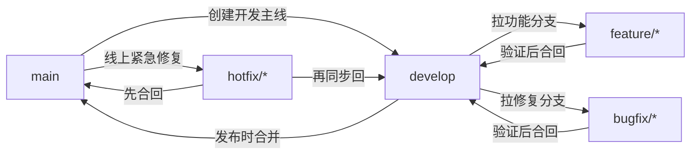

# Git个人使用规范

## 快速索引 🧭

- [📍 文档定位](#文档定位)
- [📐 规范说明](#规范说明)
- [🧠 术语约定](#术语约定)
- [💻 代码示例约定](#代码示例约定)
- [🔀 交叉阅读入口](#交叉阅读入口-)
- [🌿 分支管理规范](#分支管理规范)
- [✅ 提交规范](#提交规范)
- [🚶 单人开发流程](#单人开发流程)
- [🪜 SOP 使用导航](#sop-使用导航)
- [🧑 个人开发标准 SOP](#个人开发标准-sop)
- [🤝 小团队开发标准 SOP](#小团队开发标准-sop)
- [🏢 公司团队标准 SOP](#公司团队标准-sop)
- [🧯 冲突处理规范](#冲突处理规范)
- [🧩 配套规范](#配套规范)
- [🤝 小型协作规范](#小型协作规范)
- [📚 参考来源](#参考来源)
- [📌 当前状态](#当前状态)
- [🗂️ 返回 `docs/` 目录导航页](./README.md)

## 文档定位

本手册用于沉淀一套面向个人成长的 Git 使用规范。它的目标不是复刻腾讯、字节、谷歌等公司的未公开内部制度，而是基于公开可验证的官方文档、开源贡献指南和业界常见实践，整理出一套适合个人项目与小型协作长期坚持的 Git 行为规范。

这份规范重点解决三个问题：

- 让分支、提交、发布和协作行为更稳定，而不是想到哪做到哪
- 让自己的 Git 习惯更接近成熟工程团队的工作方式
- 让规范可以执行、可以检查、可以长期维护，而不是停留在口号

## 规范说明

### 1. 适用范围

本规范适用于以下场景：

- 个人长期维护的代码仓库
- 个人作品集、学习型项目、工具型项目
- 2 到 5 人左右的小型协作仓库
- 希望提前训练工程化 Git 习惯的开发者

本规范不追求覆盖以下场景：

- 大型企业内部权限流、代码冻结流、发布审批流
- 特定平台专属流程，如公司内部代码平台、内部机器人或内部制品系统
- 所有 Git 命令的完整说明

命令细节、参数说明和回滚命令的查阅，请优先回到 [Part 2《Git Reference手册》](./Git%20Reference手册.md)。

### 2. 规则分层

为避免“什么都重要，最后什么都落不下来”，本手册将规则分成三层：

- `硬性约束`：默认必须遵守，除非项目已有更明确的团队规则
- `推荐做法`：强烈建议长期坚持，用来培养更接近成熟团队的习惯
- `可选优化`：适合在你已经能稳定执行前两层规则后再引入

### 3. 来源边界

本手册中的规则来源分为三类：

- `官方公开依据`：例如 Git 官方文档、Google 官方公开文档
- `开源项目公开规范`：例如腾讯、字节开源项目公开的贡献指南
- `公开实践归纳`：基于多个公开来源抽象出的通用做法

如果某条规则找不到公开依据，就不会写成“腾讯/字节/谷歌都是这么做的”这种确定表述，而只会写成更保守的“适合个人训练的工程化做法”。

## 术语约定

为与其他 Part 保持一致，本手册默认统一使用以下写法：

- `工作区`：必要时补充 `working tree / working directory`
- `暂存区`：必要时补充 `index / staging area`
- `本地仓库`、`远程仓库`：正文优先使用中文，不混写成 `repository`
- `提交`、`分支`：正文优先使用中文，只在命令、报错、对象模型中保留 `commit`、`branch`
- `切换分支`：正文优先这样表述；涉及 `git checkout` 时，再明确写“检出（checkout）”
- `拉取请求（Pull Request, PR）/ 合并请求（Merge Request, MR）`：首次出现写全，后文可简写为 `PR / MR`

## 代码示例约定

为统一四个 Part 的代码块风格，本手册默认采用以下约定：

- 可直接执行的命令统一使用 `bash` 代码块
- 命名规范、提交信息模板、流程清单统一使用 `text` 代码块
- 流程图统一使用 `mermaid`
- 多步命令统一用 `# 1)`、`# 2)` 注释标明动作目的
- 示例优先覆盖真实协作场景，例如开发分支、发布、热修复、PR 自检，而不是只给最短命令

## 交叉阅读入口 🔀

本手册回答的是“应该怎样做更稳妥”，如果你还需要概念解释、命令写法或工具选型，可以直接联动到对应 Part：

| 当前阅读主题 | 建议联动 |
|------|------|
| 分支管理规范 | [Part 1 分支管理与协作](./Git学习手册.md#4-分支管理与协作)、[Part 2 分支与合并命令](./Git%20Reference手册.md#3-分支与合并命令) |
| 提交规范 | [Part 1 本地仓库核心操作](./Git学习手册.md#2-本地仓库核心操作)、[Part 2 本地仓库命令](./Git%20Reference手册.md#1-本地仓库命令) |
| 单人开发流程 | [Part 1 远程仓库基础交互](./Git学习手册.md#3-远程仓库基础交互)、[Part 2 远程仓库命令](./Git%20Reference手册.md#2-远程仓库命令) |
| 冲突处理规范 | [Part 1 冲突解决](./Git学习手册.md#6-冲突解决)、[Part 2 回滚与恢复命令](./Git%20Reference手册.md#4-回滚与恢复命令) |
| 配套规范 | [Part 4 自动化工具与脚本](./Git实用拓展手册.md#3-自动化工具与脚本)、[Part 4 大文件与敏感信息防护](./Git实用拓展手册.md#4-大文件与敏感信息防护) |
| 小型协作规范 | [Part 1 远程仓库基础交互](./Git学习手册.md#3-远程仓库基础交互)、[Part 4 命令行增强工具](./Git实用拓展手册.md#2-命令行增强工具) |

## 分支管理规范

### 1. 默认分支模型

本手册默认采用更接近公开大厂开源协作习惯的五类分支模型：

- `main`：稳定主线或发布主线
- `develop`：日常集成主线
- `feature/*`：功能开发分支
- `bugfix/*`：常规缺陷修复分支
- `hotfix/*`：线上紧急修复分支

说明：

- 部分公开项目使用 `dev` 作为开发主线名称。本手册统一使用 `develop` 讲解。
- 如果你所在仓库已经采用 `dev`，建议保留现有命名，不要在同一仓库里混用 `develop` 和 `dev`。
- 这不是所有公开项目唯一使用的分支模型。很多公开项目会直接使用 `main` 主线或 Fork + `main` 的协作方式。
- 本手册之所以默认采用 `main + develop + feature/bugfix/hotfix`，是因为它更适合个人训练“开发线、发布线、热修复线分离”的工程化习惯。

### 2. 分支职责

#### `main`

- `硬性约束`：`main` 只承接稳定版本、发布版本和紧急修复结果
- `硬性约束`：不直接在 `main` 上做日常功能开发
- `推荐做法`：只在准备发布、合并已验证内容或处理 `hotfix/*` 时修改 `main`

#### `develop`

- `硬性约束`：日常开发以 `develop` 作为默认集成主线
- `推荐做法`：功能分支和普通修复分支都从 `develop` 创建，再合回 `develop`
- `推荐做法`：开始工作前先同步 `develop`，减少分支长期漂移

#### `feature/*`

- `硬性约束`：一个功能一个分支，不把多个无关需求堆进同一条开发线
- `推荐做法`：命名使用 `feature/<topic>`，例如 `feature/auth-login`
- `推荐做法`：功能完成并验证后，尽快合回 `develop`

#### `bugfix/*`

- `硬性约束`：常规缺陷修复优先使用 `bugfix/<topic>`，不要和新功能混在一起
- `推荐做法`：命名使用 `bugfix/<topic>`，例如 `bugfix/api-timeout`
- `推荐做法`：修复时同步补充测试、回归验证或最小复现说明

#### `hotfix/*`

- `硬性约束`：生产问题或紧急线上问题从 `main` 拉出 `hotfix/<topic>`
- `硬性约束`：`hotfix/*` 修完后先回到 `main`，再同步回 `develop`
- `推荐做法`：命名使用 `hotfix/<topic>`，例如 `hotfix/login-crash`

### 3. 分支命名规则

- `硬性约束`：分支名统一使用小写字母
- `硬性约束`：单词之间使用短横线 `-`
- `硬性约束`：分支前缀必须表达职责，不使用 `test1`、`new-branch`、`tmp` 这类无意义名称
- `推荐做法`：topic 尽量短，只表达功能、问题或目标，不把完整需求句子塞进分支名

建议示例：

```text
feature/auth-login
feature/docs-navigation
bugfix/api-timeout
hotfix/payment-callback-error
```

不建议示例：

```text
mybranch
fix
test-20260405
feature/我先随便改改
```

### 4. 分支行为规则

- `硬性约束`：正常开发从 `develop` 拉分支，紧急修复从 `main` 拉 `hotfix/*`
- `硬性约束`：工作完成后及时删除已合并的功能分支和修复分支
- `推荐做法`：删除已合并分支时优先使用更安全的删除方式，不要默认使用强制删除
- `推荐做法`：公共分支默认不改写历史
- `推荐做法`：只在未共享的个人分支上谨慎使用 `rebase` 整理历史
- `可选优化`：临时实验可以使用 `temp/*` 本地分支，但不建议把它作为长期主规范的一部分

### 5. 分支流转图



## 提交规范

### 1. 提交信息格式

本手册默认采用结构化提交信息：

```text
type(scope): summary
```

如果当前改动没有清晰 scope，可以退化为：

```text
type: summary
```

说明：

- 这不是“谷歌、腾讯、字节统一官方格式”的断言
- 这是一种与公开开源实践兼容、适合长期维护和快速检索的结构化写法

### 2. 提交类型

建议优先使用以下高频类型：

- `feat`：新增功能
- `fix`：修复缺陷
- `docs`：文档修改
- `refactor`：重构但不改变外部行为
- `test`：测试补充或调整
- `chore`：杂项维护
- `perf`：性能优化
- `build`：构建流程相关
- `ci`：持续集成或自动化流程相关

示例：

```text
feat(auth): add login form validation
fix(api): handle empty response body
docs(git): add branch naming rules
test(parser): cover invalid token case
chore: update editorconfig
```

### 3. 提交摘要要求

- `硬性约束`：提交摘要使用英文短句
- `硬性约束`：摘要直接描述本次改动的核心意图
- `硬性约束`：不要使用 `update`、`misc`、`fix bug`、`临时修改` 这类低信息消息
- `推荐做法`：摘要保持简短，让人只看一眼就知道这次提交在做什么

### 4. 提交粒度要求

- `硬性约束`：一个提交尽量只表达一个明确意图
- `硬性约束`：不要把功能开发、无关重构、格式化清理和临时调试痕迹混在同一个提交里
- `推荐做法`：代码、测试、文档尽量形成闭环，相关改动放进同一组可理解的提交中
- `推荐做法`：大改动拆成多个可 review 的小提交，而不是最后一次性堆一个超大提交

更具体地说：

- 新增功能时，尽量同时补最小测试或使用说明
- 重命名和逻辑修改如果都很多，尽量拆开
- 纯格式化提交尽量单独提交，避免污染功能 diff

### 5. 提交前检查清单

每次提交前，至少完成以下动作：

1. 运行 `git status`，确认没有误带无关文件
2. 运行 `git diff --cached`，确认暂存区内容就是你想提交的内容
3. 运行必要的最小验证，例如测试、构建、lint 或关键功能手动验证
4. 自查是否误带密钥、令牌、环境文件、日志和临时截图
5. 检查提交信息是否表达了明确意图

推荐把这套检查理解成“提交前的小 review”。先自己把关，再把历史送进仓库。

## 单人开发流程

### 1. 默认开发闭环

单人项目也建议按更接近成熟团队的节奏工作，而不是直接在 `main` 上边改边提交。

默认流程如下：

1. 同步 `develop`
2. 从 `develop` 创建 `feature/*` 或 `bugfix/*`
3. 小步提交，必要时先补测试或文档
4. 本地自检通过后再合回 `develop`
5. 需要正式发布时，再从 `develop` 合到 `main`
6. 在 `main` 的发布点打附注标签 `vX.Y.Z`

### 2. 日常开发步骤

建议的最小流程：

```text
同步 develop
-> 创建 feature/* 或 bugfix/*
-> 开发与小步提交
-> 本地自检
-> 合回 develop
-> 删除已完成分支
```

对应的常见命令入口可参考 [Part 2《Git Reference手册》](./Git%20Reference手册.md#2-远程仓库命令) 与 [Part 2《Git Reference手册》中的分支与合并命令](./Git%20Reference手册.md#3-分支与合并命令)，不在本节重复展开所有参数。

如果你想直接照着命令走，可以用下面这个最小示例：

```bash
# 1) 先把 develop 同步到最新
git switch develop
git pull --ff-only origin develop

# 2) 从 develop 拉出一个主题明确的功能分支
git switch -c feature/docs-navigation

# 3) 开发过程中小步提交
git add docs/
git commit -m "docs(git): improve handbook navigation"

# 4) 提交前做最小自检
git status -sb
git diff --cached

# 5) 合回 develop，并删除已经完成的分支
git switch develop
git merge feature/docs-navigation
git branch -d feature/docs-navigation
```

说明：

- 这是单人项目和小型协作里都比较稳的默认闭环
- 如果远程存在受保护分支或必须走 PR，合回步骤应改为“推分支 + 发起 PR”

### 3. 发布流程

- `硬性约束`：正式发布只从 `develop` 合入 `main`
- `硬性约束`：发布标签只打在正式发布点
- `推荐做法`：优先使用附注标签，例如 `v1.2.0`
- `推荐做法`：轻量标签更适合临时标记，正式版本发布优先使用附注标签
- `推荐做法`：发布前做一次最小发布检查，包括版本号、变更范围、关键功能验证和文档同步

### 4. 热修复流程

当线上问题必须立即处理时：

1. 从 `main` 拉出 `hotfix/*`
2. 在 `hotfix/*` 上完成修复与最小验证
3. 合回 `main`
4. 为新的修复发布点打标签
5. 再把同样的修复同步回 `develop`

这一步非常关键。只合回 `main` 不同步回 `develop`，后面很容易再次把老问题带回来。

对应的最小命令示例：

```bash
# 1) 从 main 拉出热修复分支
git switch main
git pull --ff-only origin main
git switch -c hotfix/login-crash

# 2) 修复后提交
git add src/
git commit -m "fix(auth): handle login crash on empty token"

# 3) 先合回 main，准备发布
git switch main
git merge hotfix/login-crash
git tag -a v1.2.1 -m "Release version 1.2.1"

# 4) 再把同一修复同步回 develop，避免后续回归
git switch develop
git merge hotfix/login-crash
```

风险提示：

- 不要只修 `main` 不同步 `develop`
- 如果热修复已经推远程，后续同步和发布动作要遵循团队的分支保护规则

### 5. 关于 rebase 的边界

- `硬性约束`：不要默认改写公共分支历史
- `推荐做法`：只在未共享分支里使用 `rebase` 整理历史
- `推荐做法`：如果分支已经推送且他人可能依赖，优先使用 `merge` 或明确沟通后再改写

## SOP 使用导航

这一章不再把 SOP 混成一套“大而全模板”，而是拆成三套可独立使用的标准手册。先判断你当前处在哪种仓库环境，再进入对应 SOP 按阶段执行。

### 1. 先选适用场景

| 场景 | 更适合读哪一章 | 典型特征 |
|------|------|------|
| 个人开发 | [个人开发标准 SOP](#个人开发标准-sop) | 自己负责开发、验证、发布和维护 |
| 小团队开发 | [小团队开发标准 SOP](#小团队开发标准-sop) | 2 到 5 人协作，有 review、PR / MR 或基础 CI |
| 公司团队开发 | [公司团队标准 SOP](#公司团队标准-sop) | 有工单、审批、受保护分支、自动化检查或发布链路 |

### 2. 按阶段找对应入口

| 当前阶段 | 个人开发 | 小团队开发 | 公司团队开发 |
|------|------|------|------|
| 项目开始 / 建仓 | [阶段 0：建仓与分支初始化](#4-阶段-0建仓与分支初始化) | [阶段 0：建仓、规则落地与协作入口](#4-阶段-0建仓规则落地与协作入口) | [阶段 0：接入团队基线与仓库初始化](#4-阶段-0接入团队基线与仓库初始化) |
| 新任务进入 | [阶段 1：任务进入与分支建立](#5-阶段-1任务进入与分支建立) | [阶段 1：任务对齐与工作分支建立](#5-阶段-1任务对齐与工作分支建立) | [阶段 1：领任务、关联工单与建立分支](#5-阶段-1领任务关联工单与建立分支) |
| 开发与提交 | [阶段 2：开发、提交与同步主线](#6-阶段-2开发提交与同步主线) | [阶段 2：开发、自检与同步协作主线](#6-阶段-2开发自检与同步协作主线) | [阶段 2：开发、提测与持续同步](#6-阶段-2开发提测与持续同步) |
| 合并 / 提交流转 / 发布 | [阶段 3：提交流转、发布与收尾](#7-阶段-3提交流转发布与收尾) | [阶段 3：PR-MR 流转、发布与收尾](#7-阶段-3-pr-mr-流转发布与收尾) | [阶段 3：评审流转、发布与回写](#7-阶段-3评审流转发布与回写) |
| 维护 / 热修复 / 异常 | [阶段 4：长期维护、热修复与异常处理](#8-阶段-4长期维护热修复与异常处理) | [阶段 4：长期维护、热修复与异常协作](#8-阶段-4长期维护热修复与异常协作) | [阶段 4：维护、事故处理与历史边界](#8-阶段-4维护事故处理与历史边界) |

### 3. 遇到问题时先看哪里

| 遇到的问题 | 先看什么 |
|------|------|
| 不知道现在该从哪条分支开始 | 当前 SOP 的“阶段 1” + [分支管理规范](#分支管理规范) |
| 不确定本次提交该怎么拆 | 当前 SOP 的“阶段 2” + [提交规范](#提交规范) |
| 合并前不知道该检查什么 | 当前 SOP 的“阶段 3” + [配套规范](#配套规范) |
| 冲突、错误分支、误提交 | 当前 SOP 的“阶段 4” + [冲突处理规范](#冲突处理规范) |
| 敏感信息、发布后回归、热修复 | 当前 SOP 的“阶段 4” + [配套规范](#配套规范) |
| 目标仓库已有贡献规范 | 优先遵循目标仓库规范，再把本手册当作补充检查表 |

### 4. 使用原则

- `硬性约束`：先判断当前仓库属于个人、小团队还是公司团队，再进入对应 SOP
- `硬性约束`：一旦仓库已有 `CONTRIBUTING.md`、受保护分支、CI、代码所有者或发布规则，优先遵循仓库规则
- `推荐做法`：把 SOP 理解为“从任务进入到安全合并、可持续维护”的闭环，而不是零散命令清单
- `推荐做法`：执行 SOP 时同步联动本手册的分支、提交、冲突和配套规范，不把它们割裂开用

## 个人开发标准 SOP

### 1. 适用范围

适用于个人长期维护的项目、作品集、学习型仓库和小型工具仓库。目标是让你在没有团队兜底的情况下，仍然能保持历史清晰、发布可追溯、半年后还能快速接手。

### 2. 前置条件

- 本地已经安装 Git，且至少能完成 `clone`、`switch`、`add`、`commit`、`pull`、`push`
- 你能决定仓库默认分支、是否启用 `develop`、是否打版本标签
- 仓库中的敏感信息、构建产物和本地环境文件已经有基本忽略策略

### 3. 阶段总览

| 阶段 | 阶段目标 | 关键产出 |
|------|------|------|
| 阶段 0 | 建立长期可维护的仓库骨架 | `main`、可选 `develop`、`.gitignore`、`README.md` |
| 阶段 1 | 把任务变成边界清晰的工作分支 | 任务记录、目标主线、主题分支 |
| 阶段 2 | 稳定完成开发并控制提交质量 | 小步提交、同步记录、最小验证结果 |
| 阶段 3 | 安全合回主线并完成发布收尾 | 合并结果、标签、发布说明、分支清理 |
| 阶段 4 | 做长期维护并处理异常情况 | 热修复记录、回滚路径、维护清单 |

### 4. 阶段 0：建仓与分支初始化

#### 阶段目标

- 建立一个不是“临时文件夹”的正式仓库
- 在项目一开始就固定默认分支、忽略规则和最小文档
- 决定是否启用 `develop` 作为日常集成主线

#### 操作步骤

1. 创建远程仓库或本地仓库，默认分支使用 `main`。
2. 初始化基础文件：`README.md`、`.gitignore`、许可证文件和环境示例文件（如需要）。
3. 如果项目后续会持续迭代，尽早建立 `develop`，避免后期再迁移主线习惯。
4. 约定分支命名、提交格式、标签格式和发布方式。
5. 完成首个基础提交，并把仓库推到远程。

#### 可直接执行的命令示例

```bash
# 1) 初始化仓库并完成首个提交
git init
git branch -M main
git add README.md .gitignore
git commit -m "chore: initialize repository"

# 2) 如果需要日常集成线，尽早建立 develop
git switch -c develop
git push -u origin main
git push -u origin develop
```

#### 结束检查

- `main` 是否已经固定为稳定主线
- 是否已经决定项目是否需要 `develop`
- `.gitignore` 是否挡住了日志、缓存、构建产物和环境文件
- 首次提交是否已经包含最小启动说明和仓库定位

#### 阶段联动

- 分支命名和职责：看 [分支管理规范](#分支管理规范)
- 忽略规则、敏感信息、标签：看 [配套规范](#配套规范)

### 5. 阶段 1：任务进入与分支建立

#### 阶段目标

- 让每个需求、修复或维护任务都有清晰边界
- 在开始开发前选对主线和分支类型
- 避免一个分支塞多个无关主题

#### 操作步骤

1. 先在 `TODO.md`、issue 或个人笔记里写明本次任务目标。
2. 判断任务类型是 `feature`、`bugfix`、`docs`、`chore` 还是 `hotfix`。
3. 日常开发从 `develop` 建分支；紧急修复从 `main` 建 `hotfix/*`。
4. 同步目标主线后再创建工作分支。
5. 在分支名里直接写主题，不使用 `test`、`tmp` 这类无信息名称。

#### 可直接执行的命令示例

```bash
# 1) 同步日常集成线
git switch develop
git pull --ff-only origin develop

# 2) 从 develop 建功能分支
git switch -c feature/docs-navigation

# 3) 如果是紧急修复，则从 main 建 hotfix 分支
git switch main
git pull --ff-only origin main
git switch -c hotfix/login-crash
```

#### 结束检查

- 当前任务是否已经有明确记录
- 目标主线是否正确
- 分支名是否能直接表达主题
- 是否已经避免把多个无关改动塞进同一分支

#### 阶段联动

- 目标主线和命名方式：看 [分支管理规范](#分支管理规范)
- 热修复来源线与回流规则：看 [单人开发流程](#单人开发流程)

### 6. 阶段 2：开发、提交与同步主线

#### 阶段目标

- 以小步提交推进开发，而不是攒一大坨改动
- 在开发过程中持续控制改动范围
- 及时同步主线，避免冲突拖到最后集中爆发

#### 操作步骤

1. 先完成一个最小可解释改动，再做第一次提交。
2. 提交前运行 `git status` 和 `git diff --cached`，确认没有误带无关文件。
3. 按“一个提交表达一个明确意图”拆分提交。
4. 每完成一轮明显工作后，同步一次目标主线或检查是否需要同步。
5. 发现任务变大、顺手想修别的问题或分支拖太久时，及时拆分，而不是继续硬塞。

#### 可直接执行的命令示例

```bash
# 1) 只暂存本次任务相关文件
git status -sb
git add docs/
git diff --cached

# 2) 做一次结构化提交
git commit -m "docs(git): refine personal workflow guidance"

# 3) 分支开发时间较长时，同步主线
git fetch origin
git merge origin/develop
```

#### 结束检查

- 当前提交是否只表达一个清晰意图
- 是否已经做完与你本次改动强相关的最小验证
- 工作区和暂存区里是否还有误带文件
- 分支是否已经与目标主线保持在可控范围内

#### 阶段联动

- 提交格式、摘要和粒度：看 [提交规范](#提交规范)
- 冲突处理动作：看 [冲突处理规范](#冲突处理规范)
- 敏感信息和文档同步：看 [配套规范](#配套规范)

### 7. 阶段 3：提交流转、发布与收尾

#### 阶段目标

- 把开发分支安全合回主线
- 在发布点形成可追溯标签和说明
- 在合并后及时收尾，不留下脏分支和模糊状态

#### 操作步骤

1. 完成最终自检，确认本次改动仍符合任务边界。
2. 合回 `develop`，并删除已完成的 `feature/*` 或 `bugfix/*`。
3. 需要正式发布时，再把 `develop` 合入 `main`。
4. 在正式发布点打附注标签，并补充最小发布说明。
5. 推送分支、合并结果和标签，确保未来能回查版本点。

#### 可直接执行的命令示例

```bash
# 1) 合回 develop 并删除已完成分支
git switch develop
git merge feature/docs-navigation
git branch -d feature/docs-navigation

# 2) 正式发布时再合到 main，并打附注标签
git switch main
git merge develop
git tag -a v1.2.0 -m "Release version 1.2.0"
git push origin main --tags
```

#### 结束检查

- 是否确认没有把日常开发误合到 `main`
- 当前版本是否已经有明确标签和发布说明
- 已完成分支是否已清理
- `TODO.md`、变更说明或项目记录是否已同步更新

#### 阶段联动

- 发布边界和热修复入口：看 [单人开发流程](#单人开发流程)
- 标签和发布纪律：看 [配套规范](#配套规范)

### 8. 阶段 4：长期维护、热修复与异常处理

#### 阶段目标

- 在项目进入长期维护后仍保持仓库整洁
- 发生问题时先控影响，再修历史
- 建立可持续复盘和补记录的习惯

#### 操作步骤

1. 定期做维护任务：更新依赖、修文档、补测试、清理分支、检查 `.gitignore`。
2. 线上问题从 `main` 拉 `hotfix/*`，只做必要最小修复。
3. 热修复先合回 `main` 并打标签，再同步回 `develop`。
4. 对误提交、错误分支、长期未合并分支、发布后回归等情况，优先用可追踪方式修正。
5. 处理完成后补充记录，明确发生了什么、怎么修、以后怎么避免。

#### 可直接执行的命令示例

```bash
# 1) 从 main 拉出热修复分支
git switch main
git pull --ff-only origin main
git switch -c hotfix/login-crash

# 2) 修复后先合回 main，再同步回 develop
git add src/
git commit -m "fix(auth): handle login crash on empty token"
git switch main
git merge hotfix/login-crash
git tag -a v1.2.1 -m "Release version 1.2.1"
git switch develop
git merge hotfix/login-crash
```

#### 常见问题入口

| 问题 | 处理原则 |
|------|------|
| 冲突 | 先理解双方意图，再动手解决；不要强制覆盖 |
| 提交到错误分支 | 先停止继续推送，再判断是修正历史还是用新提交纠偏 |
| 误提交敏感信息 | 先停止扩散并旋转凭据，再处理仓库历史 |
| 分支长期未合并 | 重新评估是否拆分、关闭或重建，不要无限拖延 |
| 发布后回归 | 优先 `revert` 或用 `hotfix/*` 修复，不要直接在主线上堆改动 |
| 历史整理边界 | 未共享分支可谨慎整理；共享分支优先可追踪修正 |

#### 结束检查

- 热修复是否已经同时回流到 `develop`
- 异常处理是否留下了记录或说明
- 长期未用分支、无意义标签和过期待办是否已清理
- 是否已经明确下一次维护要继续看哪里

#### 阶段联动

- 冲突动作：看 [冲突处理规范](#冲突处理规范)
- 敏感信息、标签、文档和测试：看 [配套规范](#配套规范)

## 小团队开发标准 SOP

### 1. 适用范围

适用于 2 到 5 人左右的小型协作仓库。目标是在不过度引入大公司流程负担的前提下，把“任务对齐、分支隔离、PR / MR、基础验证、发布同步”这几件高频事做稳。

### 2. 前置条件

- 团队已经明确默认分支、是否使用 `develop`、PR / MR 入口和最小 review 规则
- 至少能在远程平台上发起 PR / MR、查看 diff、补充说明和处理 review
- 仓库已有最小忽略规则、文档入口和基础 CI 或手动验证要求

### 3. 阶段总览

| 阶段 | 阶段目标 | 关键产出 |
|------|------|------|
| 阶段 0 | 把协作边界提前定清楚 | `main + develop`、贡献入口、分支规则、PR / MR 模板 |
| 阶段 1 | 让每个任务都能追踪责任和影响范围 | issue / 任务卡、责任人、主题分支 |
| 阶段 2 | 在开发过程中持续同步和自检 | 提交历史、同步记录、验证结果 |
| 阶段 3 | 通过 PR / MR 把变更安全送入主线 | PR / MR 说明、review 结果、发布记录 |
| 阶段 4 | 以团队方式处理维护、热修复和异常 | hotfix 记录、回滚路径、后续行动项 |

### 4. 阶段 0：建仓、规则落地与协作入口

#### 阶段目标

- 在项目开始时就定清分支模型、协作入口和 review 责任
- 避免团队一边开发一边临时发明流程
- 让新人加入时能知道“从哪里开始做”

#### 操作步骤

1. 固定 `main` 为稳定线，建立 `develop` 作为日常集成线。
2. 明确 `feature/*`、`bugfix/*`、`hotfix/*` 的命名与回流规则。
3. 建立 issue、任务卡、`CONTRIBUTING.md`、PR / MR 模板或最小协作说明。
4. 确认基础 CI、lint、测试或手动验收要求。
5. 明确谁能合并、谁负责发布、谁负责热修复。

#### 可直接执行的命令示例

```bash
# 1) 建立主线与开发线
git switch -c main
git push -u origin main
git switch -c develop
git push -u origin develop

# 2) 准备贡献入口文件
git add README.md CONTRIBUTING.md .gitignore
git commit -m "chore: add collaboration baseline"
git push origin develop
```

#### 结束检查

- `main` 和 `develop` 是否都已建立
- PR / MR 入口、贡献说明和最小 review 规则是否可见
- 是否已经明确团队最低验证门槛
- 是否已经确定谁来合并和发布

#### 阶段联动

- 分支职责：看 [分支管理规范](#分支管理规范)
- 忽略规则、文档和敏感信息：看 [配套规范](#配套规范)
- 高频协作边界：看 [小型协作规范](#小型协作规范)

### 5. 阶段 1：任务对齐与工作分支建立

#### 阶段目标

- 让每项改动在开始前就知道“谁做、做什么、往哪合”
- 降低多人同时改同一块代码时的踩踏概率
- 确保每个工作分支都能回溯到任务来源

#### 操作步骤

1. 用 issue、任务卡或共享文档写明任务目标、责任人和影响范围。
2. 先判断是功能、常规修复、文档维护还是紧急修复。
3. 日常任务从 `develop` 建 `feature/*` 或 `bugfix/*`；紧急事故从 `main` 建 `hotfix/*`。
4. 开始开发前同步目标主线，必要时先与同模块协作者对齐边界。
5. 在 PR / MR 标题和分支名里保持主题一致，降低 review 成本。

#### 可直接执行的命令示例

```bash
# 1) 同步开发主线
git switch develop
git pull --ff-only origin develop

# 2) 从 develop 建任务分支
git switch -c feature/member-center

# 3) 首次推远程，便于协作和备份
git push -u origin feature/member-center
```

#### 结束检查

- 当前任务是否已经有责任人和来源记录
- 是否选对了目标主线
- 分支命名和任务主题是否一致
- 是否已经提前沟通可能冲突的模块边界

#### 阶段联动

- 命名与分支职责：看 [分支管理规范](#分支管理规范)
- 开工前同步主线和 PR / MR 基线：看 [小型协作规范](#小型协作规范)

### 6. 阶段 2：开发、自检与同步协作主线

#### 阶段目标

- 在开发过程中持续保持分支可 review
- 尽早同步 `develop`，避免最后冲突集中爆发
- 把代码、测试和文档改动尽量组成闭环

#### 操作步骤

1. 按小步提交推进开发，不要一次堆到 PR / MR 前再整理。
2. 每次提交前先检查 `git status` 和 `git diff --cached`。
3. 团队约定的 lint、测试、构建或关键功能验证要尽量在本地先跑一轮。
4. 每天开始前至少同步一次 `develop`；涉及热点模块时在关键节点前主动同步。
5. 发现需求扩大、跨模块影响变多或需要顺手修别的问题时，先拆任务再继续开发。

#### 可直接执行的命令示例

```bash
# 1) 形成一个可 review 的小提交
git add src/ tests/ docs/
git diff --cached
git commit -m "feat(profile): add member center overview"

# 2) 与 develop 保持同步
git fetch origin
git merge origin/develop

# 3) 推送最新进度，便于团队 review
git push origin feature/member-center
```

#### 结束检查

- 当前分支是否还能被别人快速 review
- 是否已经补了与你这次改动强相关的测试或说明
- 是否及时同步了 `develop`
- 临时日志、调试代码和无关格式化是否被清理

#### 阶段联动

- 提交格式和粒度：看 [提交规范](#提交规范)
- 冲突解决顺序：看 [冲突处理规范](#冲突处理规范)
- 文档、测试、敏感信息：看 [配套规范](#配套规范)

### 7. 阶段 3：PR / MR 流转、发布与收尾

#### 阶段目标

- 用小而完整的 PR / MR 完成协作交付
- 在 review 和 CI 通过后再进入主线
- 发布时让团队知道“发了什么、怎么验证、出了问题找谁”

#### 操作步骤

1. 在发起 PR / MR 前完成最终自检，并整理说明。
2. PR / MR 说明里写清变更主题、影响范围、验证方式和风险。
3. 等待 review 和基础 CI；对 review 意见用补充提交或更新说明回应。
4. 合并进 `develop` 后清理完成分支；正式发布时再从 `develop` 进入 `main`。
5. 打发布标签、补发布说明，并同步通知团队。

#### 可直接执行的命令示例

```bash
# 1) 推送待评审分支
git push origin feature/member-center

# 2) review 通过后，将 develop 发布到 main
git switch main
git pull --ff-only origin main
git merge develop
git tag -a v1.4.0 -m "Release version 1.4.0"
git push origin main --tags
```

#### PR / MR 说明最小模板

```text
变更主题：
影响范围：
验证方式：
风险与注意事项：
是否需要发布/回滚说明：
```

#### 结束检查

- PR / MR 是否足够小且主题清晰
- review 结论、CI 结果和风险说明是否完整
- 发布标签和通知是否已经同步
- 已完成分支是否已清理

#### 阶段联动

- PR / MR 的合并纪律：看 [小型协作规范](#小型协作规范)
- 标签、发布和文档同步：看 [配套规范](#配套规范)

### 8. 阶段 4：长期维护、热修复与异常协作

#### 阶段目标

- 让团队对维护和异常处理有统一动作
- 避免线上问题出现后每个人按自己习惯乱改
- 保留可追踪记录，方便后续复盘

#### 操作步骤

1. 维护类任务仍然按分支执行，不直接在公共分支上边修边推。
2. 线上事故从 `main` 建 `hotfix/*`，修复后优先回 `main`，再同步到 `develop`。
3. 对发布后回归、长期未合并分支和复杂冲突，先拉齐处理方案再动手。
4. 对误提交敏感信息、错误分支和错误合并，优先控制影响范围，再决定是否回滚或 `revert`。
5. 处理完成后补充异常记录、变更说明和后续改进项。

#### 可直接执行的命令示例

```bash
# 1) 紧急问题从 main 建 hotfix 分支
git switch main
git pull --ff-only origin main
git switch -c hotfix/payment-timeout

# 2) 修复后同步两条主线
git commit -am "fix(payment): handle timeout retry"
git switch main
git merge hotfix/payment-timeout
git switch develop
git merge hotfix/payment-timeout
```

#### 常见问题入口

| 问题 | 团队处理重点 |
|------|------|
| 冲突 | 先查明双方意图和责任边界，再解决 |
| 提交到错误分支 | 先停止继续传播，再判断是修正历史还是追加纠偏提交 |
| 误提交敏感信息 | 先旋转凭据、限制访问，再处理历史和通知相关人 |
| 长期未合并分支 | 重新评估是否拆分、关闭、重建或补同步 |
| 发布后回归 | 优先走 `revert` 或 `hotfix/*`，不要直接在主线上连修 |
| 历史整理边界 | 已共享分支优先保留可追踪历史，不随意强推改写 |

#### 结束检查

- 热修复是否已同时回到 `main` 与 `develop`
- 团队是否知道本次异常的处理结果和后续动作
- 过期分支、无意义标签和遗留待办是否已清理
- 是否把本次经验沉淀为文档、模板或检查项

#### 阶段联动

- 冲突与异常动作：看 [冲突处理规范](#冲突处理规范)
- 敏感信息、文档、标签和验证：看 [配套规范](#配套规范)
- 目标仓库优先级：看 [小型协作规范](#小型协作规范)

## 公司团队标准 SOP

### 1. 适用范围

适用于已经存在工单系统、受保护分支、代码所有者、审批链路和发布流程的团队仓库。目标不是把所有内部制度都写进这份手册，而是抽出 Git 侧最通用、最可执行的动作边界。

### 2. 前置条件

- 你已经知道团队的默认主线、发布分支、review 规则和工单系统入口
- 你拥有必要的仓库权限，并清楚谁有合并、发布、回滚权限
- 团队已有基础自动化检查、发布窗口或值班/事故响应机制

### 3. 阶段总览

| 阶段 | 阶段目标 | 关键产出 |
|------|------|------|
| 阶段 0 | 接入团队既有基线，而不是另起一套规则 | 仓库权限、分支保护、工单入口、CI 基线 |
| 阶段 1 | 让每次开发都可关联到业务任务 | 工单号、责任人、工作分支、目标版本 |
| 阶段 2 | 在开发中持续满足提测和合规要求 | 提交历史、提测记录、同步记录、文档更新 |
| 阶段 3 | 经过评审、审批和发布链路进入主线 | PR / MR、审批结论、发布记录、回写信息 |
| 阶段 4 | 用可审计方式处理维护和事故 | hotfix、rollback / revert、事故记录、复盘动作 |

### 4. 阶段 0：接入团队基线与仓库初始化

#### 阶段目标

- 明确团队已经存在的分支、权限、审批和发布规则
- 保证自己的开发动作接在现有链路上，而不是另造流程
- 在接手项目之初就知道“什么能做、什么不能做”

#### 操作步骤

1. 先阅读团队的贡献规范、分支保护、代码所有者和发布说明。
2. 确认默认主线、发布分支、热修复分支和回滚入口。
3. 验证本地身份、远程权限和必要的 CI / 工具链配置。
4. 确认工单系统、发布系统和事故响应入口。
5. 如果仓库允许补充文档，优先把新人最容易踩坑的入口补齐。

#### 可直接执行的命令示例

```bash
# 1) 克隆并确认远程
git clone <repo-url>
cd <repo-dir>
git remote -v

# 2) 拉取团队主线
git fetch origin
git switch develop
git pull --ff-only origin develop
```

#### 结束检查

- 是否已经确认默认主线、发布分支和热修复入口
- 是否明确自己有哪些权限、哪些动作需要审批
- 工单系统、CI 和发布链路是否都能访问
- 是否知道仓库的贡献规范和 owner 边界

#### 阶段联动

- 通用分支规则：看 [分支管理规范](#分支管理规范)
- 团队已有规则优先：看 [小型协作规范](#小型协作规范)

### 5. 阶段 1：领任务、关联工单与建立分支

#### 阶段目标

- 让每次改动都能关联到工单、版本和责任人
- 在开发开始前就明确目标主线、影响范围和回滚成本
- 避免“做了很多但没人知道为什么做”

#### 操作步骤

1. 先领取工单或确认需求卡，写清版本目标和影响范围。
2. 判断任务类型是功能、修复、维护还是紧急事故。
3. 按团队模板命名分支；如果团队没额外要求，仍建议保持小写和主题明确。
4. 从规定的目标主线创建工作分支，并把工单号写进 PR / MR 标题或说明。
5. 如果涉及跨模块或多人协作，先对齐 owner 和联调节奏。

#### 可直接执行的命令示例

```bash
# 1) 从受控主线创建任务分支
git switch develop
git pull --ff-only origin develop
git switch -c feature/task-123-auth-login

# 2) 首次推送远程，便于工单和平台关联
git push -u origin feature/task-123-auth-login
```

#### 结束检查

- 当前任务是否已关联工单、版本和责任人
- 分支命名是否符合团队模板
- 是否已经确认目标主线和回滚难度
- 是否对齐了相关 owner 或联调对象

#### 阶段联动

- 分支职责和热修复入口：看 [分支管理规范](#分支管理规范)
- 协作边界和目标仓库优先级：看 [小型协作规范](#小型协作规范)

### 6. 阶段 2：开发、提测与持续同步

#### 阶段目标

- 在编码过程中持续满足团队的测试、文档和配置要求
- 尽早同步受控主线，减少大面积冲突和返工
- 在进入评审前形成可读、可验证、可追溯的变更集

#### 操作步骤

1. 以小步提交推进开发，不把功能、重构、迁移和调试痕迹混成一团。
2. 提交前检查 `git status`、暂存区 diff、敏感信息和配置变更。
3. 按团队要求补测试、迁移脚本、接口说明或运行说明。
4. 按固定节奏同步主线；如果团队有合并队列或自动更新机制，遵循团队规则。
5. 提测前确认功能边界、兼容性风险和回滚方式已经写清楚。

#### 可直接执行的命令示例

```bash
# 1) 完成一个可解释的提交
git add src/ tests/ docs/
git diff --cached
git commit -m "feat(auth): add login token refresh flow"

# 2) 与团队主线保持同步
git fetch origin
git merge origin/develop
git push origin feature/task-123-auth-login
```

#### 结束检查

- 提交历史是否可读，是否还能被 reviewer 快速理解
- 测试、文档、迁移和配置说明是否与代码同步
- 是否已经按团队节奏同步主线
- 是否已经说明风险点和回滚方式

#### 阶段联动

- 提交格式和粒度：看 [提交规范](#提交规范)
- 冲突处理：看 [冲突处理规范](#冲突处理规范)
- 敏感信息、文档和测试：看 [配套规范](#配套规范)

### 7. 阶段 3：评审流转、发布与回写

#### 阶段目标

- 通过评审、自动化检查和审批，把改动安全送入主线
- 在发布时留下足够清楚的版本、风险和回滚信息
- 在流程结束后把结果回写到工单和团队记录里

#### 操作步骤

1. 发起 PR / MR，并关联工单、目标版本、验证方式和风险说明。
2. 等待自动化检查、owner review、必要审批和合并队列。
3. 如果评审意见需要修改，用补充提交或按团队规则整理历史。
4. 发布前确认版本窗口、回滚方案、观察指标和责任人。
5. 发布完成后，把结果回写到工单、发布记录或变更系统中。

#### 可直接执行的命令示例

```bash
# 1) 推送待评审分支
git push origin feature/task-123-auth-login

# 2) 如果团队使用发布分支，按团队规则同步
git switch <release-branch>
git pull --ff-only origin <release-branch>
git merge feature/task-123-auth-login
```

#### PR / MR 说明最小模板

```text
工单号 / 需求号：
变更主题：
影响范围：
验证方式：
风险与回滚方式：
是否涉及发布窗口 / 配置变更 / 数据变更：
```

#### 结束检查

- 是否已经通过自动化检查、owner review 和必要审批
- 发布说明、风险和回滚方式是否齐全
- 工单、变更系统或发布记录是否已回写
- 是否明确了发布后观察责任人

#### 阶段联动

- 发布纪律和标签：看 [配套规范](#配套规范)
- 协作入口和目标仓库优先级：看 [小型协作规范](#小型协作规范)

### 8. 阶段 4：维护、事故处理与历史边界

#### 阶段目标

- 在事故、回归和维护场景下优先保护线上稳定性
- 用可审计方式回滚、修复和记录问题
- 明确哪些历史可以整理，哪些历史不该碰

#### 操作步骤

1. 维护任务仍然走工单、分支、评审和验证，不绕过团队链路。
2. 线上事故优先按值班或应急流程处理，从指定稳定线拉 `hotfix/*`。
3. 对回归问题优先用 `revert`、回滚或标准热修复，不在受保护主线上直接堆改动。
4. 对敏感信息泄漏、错误分支、错误发布和长期未合并分支，先控制影响，再补记录和后续动作。
5. 仅在团队允许的边界内整理历史；共享分支和已发布历史优先保持可追踪。

#### 可直接执行的命令示例

```bash
# 1) 从稳定线建立 hotfix
git switch main
git pull --ff-only origin main
git switch -c hotfix/task-456-payment-timeout

# 2) 修复后提交，后续合并、发布和回滚按团队链路执行
git add src/
git commit -m "fix(payment): reduce timeout retry impact"
git push -u origin hotfix/task-456-payment-timeout
```

#### 常见问题入口

| 问题 | 公司场景下的优先动作 |
|------|------|
| 冲突 | 先理解双方意图，必要时拉 owner 一起处理 |
| 提交到错误分支 | 先停止传播，再决定是走回滚、`revert` 还是修正历史 |
| 误提交敏感信息 | 先控权限、旋转凭据、通知相关方，再处理历史 |
| 长期未合并分支 | 评估是否拆分、关闭、重建或重新对齐版本 |
| 发布后回归 | 优先走标准回滚 / 热修复链路，不在主线上临时堆修 |
| 历史整理边界 | 未共享分支按团队规则整理；共享和已发布历史优先保留审计链 |

#### 结束检查

- 是否已经按团队事故链路完成处理和通知
- 修复、回滚或 `revert` 是否留下了完整记录
- 是否明确了后续复盘、补测或规则修订动作
- 是否避免了对受保护历史的随意改写

#### 阶段联动

- 冲突和异常动作：看 [冲突处理规范](#冲突处理规范)
- 敏感信息、标签、文档和测试：看 [配套规范](#配套规范)

## 冲突处理规范

### 1. 冲突前

- `推荐做法`：开始新一轮开发前先同步 `develop`
- `推荐做法`：不要让功能分支长时间脱离主线
- `推荐做法`：多人协作时，涉及同一模块的大改动先沟通边界

### 2. 冲突中

发生冲突后，按工程动作处理，不要凭感觉乱试：

1. 先判断当前是 `merge` 还是 `rebase`
2. 运行 `git status`，锁定冲突文件
3. 打开冲突文件，理解双方改动意图
4. 手动整合为正确结果，而不是机械保留某一边
5. 删除冲突标记
6. 重新执行当前流程需要的后续命令

注意：

- 如果当前是合并流程，后续通常是继续提交流程
- 如果当前是 `rebase`，解决后通常需要继续 `rebase --continue`

### 3. 冲突后

- `硬性约束`：冲突解决后重新验证关键功能
- `硬性约束`：确认没有误删业务逻辑、测试或文档内容
- `推荐做法`：如果本次冲突本身有学习价值，可以补一条简短说明性提交或记录

### 4. 冲突处理禁忌

- `硬性约束`：没看懂两边改动意图时，不要草率保留某一边
- `硬性约束`：不要把强制覆盖当成冲突解决方案
- `推荐做法`：如果冲突涉及重要业务逻辑，先看历史、issue 或与协作方沟通

## 配套规范

### 1. `.gitignore`

- `硬性约束`：仓库尽早建立并维护 `.gitignore`
- `硬性约束`：编辑器配置、构建产物、日志、缓存、临时文件、环境文件按需忽略
- `推荐做法`：每次新增工具链或生成目录后，顺手检查是否要更新 `.gitignore`

### 2. 敏感信息

- `硬性约束`：不提交密钥、令牌、证书、生产配置、私有环境文件
- `硬性约束`：如果误提交，先停止继续传播，再旋转凭据，最后处理仓库历史
- `推荐做法`：把本地环境变量文件默认加入忽略规则，例如 `.env`、`.env.local`

### 3. 文档与测试

- `硬性约束`：新增文件结构、命令入口、公共接口或 API 变化时，同步补文档
- `推荐做法`：修复 bug 时补最小复现或回归测试
- `推荐做法`：提交前至少完成与你这次改动强相关的最小验证

### 4. 标签与发布

- `硬性约束`：正式发布才打版本标签
- `推荐做法`：使用附注标签而不是随手创建轻量标签
- `推荐做法`：标签名统一使用语义化版本，例如 `v1.0.0`

## 小型协作规范

这一节只保留高频、轻量、适合小团队执行的规则，不扩展成大型组织流程手册。

### 1. 开工前

- `硬性约束`：开始工作前先同步目标主线。默认开发同步 `develop`，发布和热修复场景同步 `main`
- `推荐做法`：大改动先开 issue，至少先沟通目标、边界和影响范围
- `推荐做法`：一个分支只处理一个主题，避免“顺手再改一点”

### 2. 提交与拉取请求 / 合并请求（PR / MR）

- `硬性约束`：日常功能和常规修复优先提交到 `develop`
- `硬性约束`：不要直接把日常开发改动推向 `main`
- `推荐做法`：PR / MR 保持小而完整，便于 review
- `推荐做法`：PR / MR 标题和说明写清变更主题、影响范围和验证方式
- `推荐做法`：提交前确认 tests/docs 已补齐或明确说明为什么暂不补
- `推荐做法`：如果项目有 lint 或格式化检查，把它视为合并前的常规检查项

### 3. 合并规则

- `硬性约束`：`main` 只承接发布与热修复
- `推荐做法`：合并前先自查 diff、提交信息、测试结果和敏感信息
- `推荐做法`：合并后及时删除已完成分支，保持仓库干净

### 4. Fork 协作的最小流程

如果项目采用 GitHub 常见的 Fork 模式，可以按下面的最小闭环执行：

```text
fork repository
-> 创建分支
-> 提交并推送
-> 发起 PR
-> 评审并更新
-> merge
```

这里的重点不是“流程看起来完整”，而是保证每次改动都能被追踪、被 review、被验证。

对应的最小命令示例：

```bash
# 1) 从自己的 fork 拉代码
git clone <your-fork-url>
cd <repo-dir>

# 2) 从主仓库同步上游远程
git remote add upstream <upstream-repo-url>
git fetch upstream

# 3) 基于目标主线创建功能分支
git switch main
git pull --ff-only upstream main
git switch -c feature/fix-doc-typo

# 4) 提交并推到自己的 fork
git add docs/
git commit -m "docs: fix handbook typo"
git push -u origin feature/fix-doc-typo
```

说明：

- 后续通常是在 GitHub 页面或 `gh pr create` 中发起 PR
- 如果目标仓库要求从 `develop` 或其他分支提 PR，应把上面的 `main` 换成对应目标分支

### 5. 目标仓库规范优先

- `硬性约束`：如果目标仓库已经提供 `CONTRIBUTING.md`、PR 模板或分支规则，优先遵循目标仓库规范
- `推荐做法`：把本手册当成个人默认习惯，而不是覆盖所有外部项目的统一规则
- `推荐做法`：对于外部开源贡献，先确认目标仓库要求你从哪条分支创建分支、向哪条分支提 PR，再开始开发

## 参考来源

### 官方公开依据

- [Git 官方文档](https://git-scm.com/doc)
- [Google Style Guides](https://google.github.io/styleguide/)
- [Google Open Source - Patching](https://opensource.google/docs/patching/)

### 开源项目公开规范

- [Tencent CodeAnalysis 贡献指南](https://tencent.github.io/CodeAnalysis/zh/community/contribute.html)
- [Tencent CodeAnalysis PR 操作流程](https://tencent.github.io/CodeAnalysis/zh/community/pr.html)
- [ByteDance Protenix-Dock CONTRIBUTING](https://github.com/bytedance/Protenix-Dock/blob/main/CONTRIBUTING.md)
- [ByteDance-Seed cudaLLM CONTRIBUTING](https://github.com/ByteDance-Seed/cudaLLM/blob/main/CONTRIBUTING.md)

### 使用说明

- 本手册中的“大厂实践”默认指公开可验证的开源规范与公开文档，而不是未公开的内部制度。
- 如果未来补充新的公开来源，应优先更新本节，再调整正文结论。

### 这些来源主要支撑的规则

- Git 官方文档：支撑“公共历史不要随意改写”“已合并分支优先安全删除”“发布优先使用附注标签”等规则
- Google Open Source 文档：支撑“大改动前先提 issue 或先讨论范围”的规则
- 腾讯公开贡献文档：支撑“稳定分支与开发分支分层”“日常改动不要直接提交到稳定主线”的思路
- 字节开源贡献文档：支撑“小 PR、更清晰的主题描述、功能 owner 对文档和测试负责”的规则

## 当前状态

- 当前已完成 Part 3 全量初稿，并将 SOP 重构为“个人开发 / 小团队开发 / 公司团队”三套独立标准流程
- 三套 SOP 已统一补齐适用范围、前置条件、阶段目标、操作步骤、命令示例、结束检查与异常入口
- 后续重点转向跨文档术语统一、交叉引用、风险提示写法和来源持续校验
