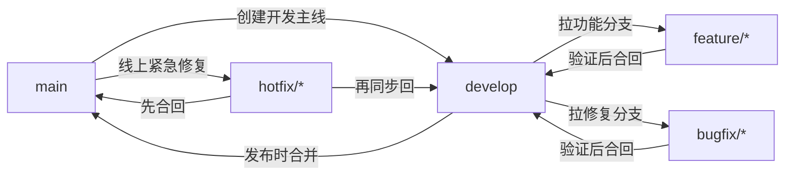

# Git个人使用规范

## 快速索引 🧭

- [📍 文档定位](#文档定位)
- [📐 规范说明](#规范说明)
- [🧠 术语约定](#术语约定)
- [💻 代码示例约定](#代码示例约定)
- [🔀 交叉阅读入口](#交叉阅读入口-)
- [🌿 分支管理规范](#分支管理规范)
- [✅ 提交规范](#提交规范)
- [🚶 单人开发流程](#单人开发流程)
- [🪜 个人使用 SOP](#个人使用-sop)
- [🧯 冲突处理规范](#冲突处理规范)
- [🧩 配套规范](#配套规范)
- [🤝 小型协作规范](#小型协作规范)
- [📚 参考来源](#参考来源)
- [📌 当前状态](#当前状态)
- [🗂️ 返回 `docs/` 目录导航页](./README.md)

## 文档定位

本手册用于沉淀一套面向个人成长的 Git 使用规范。它的目标不是复刻腾讯、字节、谷歌等公司的未公开内部制度，而是基于公开可验证的官方文档、开源贡献指南和业界常见实践，整理出一套适合个人项目与小型协作长期坚持的 Git 行为规范。

这份规范重点解决三个问题：

- 让分支、提交、发布和协作行为更稳定，而不是想到哪做到哪
- 让自己的 Git 习惯更接近成熟工程团队的工作方式
- 让规范可以执行、可以检查、可以长期维护，而不是停留在口号

## 规范说明

### 1. 适用范围

本规范适用于以下场景：

- 个人长期维护的代码仓库
- 个人作品集、学习型项目、工具型项目
- 2 到 5 人左右的小型协作仓库
- 希望提前训练工程化 Git 习惯的开发者

本规范不追求覆盖以下场景：

- 大型企业内部权限流、代码冻结流、发布审批流
- 特定平台专属流程，如公司内部代码平台、内部机器人或内部制品系统
- 所有 Git 命令的完整说明

命令细节、参数说明和回滚命令的查阅，请优先回到 [Part 2《Git Reference手册》](./Git%20Reference手册.md)。

### 2. 规则分层

为避免“什么都重要，最后什么都落不下来”，本手册将规则分成三层：

- `硬性约束`：默认必须遵守，除非项目已有更明确的团队规则
- `推荐做法`：强烈建议长期坚持，用来培养更接近成熟团队的习惯
- `可选优化`：适合在你已经能稳定执行前两层规则后再引入

### 3. 来源边界

本手册中的规则来源分为三类：

- `官方公开依据`：例如 Git 官方文档、Google 官方公开文档
- `开源项目公开规范`：例如腾讯、字节开源项目公开的贡献指南
- `公开实践归纳`：基于多个公开来源抽象出的通用做法

如果某条规则找不到公开依据，就不会写成“腾讯/字节/谷歌都是这么做的”这种确定表述，而只会写成更保守的“适合个人训练的工程化做法”。

## 术语约定

为与其他 Part 保持一致，本手册默认统一使用以下写法：

- `工作区`：必要时补充 `working tree / working directory`
- `暂存区`：必要时补充 `index / staging area`
- `本地仓库`、`远程仓库`：正文优先使用中文，不混写成 `repository`
- `提交`、`分支`：正文优先使用中文，只在命令、报错、对象模型中保留 `commit`、`branch`
- `切换分支`：正文优先这样表述；涉及 `git checkout` 时，再明确写“检出（checkout）”
- `拉取请求（Pull Request, PR）/ 合并请求（Merge Request, MR）`：首次出现写全，后文可简写为 `PR / MR`

## 代码示例约定

为统一四个 Part 的代码块风格，本手册默认采用以下约定：

- 可直接执行的命令统一使用 `bash` 代码块
- 命名规范、提交信息模板、流程清单统一使用 `text` 代码块
- 流程图统一使用 `mermaid`
- 多步命令统一用 `# 1)`、`# 2)` 注释标明动作目的
- 示例优先覆盖真实协作场景，例如开发分支、发布、热修复、PR 自检，而不是只给最短命令

## 交叉阅读入口 🔀

本手册回答的是“应该怎样做更稳妥”，如果你还需要概念解释、命令写法或工具选型，可以直接联动到对应 Part：

| 当前阅读主题 | 建议联动 |
|------|------|
| 分支管理规范 | [Part 1 分支管理与协作](./Git学习手册.md#4-分支管理与协作)、[Part 2 分支与合并命令](./Git%20Reference手册.md#3-分支与合并命令) |
| 提交规范 | [Part 1 本地仓库核心操作](./Git学习手册.md#2-本地仓库核心操作)、[Part 2 本地仓库命令](./Git%20Reference手册.md#1-本地仓库命令) |
| 单人开发流程 | [Part 1 远程仓库基础交互](./Git学习手册.md#3-远程仓库基础交互)、[Part 2 远程仓库命令](./Git%20Reference手册.md#2-远程仓库命令) |
| 冲突处理规范 | [Part 1 冲突解决](./Git学习手册.md#6-冲突解决)、[Part 2 回滚与恢复命令](./Git%20Reference手册.md#4-回滚与恢复命令) |
| 配套规范 | [Part 4 自动化工具与脚本](./Git实用拓展手册.md#3-自动化工具与脚本)、[Part 4 大文件与敏感信息防护](./Git实用拓展手册.md#4-大文件与敏感信息防护) |
| 小型协作规范 | [Part 1 远程仓库基础交互](./Git学习手册.md#3-远程仓库基础交互)、[Part 4 命令行增强工具](./Git实用拓展手册.md#2-命令行增强工具) |

## 分支管理规范

### 1. 默认分支模型

本手册默认采用更接近公开大厂开源协作习惯的五类分支模型：

- `main`：稳定主线或发布主线
- `develop`：日常集成主线
- `feature/*`：功能开发分支
- `bugfix/*`：常规缺陷修复分支
- `hotfix/*`：线上紧急修复分支

说明：

- 部分公开项目使用 `dev` 作为开发主线名称。本手册统一使用 `develop` 讲解。
- 如果你所在仓库已经采用 `dev`，建议保留现有命名，不要在同一仓库里混用 `develop` 和 `dev`。
- 这不是所有公开项目唯一使用的分支模型。很多公开项目会直接使用 `main` 主线或 Fork + `main` 的协作方式。
- 本手册之所以默认采用 `main + develop + feature/bugfix/hotfix`，是因为它更适合个人训练“开发线、发布线、热修复线分离”的工程化习惯。

### 2. 分支职责

#### `main`

- `硬性约束`：`main` 只承接稳定版本、发布版本和紧急修复结果
- `硬性约束`：不直接在 `main` 上做日常功能开发
- `推荐做法`：只在准备发布、合并已验证内容或处理 `hotfix/*` 时修改 `main`

#### `develop`

- `硬性约束`：日常开发以 `develop` 作为默认集成主线
- `推荐做法`：功能分支和普通修复分支都从 `develop` 创建，再合回 `develop`
- `推荐做法`：开始工作前先同步 `develop`，减少分支长期漂移

#### `feature/*`

- `硬性约束`：一个功能一个分支，不把多个无关需求堆进同一条开发线
- `推荐做法`：命名使用 `feature/<topic>`，例如 `feature/auth-login`
- `推荐做法`：功能完成并验证后，尽快合回 `develop`

#### `bugfix/*`

- `硬性约束`：常规缺陷修复优先使用 `bugfix/<topic>`，不要和新功能混在一起
- `推荐做法`：命名使用 `bugfix/<topic>`，例如 `bugfix/api-timeout`
- `推荐做法`：修复时同步补充测试、回归验证或最小复现说明

#### `hotfix/*`

- `硬性约束`：生产问题或紧急线上问题从 `main` 拉出 `hotfix/<topic>`
- `硬性约束`：`hotfix/*` 修完后先回到 `main`，再同步回 `develop`
- `推荐做法`：命名使用 `hotfix/<topic>`，例如 `hotfix/login-crash`

### 3. 分支命名规则

- `硬性约束`：分支名统一使用小写字母
- `硬性约束`：单词之间使用短横线 `-`
- `硬性约束`：分支前缀必须表达职责，不使用 `test1`、`new-branch`、`tmp` 这类无意义名称
- `推荐做法`：topic 尽量短，只表达功能、问题或目标，不把完整需求句子塞进分支名

建议示例：

```text
feature/auth-login
feature/docs-navigation
bugfix/api-timeout
hotfix/payment-callback-error
```

不建议示例：

```text
mybranch
fix
test-20260405
feature/我先随便改改
```

### 4. 分支行为规则

- `硬性约束`：正常开发从 `develop` 拉分支，紧急修复从 `main` 拉 `hotfix/*`
- `硬性约束`：工作完成后及时删除已合并的功能分支和修复分支
- `推荐做法`：删除已合并分支时优先使用更安全的删除方式，不要默认使用强制删除
- `推荐做法`：公共分支默认不改写历史
- `推荐做法`：只在未共享的个人分支上谨慎使用 `rebase` 整理历史
- `可选优化`：临时实验可以使用 `temp/*` 本地分支，但不建议把它作为长期主规范的一部分

### 5. 分支流转图



## 提交规范

### 1. 提交信息格式

本手册默认采用结构化提交信息：

```text
type(scope): summary
```

如果当前改动没有清晰 scope，可以退化为：

```text
type: summary
```

说明：

- 这不是“谷歌、腾讯、字节统一官方格式”的断言
- 这是一种与公开开源实践兼容、适合长期维护和快速检索的结构化写法

### 2. 提交类型

建议优先使用以下高频类型：

- `feat`：新增功能
- `fix`：修复缺陷
- `docs`：文档修改
- `refactor`：重构但不改变外部行为
- `test`：测试补充或调整
- `chore`：杂项维护
- `perf`：性能优化
- `build`：构建流程相关
- `ci`：持续集成或自动化流程相关

示例：

```text
feat(auth): add login form validation
fix(api): handle empty response body
docs(git): add branch naming rules
test(parser): cover invalid token case
chore: update editorconfig
```

### 3. 提交摘要要求

- `硬性约束`：提交摘要使用英文短句
- `硬性约束`：摘要直接描述本次改动的核心意图
- `硬性约束`：不要使用 `update`、`misc`、`fix bug`、`临时修改` 这类低信息消息
- `推荐做法`：摘要保持简短，让人只看一眼就知道这次提交在做什么

### 4. 提交粒度要求

- `硬性约束`：一个提交尽量只表达一个明确意图
- `硬性约束`：不要把功能开发、无关重构、格式化清理和临时调试痕迹混在同一个提交里
- `推荐做法`：代码、测试、文档尽量形成闭环，相关改动放进同一组可理解的提交中
- `推荐做法`：大改动拆成多个可 review 的小提交，而不是最后一次性堆一个超大提交

更具体地说：

- 新增功能时，尽量同时补最小测试或使用说明
- 重命名和逻辑修改如果都很多，尽量拆开
- 纯格式化提交尽量单独提交，避免污染功能 diff

### 5. 提交前检查清单

每次提交前，至少完成以下动作：

1. 运行 `git status`，确认没有误带无关文件
2. 运行 `git diff --cached`，确认暂存区内容就是你想提交的内容
3. 运行必要的最小验证，例如测试、构建、lint 或关键功能手动验证
4. 自查是否误带密钥、令牌、环境文件、日志和临时截图
5. 检查提交信息是否表达了明确意图

推荐把这套检查理解成“提交前的小 review”。先自己把关，再把历史送进仓库。

## 单人开发流程

### 1. 默认开发闭环

单人项目也建议按更接近成熟团队的节奏工作，而不是直接在 `main` 上边改边提交。

默认流程如下：

1. 同步 `develop`
2. 从 `develop` 创建 `feature/*` 或 `bugfix/*`
3. 小步提交，必要时先补测试或文档
4. 本地自检通过后再合回 `develop`
5. 需要正式发布时，再从 `develop` 合到 `main`
6. 在 `main` 的发布点打附注标签 `vX.Y.Z`

### 2. 日常开发步骤

建议的最小流程：

```text
同步 develop
-> 创建 feature/* 或 bugfix/*
-> 开发与小步提交
-> 本地自检
-> 合回 develop
-> 删除已完成分支
```

对应的常见命令入口可参考 [Part 2《Git Reference手册》](./Git%20Reference手册.md#2-远程仓库命令) 与 [Part 2《Git Reference手册》中的分支与合并命令](./Git%20Reference手册.md#3-分支与合并命令)，不在本节重复展开所有参数。

如果你想直接照着命令走，可以用下面这个最小示例：

```bash
# 1) 先把 develop 同步到最新
git switch develop
git pull --ff-only origin develop

# 2) 从 develop 拉出一个主题明确的功能分支
git switch -c feature/docs-navigation

# 3) 开发过程中小步提交
git add docs/
git commit -m "docs(git): improve handbook navigation"

# 4) 提交前做最小自检
git status -sb
git diff --cached

# 5) 合回 develop，并删除已经完成的分支
git switch develop
git merge feature/docs-navigation
git branch -d feature/docs-navigation
```

说明：

- 这是单人项目和小型协作里都比较稳的默认闭环
- 如果远程存在受保护分支或必须走 PR，合回步骤应改为“推分支 + 发起 PR”

### 3. 发布流程

- `硬性约束`：正式发布只从 `develop` 合入 `main`
- `硬性约束`：发布标签只打在正式发布点
- `推荐做法`：优先使用附注标签，例如 `v1.2.0`
- `推荐做法`：轻量标签更适合临时标记，正式版本发布优先使用附注标签
- `推荐做法`：发布前做一次最小发布检查，包括版本号、变更范围、关键功能验证和文档同步

### 4. 热修复流程

当线上问题必须立即处理时：

1. 从 `main` 拉出 `hotfix/*`
2. 在 `hotfix/*` 上完成修复与最小验证
3. 合回 `main`
4. 为新的修复发布点打标签
5. 再把同样的修复同步回 `develop`

这一步非常关键。只合回 `main` 不同步回 `develop`，后面很容易再次把老问题带回来。

对应的最小命令示例：

```bash
# 1) 从 main 拉出热修复分支
git switch main
git pull --ff-only origin main
git switch -c hotfix/login-crash

# 2) 修复后提交
git add src/
git commit -m "fix(auth): handle login crash on empty token"

# 3) 先合回 main，准备发布
git switch main
git merge hotfix/login-crash
git tag -a v1.2.1 -m "Release version 1.2.1"

# 4) 再把同一修复同步回 develop，避免后续回归
git switch develop
git merge hotfix/login-crash
```

风险提示：

- 不要只修 `main` 不同步 `develop`
- 如果热修复已经推远程，后续同步和发布动作要遵循团队的分支保护规则

### 5. 关于 rebase 的边界

- `硬性约束`：不要默认改写公共分支历史
- `推荐做法`：只在未共享分支里使用 `rebase` 整理历史
- `推荐做法`：如果分支已经推送且他人可能依赖，优先使用 `merge` 或明确沟通后再改写

## 个人使用 SOP

这一章把前面的规则整理成一套可以直接参照执行的 Git SOP 范式。目标不是给出“唯一正确流程”，而是给出一份从项目开始、日常开发、协作合并、发布维护到异常处理都能落地的标准流程模板。个人、小团队和公司团队都可以以此为基线，再按自己的仓库规则做裁剪。

### 1. SOP 的定位与使用原则

- `硬性约束`：先判断当前仓库属于个人项目、小团队仓库，还是受公司流程约束的仓库，再套用对应级别的流程
- `硬性约束`：一旦目标仓库已有 `CONTRIBUTING.md`、受保护分支、CI、代码所有者或发布流程，优先遵循仓库规则
- `推荐做法`：把 SOP 理解为“从任务进入到安全合并、可持续维护”的整套闭环，而不是零散命令清单
- `推荐做法`：SOP 负责串起阶段；具体分支规则、提交规则、冲突规则和配套规则，继续联动本手册其他章节执行

### 2. 全流程总览

| 阶段 | 核心问题 | 关键产出 |
|------|------|------|
| 阶段 0 | 项目开始时怎么建仓与定规则 | 仓库、默认分支、忽略规则、基础文档 |
| 阶段 1 | 新任务来了怎么进入开发 | 任务记录、目标分支、开发分支 |
| 阶段 2 | 开发过程中怎么提交与同步 | 小步提交、同步主线、自检记录 |
| 阶段 3 | 开发完成后怎么流转 | PR / MR 或本地合并、验证结果、review 记录 |
| 阶段 4 | 怎么发布与打标签 | 合并结果、版本标签、发布说明 |
| 阶段 5 | 怎么做日常维护 | 依赖更新、文档修订、分支清理、周期检查 |
| 阶段 6 | 出问题时怎么处理 | hotfix、回滚、revert、异常记录 |

### 3. 三种适用场景

| 场景 | 核心目标 | 流程重点 | 默认门槛 |
|------|------|------|------|
| 个人开发 | 保持历史清晰、自己半年后还能接手 | 自检、可回看、可发布 | 最小验证、分支整洁、标签可追溯 |
| 小团队开发 | 保持协作透明、降低踩踏与返工 | PR / MR、review、基础 CI | 需求对齐、评审、合并前验证 |
| 大公司开发 | 保持可审计、可回滚、可规模化协作 | 工单流、受保护分支、审批与发布链路 | 工单关联、自动化检查、审批与回写 |

### 4. 阶段 0：项目开始与仓库初始化 SOP

适用问题：项目刚开始时，怎么建立仓库、默认分支和基础规范。

#### 4.1 初始化目标

- 建立一个可长期维护的仓库，而不是临时堆代码目录
- 在第一天就把分支、忽略规则、基础文档和发布入口定清楚
- 让后续个人开发、团队协作和公司接管都能平滑衔接

#### 4.2 标准初始化步骤

1. 创建远程仓库并明确默认分支，默认使用 `main`。
2. 初始化本地仓库，完成首个基础提交。
3. 建立基础文件：`README.md`、`.gitignore`、许可证文件（如需要）、环境示例文件（如需要）。
4. 明确是否启用 `develop` 作为日常集成分支；若启用，在项目早期就固定下来。
5. 约定分支命名、提交格式、标签格式和发布方式。
6. 如果是团队项目，补 `CONTRIBUTING.md`、PR 模板、Issue 模板或任务入口说明。
7. 如果是公司项目，再补充代码所有者、分支保护、CI、发布说明和回滚入口。

#### 4.3 三种场景的初始化差异

| 场景 | 初始化建议 |
|------|------|
| 个人开发 | 至少建立 `main`、`.gitignore`、`README.md`；项目稍有复杂度时再增加 `develop` |
| 小团队开发 | 建议一开始就建立 `main + develop`，并明确 `feature/*`、`bugfix/*`、`hotfix/*` 命名 |
| 大公司开发 | 除分支外，还应在项目开始就确定工单系统、代码所有者、CI、权限控制、发布责任人 |

#### 4.4 建仓完成前的检查清单

- `硬性约束`：默认分支名称、目标运行环境和基础忽略规则已经确定
- `硬性约束`：仓库中没有误提交的密钥、构建产物、临时日志和个人本地配置
- `推荐做法`：在首次提交中把“如何启动、如何提交、如何发布”写成最小说明
- `推荐做法`：如果项目将进入多人协作，尽早建立 PR / MR 入口和 review 责任边界

### 5. 阶段 1：任务进入与分支建立 SOP

适用问题：新需求、缺陷、重构或维护任务来了，怎么开始。

#### 5.1 标准步骤

1. 明确任务来源：个人待办、issue、工单、缺陷单或需求卡。
2. 判断任务类型：`feature`、`bugfix`、`hotfix`、`docs`、`chore`、`refactor`。
3. 选择目标主线：日常开发通常选 `develop`，正式发布和紧急修复通常选 `main`。
4. 同步目标主线到最新状态。
5. 从目标主线创建主题明确的工作分支。
6. 在开始编码前写下本次任务边界，避免一个分支塞多个主题。

#### 5.2 默认分支建立规则

```text
正式稳定线：main
日常集成线：develop
功能开发：feature/<topic>
常规修复：bugfix/<topic>
紧急修复：hotfix/<topic>
文档维护：docs/<topic>（可选）
杂项维护：chore/<topic>（可选）
```

#### 5.3 三种场景的任务进入方式

| 场景 | 任务入口 | 分支建立要求 |
|------|------|------|
| 个人开发 | `TODO.md`、笔记、issue | 可以轻量，但仍建议一任务一分支 |
| 小团队开发 | issue、任务卡、口头确认后落文档 | 必须写清目标分支、责任人和影响范围 |
| 大公司开发 | 工单、需求单、缺陷单、排期系统 | 必须关联工单号、版本信息、负责人和变更类型 |

#### 5.4 这一阶段常见错误

- 没同步主线就直接开分支
- 一个分支里同时做功能、修 bug、改文档和临时清理
- 分支名只写 `test`、`fix`、`tmp`，后续完全看不出用途
- 热修复从 `develop` 而不是 `main` 拉出，导致发布链路混乱

### 6. 阶段 2：开发中提交与同步 SOP

适用问题：开发过程中怎么提交、多久同步一次主线、遇到变化怎么办。

#### 6.1 标准步骤

1. 先在本地完成一个最小可解释改动。
2. 运行 `git status`，确认改动范围。
3. 只将本次任务相关文件加入暂存区。
4. 写清晰提交信息，尽量让每个提交都能单独解释。
5. 与主线保持同步，避免分支长期漂移。
6. 如果主线变化较大，优先尽早同步并处理冲突，而不是拖到合并前一起爆发。

#### 6.2 提交粒度 SOP

- `硬性约束`：一个提交只表达一个明确意图
- `硬性约束`：临时调试代码、打印日志和无关格式化不要混入正式提交
- `推荐做法`：功能改动与配套测试、文档说明尽量形成一个可理解的小闭环
- `推荐做法`：开发中可以有中间提交，但在进入 review 前至少保证历史可读

#### 6.3 同步主线 SOP

- `个人开发`：每次开始新一轮开发前同步一次目标主线；分支存活时间较长时，中途再同步一次
- `小团队开发`：每天开始前同步一次；涉及多人同改模块时，关键节点前主动同步
- `大公司开发`：按团队节奏同步受控主线；必要时配合合并队列、rebase 规则或自动更新机制

#### 6.4 开发中可能发生的情况

| 情况 | 处理方式 |
|------|------|
| 需求变大了 | 不继续往当前分支硬塞，拆成新任务或新分支 |
| 发现顺手还能修个别的小问题 | 只有在同一主题强相关时才顺带处理，否则另开分支 |
| 主线变化太大 | 先同步再继续开发，必要时暂停编码先消化冲突 |
| 提交写乱了 | 在未共享前可整理历史；已共享时优先补说明，不轻易改写公共历史 |
| 做到一半要切换任务 | 先提交、暂存或记录当前进度，不要让工作区长期处于不可恢复状态 |

#### 6.5 提交前最小检查

```text
git status
-> git diff --cached
-> 最小测试 / 构建 / lint / 手动验证
-> 检查敏感信息
-> 再提交
```

### 7. 阶段 3：开发完成、自检与提交流转 SOP

适用问题：开发做完后，怎么把变更安全地送入主线。

#### 7.1 标准步骤

1. 自查本次改动是否仍然符合任务边界。
2. 运行必要验证：测试、构建、lint、关键功能验收或文档检查。
3. 检查暂存区和最终 diff 是否干净。
4. 根据场景选择流转方式：个人项目可直接合回，小团队和公司通常走 PR / MR。
5. 合并前补齐说明：改了什么、怎么验证、还有什么风险。

#### 7.2 三种场景的提交流转差异

| 场景 | 推荐流转方式 |
|------|------|
| 个人开发 | 本地自检后直接合回 `develop`，发布时再合入 `main` |
| 小团队开发 | 推送分支，发起 PR / MR，等待 review 和基础 CI |
| 大公司开发 | 关联工单发起 PR，等待自动化检查、owner review、必要审批和合并队列 |

#### 7.3 PR / MR 说明最小模板

```text
变更主题：
影响范围：
验证方式：
风险与注意事项：
是否需要发布/回滚说明：
```

#### 7.4 合并前必须确认的事情

- `硬性约束`：目标分支正确，没有把日常开发误合到 `main`
- `硬性约束`：最终 diff 只包含本次任务相关内容
- `硬性约束`：测试、文档、配置和迁移说明没有明显缺口
- `推荐做法`：review 重点看行为变化、边界条件、回滚难度和是否引入敏感信息

### 8. 阶段 4：发布与版本管理 SOP

适用问题：准备发版时怎么合并、打标签、写发布说明。

#### 8.1 标准步骤

1. 确认本次发布来源于稳定的 `develop` 或团队规定的发布分支。
2. 汇总本次版本变更范围，确认没有混入未完成功能。
3. 执行发布前验证。
4. 合入 `main` 或目标发布分支。
5. 打正式版本标签，优先使用附注标签。
6. 写发布说明或变更摘要。
7. 推送代码与标签，并确保团队能追踪到本次发布点。

#### 8.2 三种场景的发布差异

| 场景 | 发布做法 |
|------|------|
| 个人开发 | 可以轻量，但至少保证标签、说明和关键功能自测 |
| 小团队开发 | 建议有版本说明、验证记录和发布后同步通知 |
| 大公司开发 | 往往需要发布窗口、审批、回滚方案、监控观察和变更回写 |

#### 8.3 发布前检查清单

- 版本号是否正确
- 标签名是否统一，如 `v1.2.0`
- 文档、配置、迁移脚本是否同步
- 是否有明确回滚路径
- 发布后由谁观察结果、谁负责热修复

### 9. 阶段 5：日常维护与长期维护 SOP

适用问题：不是新功能开发，而是持续维护仓库时怎么做。

#### 9.1 高低频维护动作

- 高频维护：修文档、补测试、更新依赖、清理分支、补忽略规则、修 CI
- 中频维护：整理提交历史、补发布说明、梳理目录、统一命名
- 低频但重要：检查敏感信息泄漏风险、淘汰废弃分支、审视分支模型是否仍适用

#### 9.2 维护类任务的标准步骤

1. 明确维护目标是文档、依赖、工具链、CI 还是安全问题。
2. 仍然按任务开分支，不直接在公共分支上边修边推。
3. 提交类型优先使用 `docs`、`chore`、`ci`、`build`、`test`。
4. 如果维护动作影响行为、构建或部署，必须补验证记录。
5. 合并后同步清理过期分支、过期标签说明或待办记录。

#### 9.3 长期维护检查项

- `推荐做法`：定期检查 `README.md`、贡献说明、启动方式是否仍然正确
- `推荐做法`：定期检查 `.gitignore`、密钥管理、环境示例文件是否仍然适配当前项目
- `推荐做法`：定期清理已合并分支和无意义标签，保持仓库整洁
- `推荐做法`：如果项目规模变了，及时升级 SOP，而不是继续沿用不合适的轻量流程

### 10. 阶段 6：热修复与异常处理 SOP

适用问题：线上事故、错误提交、敏感信息泄漏、合并后回归等异常情况怎么处理。

#### 10.1 热修复标准步骤

1. 从 `main` 拉出 `hotfix/*`。
2. 只修复当前事故所需的最小改动。
3. 做最小但可靠的验证。
4. 优先合回 `main` 并打修复标签。
5. 再把同一修复同步回 `develop`。
6. 补充事故记录、发布说明或回滚说明。

#### 10.2 常见异常与处理原则

| 异常情况 | 处理原则 |
|------|------|
| 误提交敏感信息 | 先阻止继续扩散，再旋转凭据，最后处理历史 |
| 合并后发现回归 | 优先 `revert` 或走团队回滚流程，不要在主线上继续临时堆修复 |
| 提交到错误分支 | 尽快停止传播，视是否共享决定是修正历史还是用新提交纠偏 |
| 分支长期不合并 | 重新评估是否拆分、关闭或重建，避免无限拖延 |
| 冲突复杂到看不懂 | 先停下来理解意图，必要时与相关人确认，不靠强制覆盖硬解 |

#### 10.3 异常处理的统一要求

- `硬性约束`：先控制影响范围，再处理历史整洁
- `硬性约束`：共享分支上的错误优先用可追踪方式修正，如 `revert`
- `推荐做法`：异常处理后补记录，让团队知道发生了什么、怎么修、以后怎么避免
- `推荐做法`：对于公司场景，优先遵循值班、审批、发布和事故复盘机制

### 11. 可直接套用的最小 SOP 模板

#### 11.1 个人项目模板

```text
建仓
-> main
-> README.md + .gitignore
-> 按需要建立 develop

日常开发
-> 从 develop 建 feature/* 或 bugfix/*
-> 小步提交
-> 本地自检
-> 合回 develop

发布
-> develop 合到 main
-> 打 vX.Y.Z 标签
-> 补发布说明
```

#### 11.2 小团队模板

```text
建仓
-> main + develop
-> 明确分支命名和提交规范
-> 建立 PR / MR 入口

日常开发
-> issue / 任务卡
-> feature/* 或 bugfix/*
-> 开发 + 自检
-> PR / MR
-> review + CI
-> 合回 develop

发布
-> develop -> main
-> 标签 + 发布说明 + 通知同步
```

#### 11.3 公司团队模板

```text
项目开始
-> 建仓 + 默认分支 + 权限 + CI + 代码所有者
-> 明确工单流、发布流、回滚流

日常开发
-> 领取工单
-> 建任务分支
-> 开发 + 测试 + 文档 + 配置说明
-> PR + 工单关联
-> 自动化检查 + owner review + 审批
-> 按规则合并

发布与维护
-> 发布队列 / 发布窗口
-> 标签 / 发布记录 / 监控观察
-> hotfix / rollback / 复盘
```

### 12. 使用这套 SOP 时的边界提醒

- 这套 SOP 是通用范式，不是替代团队现有规则的“万能模板”
- 个人项目可以先用轻量版，但一旦进入多人协作，应及时升级到 PR / MR 流程
- 小团队不要为了显得专业而堆过重审批，但也不要省掉 review、验证和记录
- 公司团队不要把内部复杂制度原样搬回个人项目，重点应学习其“可审计、可验证、可回滚”的方法

## 冲突处理规范

### 1. 冲突前

- `推荐做法`：开始新一轮开发前先同步 `develop`
- `推荐做法`：不要让功能分支长时间脱离主线
- `推荐做法`：多人协作时，涉及同一模块的大改动先沟通边界

### 2. 冲突中

发生冲突后，按工程动作处理，不要凭感觉乱试：

1. 先判断当前是 `merge` 还是 `rebase`
2. 运行 `git status`，锁定冲突文件
3. 打开冲突文件，理解双方改动意图
4. 手动整合为正确结果，而不是机械保留某一边
5. 删除冲突标记
6. 重新执行当前流程需要的后续命令

注意：

- 如果当前是合并流程，后续通常是继续提交流程
- 如果当前是 `rebase`，解决后通常需要继续 `rebase --continue`

### 3. 冲突后

- `硬性约束`：冲突解决后重新验证关键功能
- `硬性约束`：确认没有误删业务逻辑、测试或文档内容
- `推荐做法`：如果本次冲突本身有学习价值，可以补一条简短说明性提交或记录

### 4. 冲突处理禁忌

- `硬性约束`：没看懂两边改动意图时，不要草率保留某一边
- `硬性约束`：不要把强制覆盖当成冲突解决方案
- `推荐做法`：如果冲突涉及重要业务逻辑，先看历史、issue 或与协作方沟通

## 配套规范

### 1. `.gitignore`

- `硬性约束`：仓库尽早建立并维护 `.gitignore`
- `硬性约束`：编辑器配置、构建产物、日志、缓存、临时文件、环境文件按需忽略
- `推荐做法`：每次新增工具链或生成目录后，顺手检查是否要更新 `.gitignore`

### 2. 敏感信息

- `硬性约束`：不提交密钥、令牌、证书、生产配置、私有环境文件
- `硬性约束`：如果误提交，先停止继续传播，再旋转凭据，最后处理仓库历史
- `推荐做法`：把本地环境变量文件默认加入忽略规则，例如 `.env`、`.env.local`

### 3. 文档与测试

- `硬性约束`：新增文件结构、命令入口、公共接口或 API 变化时，同步补文档
- `推荐做法`：修复 bug 时补最小复现或回归测试
- `推荐做法`：提交前至少完成与你这次改动强相关的最小验证

### 4. 标签与发布

- `硬性约束`：正式发布才打版本标签
- `推荐做法`：使用附注标签而不是随手创建轻量标签
- `推荐做法`：标签名统一使用语义化版本，例如 `v1.0.0`

## 小型协作规范

这一节只保留高频、轻量、适合小团队执行的规则，不扩展成大型组织流程手册。

### 1. 开工前

- `硬性约束`：开始工作前先同步目标主线。默认开发同步 `develop`，发布和热修复场景同步 `main`
- `推荐做法`：大改动先开 issue，至少先沟通目标、边界和影响范围
- `推荐做法`：一个分支只处理一个主题，避免“顺手再改一点”

### 2. 提交与拉取请求 / 合并请求（PR / MR）

- `硬性约束`：日常功能和常规修复优先提交到 `develop`
- `硬性约束`：不要直接把日常开发改动推向 `main`
- `推荐做法`：PR / MR 保持小而完整，便于 review
- `推荐做法`：PR / MR 标题和说明写清变更主题、影响范围和验证方式
- `推荐做法`：提交前确认 tests/docs 已补齐或明确说明为什么暂不补
- `推荐做法`：如果项目有 lint 或格式化检查，把它视为合并前的常规检查项

### 3. 合并规则

- `硬性约束`：`main` 只承接发布与热修复
- `推荐做法`：合并前先自查 diff、提交信息、测试结果和敏感信息
- `推荐做法`：合并后及时删除已完成分支，保持仓库干净

### 4. Fork 协作的最小流程

如果项目采用 GitHub 常见的 Fork 模式，可以按下面的最小闭环执行：

```text
fork repository
-> 创建分支
-> 提交并推送
-> 发起 PR
-> 评审并更新
-> merge
```

这里的重点不是“流程看起来完整”，而是保证每次改动都能被追踪、被 review、被验证。

对应的最小命令示例：

```bash
# 1) 从自己的 fork 拉代码
git clone <your-fork-url>
cd <repo-dir>

# 2) 从主仓库同步上游远程
git remote add upstream <upstream-repo-url>
git fetch upstream

# 3) 基于目标主线创建功能分支
git switch main
git pull --ff-only upstream main
git switch -c feature/fix-doc-typo

# 4) 提交并推到自己的 fork
git add docs/
git commit -m "docs: fix handbook typo"
git push -u origin feature/fix-doc-typo
```

说明：

- 后续通常是在 GitHub 页面或 `gh pr create` 中发起 PR
- 如果目标仓库要求从 `develop` 或其他分支提 PR，应把上面的 `main` 换成对应目标分支

### 5. 目标仓库规范优先

- `硬性约束`：如果目标仓库已经提供 `CONTRIBUTING.md`、PR 模板或分支规则，优先遵循目标仓库规范
- `推荐做法`：把本手册当成个人默认习惯，而不是覆盖所有外部项目的统一规则
- `推荐做法`：对于外部开源贡献，先确认目标仓库要求你从哪条分支创建分支、向哪条分支提 PR，再开始开发

## 参考来源

### 官方公开依据

- [Git 官方文档](https://git-scm.com/doc)
- [Google Style Guides](https://google.github.io/styleguide/)
- [Google Open Source - Patching](https://opensource.google/docs/patching/)

### 开源项目公开规范

- [Tencent CodeAnalysis 贡献指南](https://tencent.github.io/CodeAnalysis/zh/community/contribute.html)
- [Tencent CodeAnalysis PR 操作流程](https://tencent.github.io/CodeAnalysis/zh/community/pr.html)
- [ByteDance Protenix-Dock CONTRIBUTING](https://github.com/bytedance/Protenix-Dock/blob/main/CONTRIBUTING.md)
- [ByteDance-Seed cudaLLM CONTRIBUTING](https://github.com/ByteDance-Seed/cudaLLM/blob/main/CONTRIBUTING.md)

### 使用说明

- 本手册中的“大厂实践”默认指公开可验证的开源规范与公开文档，而不是未公开的内部制度。
- 如果未来补充新的公开来源，应优先更新本节，再调整正文结论。

### 这些来源主要支撑的规则

- Git 官方文档：支撑“公共历史不要随意改写”“已合并分支优先安全删除”“发布优先使用附注标签”等规则
- Google Open Source 文档：支撑“大改动前先提 issue 或先讨论范围”的规则
- 腾讯公开贡献文档：支撑“稳定分支与开发分支分层”“日常改动不要直接提交到稳定主线”的思路
- 字节开源贡献文档：支撑“小 PR、更清晰的主题描述、功能 owner 对文档和测试负责”的规则

## 当前状态

- 当前已完成 Part 3 全量初稿
- 后续重点转向跨文档术语统一、交叉引用和来源持续校验
