# Git学习手册

## 快速索引 🧭

- [📍 文档定位](#文档定位)
- [👀 目标读者](#目标读者)
- [🆕 当前版本说明](#当前版本说明)
- [🧠 术语约定](#术语约定)
- [💻 代码示例约定](#代码示例约定)
- [1️⃣ Git 简介与安装配置](#1-git-简介与安装配置)
- [2️⃣ 本地仓库核心操作](#2-本地仓库核心操作)
- [3️⃣ 远程仓库基础交互](#3-远程仓库基础交互)
- [4️⃣ 分支管理与协作](#4-分支管理与协作)
- [5️⃣ 回滚、撤销与恢复](#5-回滚撤销与恢复)
- [6️⃣ 冲突解决](#6-冲突解决)
- [7️⃣ 标签与版本标记](#7-标签与版本标记)
- [8️⃣ Git 原理](#8-git-原理)
- [9️⃣ 常见问题排查](#9-常见问题排查)
- [📝 写作要求](#写作要求)
- [📌 当前状态](#当前状态)
- [🗂️ 返回 `docs/` 目录导航页](./README.md)

## 文档定位

本手册面向 Git 学习路径，重点解决“从入门到进阶如何建立完整认知”的问题。内容会覆盖基础命令、远程协作、分支管理、回滚恢复、冲突处理和底层原理。

## 目标读者

- 刚开始系统学习 Git 的开发者
- 已会基础命令，但缺少知识结构的人
- 希望把 Git 用法和原理真正串起来的读者

## 当前版本说明

当前版本已经完成 Part 1 的全量初稿，覆盖以下内容：

- Git 简介与安装配置
- 本地仓库核心操作
- 远程仓库基础交互
- 分支管理与协作
- 回滚、撤销与恢复
- 冲突解决
- 标签与版本标记
- Git 原理
- 常见问题排查

本阶段目标已经从“先完成基础闭环”升级为“形成一份可阅读、可继续打磨的完整 Part 1 初稿”。后续重点将放在案例深化、图示优化、链接核验和术语统一上。

## 术语约定

为避免四个 Part 对同一概念换着叫，本仓库默认统一使用以下写法：

- `工作区`：必要时补充 `working tree / working directory`
- `暂存区`：必要时补充 `index / staging area`
- `本地仓库`、`远程仓库`：正文优先使用中文，不混写成 `repository`
- `提交`、`分支`：正文优先使用中文，只在命令、报错、对象模型中保留 `commit`、`branch`
- `切换分支`：正文优先这样表述；涉及 `git checkout` 时，再明确写“检出（checkout）”
- `拉取请求（Pull Request, PR）/ 合并请求（Merge Request, MR）`：首次出现写全，后文可简写为 `PR / MR`

## 代码示例约定

为统一四个 Part 的代码块风格，本手册默认采用以下约定：

- 可直接执行的命令统一使用 `bash` 代码块
- 命令输出、命名示例、流程清单统一使用 `text` 代码块
- 图示统一使用 `mermaid`
- 多步命令统一在代码块内使用 `# 1)`、`# 2)` 这类注释说明步骤意图
- 占位符统一使用 `<repo-url>`、`<branch-name>`、`<tag-name>`、`<commit-hash>`、`<path>` 这类写法
- 命令块外优先补充 `适用场景`、`预期结果`、`说明`、`风险提示`，避免只贴命令不解释上下文

## 1. Git 简介与安装配置

### 模块目标

- 理解 Git 的核心定位与优势
- 知道 Git 与 SVN 这类集中式版本控制工具的关键差异
- 完成 Git 安装与最基础的全局配置
- 为后续“本地提交 -> 远程同步”打好环境基础

### 专业讲解

Git 是一个分布式版本控制系统。它的核心职责不是“帮你备份文件”这么简单，而是帮助你记录文件历史、管理多人修改、快速切换分支，并在需要时回到任意一个历史状态。

和传统集中式版本控制工具相比，Git 有几个特别重要的特点：

- 本地仓库是完整的，离线也能查看历史、创建提交、切换分支
- 版本记录以提交快照为核心，而不是只依赖中央服务器保存历史
- 分支创建和切换成本低，适合并行开发和功能隔离
- 与 GitHub、GitLab、Gitee 等远程平台结合后，可以形成完整协作流程

Git 与 SVN 的区别，可以先抓住这几点：

| 维度 | Git | SVN |
|------|-----|-----|
| 架构 | 分布式 | 集中式 |
| 本地历史 | 本地仓库可保留完整历史 | 主要依赖中心服务器 |
| 分支成本 | 低，适合频繁使用 | 相对更重 |
| 离线能力 | 强 | 较弱 |
| 协作方式 | 更灵活，适合现代开发流 | 更偏集中管理 |

安装 Git 时，建议先确认三件事：

1. 是否已经安装 Git
2. 命令行是否可直接执行 `git`
3. 当前 Git 版本是否满足 `2.23+`

安装完成后，最常见的基础配置有四类：

- 提交身份：`user.name`、`user.email`
- 默认编辑器：`core.editor`
- 默认初始分支名：`init.defaultBranch`
- 全局配置查看：`git config --global --list`

其中：

- `user.name` 和 `user.email` 会写入提交记录
- `core.editor` 决定 Git 在需要编辑提交信息时调用哪个编辑器
- `init.defaultBranch` 影响新仓库初始化后的默认分支名

### 通俗解读

可以把 Git 理解成一个“带时间机器的项目历史管理器”。

- `git init` 像是在项目目录里装上一套历史记录系统
- `git add` 像把准备提交的文件先放进购物车
- `git commit` 像拍下一张当前状态的快照，并写下说明
- 远程仓库像一个共享的同步中心，但你的本地仓库本身也很完整

Git 和普通网盘同步的最大区别在于：它不只是保存“最新版文件”，而是保存“每次变更的可追踪历史”。

### 高频示例

#### 1. 检查 Git 是否安装成功

```bash
git --version
```

预期结果：

- 能看到类似 `git version 2.xx.x` 的输出

#### 2. 配置提交身份

```bash
git config --global user.name "Your Name"
git config --global user.email "you@example.com"
```

#### 3. 配置默认编辑器

如果你使用 VS Code，可以这样设置：

```bash
git config --global core.editor "code --wait"
```

如果你更习惯 Vim，也可以保持默认或显式设置：

```bash
git config --global core.editor "vim"
```

#### 4. 配置新仓库默认分支名

```bash
git config --global init.defaultBranch main
```

#### 5. 查看当前全局配置

```bash
git config --global --list
```

### 图示

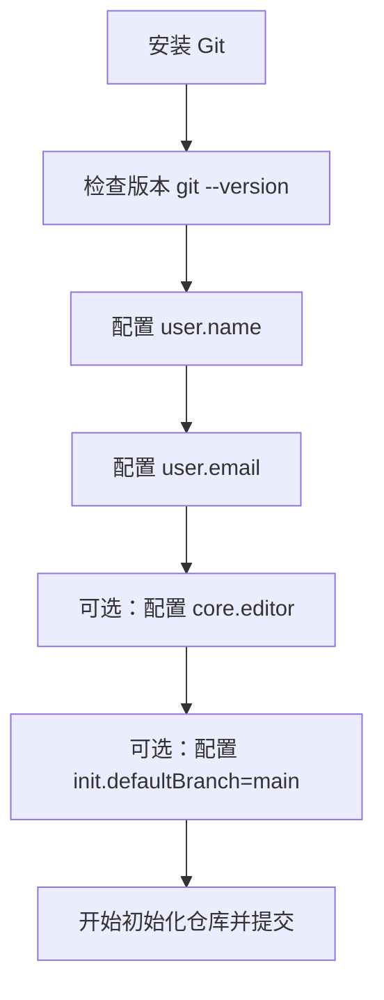

### 风险与注意事项

- `--global` 会影响当前用户下的所有 Git 仓库，配置前先确认你是否真的想全局生效。
- `user.email` 会进入提交历史；如果仓库会公开，请使用你愿意公开展示的邮箱。
- `init.defaultBranch` 只影响新初始化的仓库，不会自动改掉已经存在仓库的分支名。
- Windows、macOS、Linux 的安装方式不同，但安装完成后的大多数 Git 命令是一致的。
- 如果 `code --wait` 无法使用，通常说明 VS Code 命令行工具还没有加入 PATH。

### 参考链接

- [Git 官方下载页](https://git-scm.com/downloads)
- [Pro Git: What is Git?](https://git-scm.com/book/en/v2/Getting-Started-What-is-Git%3F)
- [git-config 官方文档](https://git-scm.com/docs/git-config)
- [git-init 官方文档](https://git-scm.com/docs/git-init)

## 2. 本地仓库核心操作

### 模块目标

- 理解工作区、暂存区和本地仓库的关系
- 掌握本地开发最常见的 Git 基础命令
- 能独立完成一次最小提交闭环

### 专业讲解

在 Git 的本地工作流中，最需要先建立的概念是这三个区域：

- 工作区：你实际看到和编辑的文件
- 暂存区：准备进入下一次提交的内容集合
- 本地仓库：已经写入历史的提交记录

这三个区域对应的常见命令如下：

| 命令 | 作用 |
|------|------|
| `git init` | 创建一个新的 Git 仓库 |
| `git status` | 查看当前工作区和暂存区状态 |
| `git add` | 将改动加入暂存区 |
| `git commit` | 把暂存区内容记录为一次提交 |
| `git log` | 查看提交历史 |
| `git diff` | 查看差异 |

其中有两个新手最容易混淆的点：

1. `git commit` 默认只提交已经暂存的内容
2. `git diff` 查看的是差异，但“查看工作区差异”和“查看暂存区差异”不是同一个场景

常见理解方式可以这样记：

- 改文件后，变化先出现在工作区
- `git add` 后，变化进入暂存区
- `git commit` 后，变化进入本地历史

### 通俗解读

把本地 Git 操作想成“整理要寄出的包裹”会比较容易：

- 工作区是你桌上正在改的文件
- 暂存区像你已经放进包裹箱、准备寄出的内容
- 提交记录像已经寄出的、有时间戳的包裹快照

所以 `git add` 不是“提交”，而是“把要提交的内容先装箱”；`git commit` 才是真正把这一箱内容记入历史。

### 高频示例

下面用一个更接近日常工作的流程演示本地提交闭环。示例默认适用于 Bash / Git Bash / PowerShell。

#### 1. 初始化仓库并创建第一次提交

适用场景：

- 新建一个本地项目
- 希望在第一次提交前就把主分支名和提交内容整理清楚

```bash
# 1) 初始化仓库，并把默认分支直接设为 main
git init -b main

# 2) 先看当前状态，确认哪些文件还没进入跟踪
git status

# 3) 只暂存这次准备提交的文件，避免把无关文件一起带进去
git add README.md .gitignore

# 4) 提交前先看一眼暂存区 diff，确认这次提交到底会写进什么
git diff --cached

# 5) 创建第一次提交
git commit -m "docs: add initial project docs"
```

说明：

- 如果你还没准备好 `.gitignore`，至少先不要把日志、缓存、环境文件误加入暂存区
- `git diff --cached` 是生产中非常值得养成的习惯，它能明显减少误提交

#### 2. 只暂存本次真正想提交的改动

适用场景：

- 一个文件里同时混有“想提交”和“还不想提交”的修改
- 你希望把提交切得更小、更可 review

```bash
# 1) 先看工作区里到底改了什么
git status

# 2) 交互式选择要进入本次提交的代码片段
git add -p

# 3) 再看一次暂存区差异，确认已经切分干净
git diff --cached
```

说明：

- `git add -p` 特别适合把“功能代码”和“顺手格式化”拆开
- 如果你直接执行 `git add .`，这类精细控制通常就做不到了

#### 3. 查看历史与排查当前状态

适用场景：

- 想确认最近几次提交长什么样
- 想快速判断当前工作区、暂存区、历史三者之间的关系

```bash
# 1) 看当前状态：是否有未跟踪、未暂存、已暂存的内容
git status -sb

# 2) 看工作区里尚未暂存的改动
git diff

# 3) 看已经暂存、但还没提交的改动
git diff --cached

# 4) 用图形化单行日志快速建立历史上下文
git log --oneline --graph --decorate -5
```

预期结果：

- `git status -sb` 能帮助你第一时间知道当前在哪个分支、工作区是否干净
- `git diff` 和 `git diff --cached` 配合使用，能避免“我明明改了，为什么没进 commit”这类问题

### 图示

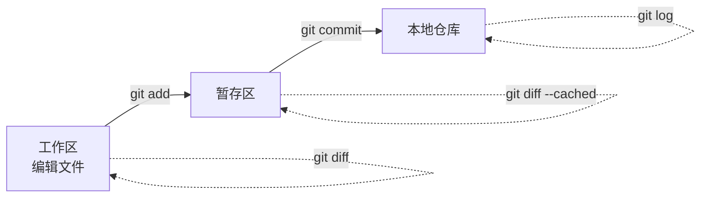

补充一个更贴近 Git 历史视角的图示：

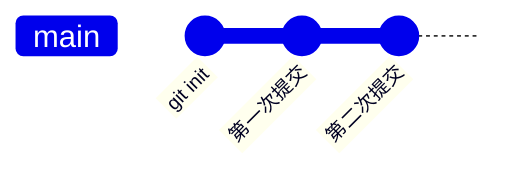

### 风险与注意事项

- `git add .` 很方便，但也很容易把你本来不想提交的文件一起放进暂存区。
- `git commit -m` 的提交信息应该描述这次改动的核心意图，不建议写成含糊的“update”“fix bug”。
- `git diff` 默认看的是工作区和暂存区之间的差异，不等于“所有差异”。
- Windows 下经常会遇到换行符差异问题，后续可以结合 `.gitattributes` 或 Git 配置进一步规范。
- 如果你执行了 `git commit` 却发现改动没进去，第一时间先检查是不是忘记执行 `git add`。

### 参考链接

- [git-init 官方文档](https://git-scm.com/docs/git-init)
- [git-add 官方文档](https://git-scm.com/docs/git-add)
- [git-commit 官方文档](https://git-scm.com/docs/git-commit)
- [git-status 官方文档](https://git-scm.com/docs/git-status)
- [git-log 官方文档](https://git-scm.com/docs/git-log)
- [git-diff 官方文档](https://git-scm.com/docs/git-diff)
- [Pro Git: Recording Changes to the Repository](https://git-scm.com/book/en/v2/Git-Basics-Recording-Changes-to-the-Repository)

## 3. 远程仓库基础交互

### 模块目标

- 理解远程仓库在 Git 协作中的作用
- 掌握 `clone`、`remote`、`pull`、`push` 的基础用法
- 建立 SSH 连接 GitHub 的基础认知
- 能完成一次最基本的本地与远程同步

### 专业讲解

Git 是分布式版本控制系统，但这不意味着远程仓库不重要。远程仓库的主要价值在于：

- 作为团队协作的共享同步点
- 作为备份和代码托管中心
- 承接拉取请求 / 合并请求（PR / MR）、代码审查、CI 等协作流程

几个高频命令的职责可以这样理解：

| 命令 | 作用 |
|------|------|
| `git clone` | 从远程复制一个已有仓库到本地 |
| `git remote` | 查看、添加、修改远程仓库地址 |
| `git pull` | 拉取并整合远程更新 |
| `git push` | 把本地提交推送到远程 |

其中：

- `clone` 适合“从零拿到一个已有仓库”
- `remote add origin ...` 适合“本地已有仓库，后面再关联远程”
- `pull` 本质上是“获取更新 + 合并/变基”
- `push` 只会推送已经存在于本地提交历史中的内容

远程连接常见有两种方式：

- HTTPS：配置简单，但通常需要用户名和令牌
- SSH：初次配置多一步，但之后更顺手，适合长期使用

如果你长期使用 GitHub，通常更推荐 SSH 方式。

### 通俗解读

可以把远程仓库理解成一个“共享的同步中心”：

- `git clone` 是把远程项目完整拷到本地
- `git pull` 是把别人已经同步到云端的新内容拉下来
- `git push` 是把你本地已经整理好的提交同步上去

但 Git 和网盘不一样的一点在于：它同步的不是单纯的文件最新版，而是带历史结构的提交记录。

### 高频示例

#### 1. 首次克隆并确认远程信息

适用场景：

- 第一次接手一个远程仓库
- 希望确认后续 `pull / push` 连到的是正确地址

```bash
# 1) 通过 SSH 克隆仓库
git clone git@github.com:your-name/git-demo.git

# 2) 进入仓库目录
cd git-demo

# 3) 查看远程地址，确认 origin 是否配置正确
git remote -v
```

说明：

- 如果团队统一使用 SSH，就尽量不要再混用 HTTPS
- 克隆后第一件事就看 `git remote -v`，可以少掉很多后面才发现“推错仓库”的问题

#### 2. 本地已有仓库时补远程并建立上游

适用场景：

- 本地项目原本没有远程
- 现在准备同步到 GitHub / GitLab / Gitee 等平台

```bash
# 1) 给当前仓库添加默认远程 origin
git remote add origin git@github.com:your-name/git-demo.git

# 2) 确认当前分支名，避免把错误分支推上去
git branch --show-current

# 3) 首次推送并建立上游关系
git push -u origin main
```

说明：

- 加上 `-u` 之后，后续同一分支通常只需要 `git push` / `git pull`
- 如果远程地址写错，优先用 `git remote set-url origin <repo-url>` 修正，不要反复猜

#### 3. 日常同步远程更新

适用场景：

- 开始工作前先同步远程
- 推送前确认自己不是落后状态

```bash
# 1) 先把远程更新拿到本地，但先不自动整合
git fetch origin

# 2) 用状态和日志确认自己是否落后
git status -sb
git log --oneline --graph --decorate --all -8

# 3) 确认无误后，再拉取并整合远程更新
git pull --ff-only
```

风险提示：

- `git pull` 不是单纯“下载最新代码”，它会直接尝试整合
- 如果你想先观察再整合，生产中更稳的顺序通常是 `fetch -> 看状态 -> 再 pull`

#### 4. GitHub SSH 最小配置流程

适用场景：

- 第一次在当前机器上接 GitHub SSH
- 想避免每次推送都输入账号密码或令牌

```bash
# 1) 生成新的 SSH 密钥
ssh-keygen -t ed25519 -C "you@example.com"

# 2) 查看公钥内容，准备复制到 GitHub
cat ~/.ssh/id_ed25519.pub

# 3) 添加完成后测试 SSH 连通性
ssh -T git@github.com
```

说明：

- Windows 用户在 Git Bash 中可以直接使用 `cat`；如果是 PowerShell，可改用 `Get-Content $HOME/.ssh/id_ed25519.pub`
- 如果你的公司机器有统一密钥管理要求，应优先遵循公司规范

### 图示

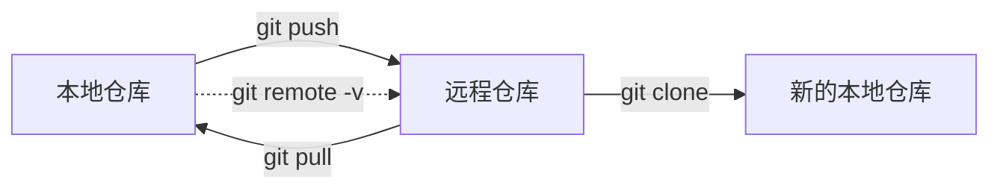

### 风险与注意事项

- `git push` 推送的是本地已经提交的历史，不会自动带上“尚未提交的改动”。
- 如果远程比你本地更新，`git push` 可能会被拒绝；这通常不是 Git 出错，而是在保护远程历史。
- `git pull` 可能触发合并或冲突，基础版先理解入口，详细冲突处理放到后续章节展开。
- 如果同一个仓库一会儿用 HTTPS、一会儿用 SSH，排查问题时容易混乱，建议固定一种方式。
- 首次使用 SSH 时，最常见的问题不是 Git 命令本身，而是密钥没生成、没添加到账号，或者没有正确加载。

### 参考链接

- [git-clone 官方文档](https://git-scm.com/docs/git-clone)
- [git-remote 官方文档](https://git-scm.com/docs/git-remote)
- [git-pull 官方文档](https://git-scm.com/docs/git-pull)
- [git-push 官方文档](https://git-scm.com/docs/git-push)
- [GitHub Docs: Connecting to GitHub with SSH](https://docs.github.com/en/authentication/connecting-to-github-with-ssh)

## 4. 分支管理与协作

### 模块目标

- 理解分支在 Git 中的核心作用
- 掌握 `git branch`、`git switch`、`git checkout`、`git merge`、`git rebase`、`git stash` 的基础用法
- 建立“功能分支开发 -> 合并回主线”的基本工作流认知
- 知道 `merge` 和 `rebase` 的基础区别与使用边界

### 专业讲解

Git 分支本质上是“指向某个提交的可移动引用”。这也是为什么 Git 分支创建和切换速度很快，因为大多数时候它并不是在复制整份项目，而是在移动指针。

分支的核心价值主要体现在三类场景：

- 功能隔离：一个功能一个分支，避免不同改动混在一起
- 并行开发：多人可以同时在不同分支上推进工作
- 风险控制：实验性改动、临时修复、正式主线可以分开管理

几个高频命令的职责可以这样理解：

| 命令 | 作用 |
|------|------|
| `git branch` | 创建、查看、删除分支 |
| `git switch` | 切换分支，或创建并切换到新分支 |
| `git checkout` | 历史兼容命令，可用于切换分支或恢复文件 |
| `git merge` | 将一个分支的提交整合到当前分支 |
| `git rebase` | 改变当前分支的基底，让提交“接到”新的起点上 |
| `git stash` | 临时保存当前未提交的改动，便于切换上下文 |

本手册遵循开发方案中的命令表述策略：

- 正文优先使用 `git switch`
- `git checkout` 只作为兼容命令补充说明

`merge` 和 `rebase` 的基础区别可以先这样理解：

- `merge` 更像“把两条开发线汇合起来”，通常会保留分叉历史
- `rebase` 更像“把你的提交整体挪到新的起点后面”，历史会更线性

在日常开发里，可以先掌握一个基础判断：

- 公共分支、更稳定的协作场景，优先理解和使用 `merge`
- 个人本地整理提交历史时，再谨慎使用 `rebase`

`stash` 的典型场景是：你改到一半，突然需要切到别的分支处理问题，但当前修改还不适合提交。这时可以先暂存，再切走，回来后再恢复。

### 通俗解读

可以把分支理解成“同一个项目的平行工作线”。

- `main` 像正式主线
- `feature/xxx` 像你正在单独推进的一个功能支线
- 当支线完成后，再把它合回主线

`merge` 和 `rebase` 可以用两种形象方式来记：

- `merge` 像两条路在前面汇合
- `rebase` 像把你这条路整体搬到另一条路后面重新接上

而 `stash` 更像“把桌面上做到一半的东西临时收进抽屉”，这样你可以先去处理别的任务，回来再继续。

### 高频示例

#### 1. 标准功能分支工作流

适用场景：

- 从主线拉功能分支
- 开发完成后再合回主线

```bash
# 1) 先切回主线，并同步远程最新状态
git switch main
git pull --ff-only origin main

# 2) 从最新主线创建功能分支
git switch -c feature/user-login

# 3) 开发过程中按小步提交推进
git add src/auth.js
git commit -m "feat(auth): add login handler"

# 4) 功能完成后切回主线并合并
git switch main
git merge feature/user-login

# 5) 合并完成后删除本地功能分支
git branch -d feature/user-login
```

说明：

- 这是最容易理解、也最适合大多数团队默认采用的主线 + 功能分支模式
- 如果团队要求保留独立合并记录，可以改用 `git merge --no-ff feature/user-login`

#### 2. 用 `rebase` 让个人分支跟上主线

适用场景：

- 功能分支还没合并
- 你想先把自己的提交整理到最新主线之后

```bash
# 1) 在功能分支上先拿到远程主线最新提交
git fetch origin

# 2) 把当前分支的提交重放到 origin/main 之后
git rebase origin/main
```

风险提示：

- 如果这个分支已经推送并且别人正在协作，先确认团队是否允许改写历史
- `rebase` 后如果需要推远程，通常要重新推送，甚至可能涉及 `--force-with-lease`

#### 3. 临时切任务前先保存现场

适用场景：

- 改到一半要去处理线上问题
- 当前改动还不适合提交

```bash
# 1) 给 stash 写清楚说明，避免后面忘记它是什么
git stash push -u -m "wip: login form"

# 2) 查看当前 stash 列表
git stash list

# 3) 处理完别的任务后恢复现场
git stash pop
```

说明：

- `-u` 可以把未跟踪文件一起纳入 stash
- 如果你不确定恢复时是否要删除 stash 记录，先用 `git stash apply` 更稳

#### 4. 兼容旧版本 Git 的分支切换写法

```bash
# 新版 Git 推荐写法
git switch -c feature/user-login

# 历史兼容写法
git checkout -b feature/user-login
```

### 图示

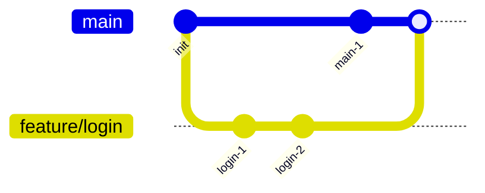

### 风险与注意事项

- `git switch` 是更适合新手理解的切换命令；`git checkout` 功能更杂，学习初期不要把它当成唯一入口。
- `git merge` 可能触发冲突；如果冲突出现，不要急着用强制手段覆盖历史。
- `git rebase` 会改写提交历史。已经推送到公共分支的历史，不建议随意 rebase。
- `git stash` 只是临时保存现场，不是长期备份方案；stash 太多时容易忘记内容来源。
- 删除分支前先确认该分支是否真的已经合并，优先使用 `git branch -d`，不要默认使用更激进的删除方式。

### 参考链接

- [git-branch 官方文档](https://git-scm.com/docs/git-branch)
- [git-switch 官方文档](https://git-scm.com/docs/git-switch)
- [git-checkout 官方文档](https://git-scm.com/docs/git-checkout)
- [git-merge 官方文档](https://git-scm.com/docs/git-merge)
- [git-rebase 官方文档](https://git-scm.com/docs/git-rebase)
- [git-stash 官方文档](https://git-scm.com/docs/git-stash)
- [Learn Git Branching](https://learngitbranching.js.org/)

## 5. 回滚、撤销与恢复

### 模块目标

- 理解 `git reset`、`git revert`、`git restore`、`git commit --amend` 的职责差异
- 能区分“撤销工作区改动”“撤销暂存”“撤销提交”“修正最近一次提交”
- 建立先判断场景、再选择命令的习惯
- 对高风险回滚命令保持明确警惕

### 专业讲解

Git 中“回滚、撤销、恢复”是最容易混淆的一组操作，因为它们看起来都像在“后退”，但作用层级并不一样。

可以先按对象来分：

- 工作区文件：你当前正在编辑但还没提交的内容
- 暂存区内容：已经 `add`，准备提交的内容
- 提交历史：已经写进仓库历史的提交

这几个高频命令分别更适合处理不同层级的问题：

| 命令 | 更适合解决的问题 |
|------|------------------|
| `git restore` | 恢复工作区或暂存区中的文件内容 |
| `git reset` | 重置暂存区状态，或让当前分支回到某个提交 |
| `git revert` | 用一个新提交撤销某个旧提交的影响 |
| `git commit --amend` | 修改最近一次提交的内容或提交信息 |

这四个命令里，最需要先建立边界意识的是：

- `git restore` 更偏向“把文件恢复成某个状态”
- `git reset` 更偏向“重置 HEAD 或暂存区状态”
- `git revert` 更偏向“保留历史，但新增一个反向提交”
- `git commit --amend` 更偏向“修改最近一次提交”

`git reset` 之所以容易出问题，是因为不同模式影响范围不同：

- `--soft`：移动 `HEAD`，保留暂存区和工作区
- `--mixed`：移动 `HEAD` 并重置暂存区，默认模式
- `--hard`：移动 `HEAD`，并重置暂存区和工作区

其中 `--hard` 风险最大，因为它会直接覆盖工作区未提交改动。

`git revert` 的思路和 `reset` 完全不同。它不会把历史“删掉”，而是新增一个提交，把旧提交带来的改动反向抵消。也正因为这样，它通常更适合已经共享出去的历史。

`git commit --amend` 常见于两种场景：

- 刚提交完，发现提交信息写错
- 刚提交完，发现漏了一个小文件或一个小改动

但它也会改写最近一次提交的提交对象，因此如果这次提交已经推送到公共分支，后续处理要更谨慎。

### 通俗解读

这几个命令可以先用一句话区分：

- `restore`：把文件状态“恢复回去”
- `reset`：把当前进度“退回去”
- `revert`：不删历史，而是“做一个反向操作”
- `amend`：把最近一次提交“改一下”

如果用生活化比喻：

- `restore` 像把草稿恢复成之前保存的版本
- `reset` 像把当前进度条往回拨
- `revert` 像在记录本上补写一条“撤销上一条决定”
- `amend` 像刚发出去一封邮件，马上补发修正版并替换最新版本

初学阶段可以优先记一个安全原则：

- 没共享出去的本地历史，更适合用 `reset`、`restore`、`amend`
- 已经共享出去的历史，更适合优先考虑 `revert`

### 高频示例

#### 1. 只恢复文件，不动提交历史

适用场景：

- 文件内容改乱了
- 你还不想碰历史层面的回退

```bash
# 1) 恢复工作区里的文件内容，回到当前暂存区版本
git restore README.md

# 2) 如果这个文件只是暂存错了，把它从暂存区拿出来
git restore --staged README.md
```

说明：

- 这是处理“文件改坏 / 暂存错了”最稳的入口
- 如果你真正想处理的是“某次提交”，不要直接跳到 `reset --hard`

#### 2. 修改最近一次提交，但保留其余历史不变

适用场景：

- 提交信息写错
- 漏了一个文件或一个小改动

```bash
# 1) 先把漏掉的文件补进暂存区
git add README.md

# 2) 保留原提交信息，只把内容补进最近一次提交
git commit --amend --no-edit

# 3) 如果只是提交信息写错，也可以直接改 message
git commit --amend -m "docs: refine git basics section"
```

风险提示：

- 如果最近一次提交已经推送到公共分支，执行前先确认是否允许改写历史

#### 3. 重做最近一次本地提交

适用场景：

- 最近一次提交的拆分方式不满意
- 这些历史还没有共享给别人

```bash
# 1) 回退一个提交，但把改动保留在暂存区，适合重新提交
git reset --soft HEAD~1

# 2) 如果你想把改动退回工作区、重新选择暂存内容
git reset --mixed HEAD~1
```

说明：

- `--soft` 更适合“提交内容没问题，只想重写提交”
- `--mixed` 更适合“我要重新挑哪些改动进入下一次提交”

#### 4. 用新提交撤销共享历史

适用场景：

- 某次错误提交已经推到远程
- 你希望保留历史链路，避免直接改写公共历史

```bash
# 1) 先确认工作区是干净的
git status

# 2) 用一个新提交撤销最近一次提交
git revert HEAD

# 3) 如果想一次撤销多次提交，可以明确指定提交哈希
git revert <commit-hash>
```

说明：

- 生产协作里，`revert` 往往比 `reset` 更安全
- 因为它不会把旧历史抹掉，而是留下可追踪的撤销记录

### 图示

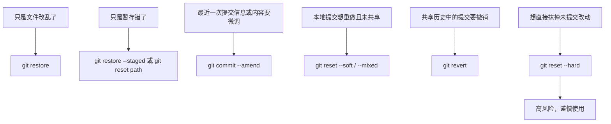

如果从提交历史的角度看，`revert` 更适合这样理解：

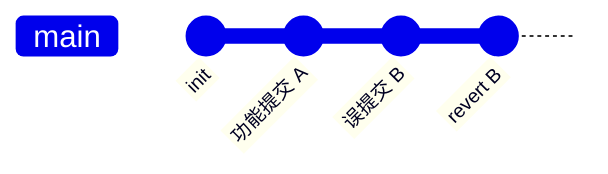

这张图想表达的是：`revert` 不会抹掉旧提交，而是在历史后面新增一个“反向提交”。

### 风险与注意事项

- `git reset --hard` 会直接覆盖工作区和暂存区内容。在不确定后果前，不要轻易使用。
- `git revert` 通常要求工作区干净，先确认没有未提交改动再执行会更稳妥。
- `git commit --amend` 会改写最近一次提交；如果这次提交已经推送到公共分支，要先确认是否允许改写历史。
- `git restore` 更适合处理文件级恢复；如果你真正想处理的是“提交历史”，不要误用它。
- 当你分不清该用 `reset` 还是 `revert` 时，可以先问自己一个问题：这段历史是否已经共享给别人。

### 参考链接

- [git-reset 官方文档](https://git-scm.com/docs/git-reset)
- [git-revert 官方文档](https://git-scm.com/docs/git-revert)
- [git-restore 官方文档](https://git-scm.com/docs/git-restore)
- [git-commit 官方文档](https://git-scm.com/docs/git-commit)
- [Pro Git: Undoing Things](https://git-scm.com/book/en/v2/Git-Basics-Undoing-Things)

## 6. 冲突解决

### 模块目标

- 理解 Git 冲突为什么会发生
- 认识最常见的冲突标记和排查入口
- 掌握基础冲突解决流程
- 建立减少冲突的工作习惯

### 专业讲解

Git 冲突通常发生在“Git 无法自动判断应该保留哪一份修改”的时候。最常见的场景有两类：

- 你在合并分支时，两个分支都改了同一个文件的同一部分
- 你在拉取远程更新或执行 rebase 时，本地修改和上游修改发生了重叠

冲突不是仓库损坏，也不代表 Git 失效。它的真正含义是：自动合并到这里为止已经不够安全，必须由你来决定最终保留什么内容。

Git 常见的冲突入口包括：

- `git merge`
- `git pull`
- `git rebase`
- `git stash pop`

当冲突发生后，通常会看到以下特征：

- `git status` 提示存在 unmerged paths
- 文件中出现冲突标记，如 `<<<<<<<`、`=======`、`>>>>>>>`
- Git 阻止你直接继续提交，直到冲突被解决

一个最基础的冲突解决流程通常是：

1. 用 `git status` 确认哪些文件冲突
2. 打开冲突文件，阅读标记内容
3. 手动决定保留哪部分内容，或整合为新的最终版本
4. 删除冲突标记
5. 再次 `git add`
6. 根据当前流程继续 merge / rebase / commit

需要特别注意的是：`merge` 和 `rebase` 的冲突后续命令并不完全一样。

- 合并冲突解决后，通常继续正常提交流程
- rebase 冲突解决后，经常需要执行 `git rebase --continue`

### 通俗解读

可以把冲突想成“两个人同时改了同一段内容，Git 不敢替你拍板”。

比如：

- 你把一段文字改成了 A
- 别人把同一段文字改成了 B
- Git 知道这里变了，但它不知道最后应该保留 A、B，还是你们两者的组合

所以 Git 会先把选择权交给你，而不是擅自覆盖其中一边。

### 高频示例

#### 1. 查看当前有哪些冲突文件

```bash
# 先看有哪些文件冲突，以及当前是在 merge 还是 rebase 流程里
git status
```

你通常会看到类似：

- `both modified`
- `unmerged paths`

#### 2. 识别文件中的冲突标记

冲突文件里常见结构如下：

```text
<<<<<<< HEAD
当前分支中的内容
=======
另一边带来的内容
>>>>>>> feature/xxx
```

说明：

- `<<<<<<< HEAD` 到 `=======` 之间，通常是当前分支版本
- `=======` 到 `>>>>>>> ...` 之间，通常是另一边的版本

#### 3. 合并冲突后的最小处理流程

```bash
# 1) 先确认冲突文件列表
git status

# 2) 手动编辑冲突文件，删除冲突标记后重新加入暂存区
git add conflicted-file.txt

# 3) 提交这次合并结果
git commit
```

#### 4. rebase 冲突后的最小处理流程

```bash
# 1) 先确认当前 rebase 停在什么位置
git status

# 2) 手动编辑冲突文件，删除冲突标记后重新加入暂存区
git add conflicted-file.txt

# 3) 继续本次 rebase
git rebase --continue
```

如果你决定这次 rebase 不继续了，也可以中止：

```bash
git rebase --abort
```

#### 5. 合并流程想放弃时

如果当前是一次正在进行中的 merge，也可以中止：

```bash
git merge --abort
```

补充一个更接近生产排障的冲突处理顺序：

```bash
# 1) 先确认冲突文件列表和当前流程状态
git status

# 2) 必要时看一下双方最近提交，先理解冲突为什么发生
git log --oneline --graph --decorate -10

# 3) 解决冲突后重新加入暂存区
git add <path>

# 4) 根据当前流程决定继续、提交，还是直接中止
git rebase --continue
# 或
git commit
# 或
git merge --abort
```

### 图示

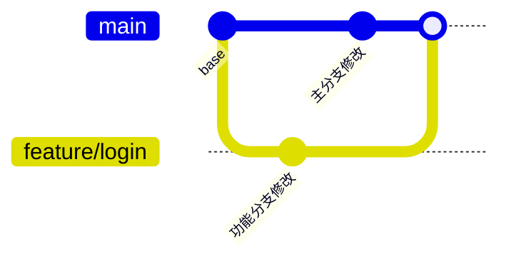

上面的图表示“两边都继续向前走，然后在整合时相遇”。如果双方修改刚好重叠到同一段内容，就容易在 `merge`、`pull` 或 `rebase` 阶段出现冲突。

### 风险与注意事项

- 解决冲突时不要只删除标记却忘了检查最终内容是否正确。
- 冲突解决完后，最好重新运行相关测试或最小验证，确认功能没有被手动合并过程破坏。
- `git merge --abort` 和 `git rebase --abort` 适合“本次整合先取消”，不要混用。
- 冲突不是异常情况，而是多人协作和历史整合中的正常入口，关键是按流程处理。
- 如果你不理解两边修改意图，优先先看提交历史或与协作方沟通，不要盲目保留其中一边。

### 参考链接

- [git-merge 官方文档](https://git-scm.com/docs/git-merge)
- [git-rebase 官方文档](https://git-scm.com/docs/git-rebase)
- [git-status 官方文档](https://git-scm.com/docs/git-status)
- [Pro Git: Basic Branching and Merging](https://git-scm.com/book/en/v2/Git-Branching-Basic-Branching-and-Merging)

## 7. 标签与版本标记

### 模块目标

- 理解标签在 Git 中的定位
- 掌握轻量标签与附注标签的基本区别
- 能为版本发布创建、查看、删除和推送标签
- 建立“标签用于标记版本点”的基本意识

### 专业讲解

标签（tag）用于给某个特定提交打上一个更稳定、更容易识别的名字。它最常见的用途是：

- 标记版本发布点，例如 `v1.0.0`
- 快速定位某个里程碑提交
- 配合发布说明、归档和回溯使用

Git 中最常见的两类标签是：

- 轻量标签：更像一个简单的别名，直接指向某个提交
- 附注标签：除了指向提交，还包含标签名、说明、创建者、日期等元信息

在实际项目里，版本发布通常更推荐使用附注标签，因为它信息更完整，也更适合长期维护。

高频命令包括：

| 命令 | 作用 |
|------|------|
| `git tag` | 查看标签 |
| `git tag v1.0.0` | 创建轻量标签 |
| `git tag -a v1.0.0 -m "..."` | 创建附注标签 |
| `git tag -d v1.0.0` | 删除本地标签 |
| `git push origin v1.0.0` | 推送指定标签到远程 |
| `git fetch --tags` | 拉取远程标签 |

### 通俗解读

可以把标签理解成“给某个历史提交贴一个正式名字”。

比如：

- 你平时提交很多次，提交 hash 不容易记
- 但当一个版本准备发布时，你可以给它贴上 `v1.0.0`
- 以后别人一看到这个标签，就知道这是一个正式版本点

所以标签不是用来替代分支的，而是用来标记“某个已经确定的重要历史位置”。

### 高频示例

#### 1. 为正式发布创建附注标签并推到远程

适用场景：

- 一个版本已经准备发布
- 你希望标签里带上明确说明，而不是只给一个名字

```bash
# 1) 先确认当前提交就是你要发布的位置
git log --oneline -1

# 2) 创建附注标签
git tag -a v1.0.0 -m "Release version 1.0.0"

# 3) 推送该标签到远程
git push origin v1.0.0
```

#### 2. 查看和同步标签

```bash
# 查看本地所有标签
git tag

# 查看某个标签对应的详细信息
git show v1.0.0

# 把远程标签同步到本地
git fetch --tags
```

#### 3. 删除本地标签

```bash
# 删除本地标签
git tag -d v1.0.0
```

说明：

- 正式发布优先用附注标签；轻量标签更适合临时标记
- 删除本地标签不会自动删除远程同名标签

### 图示

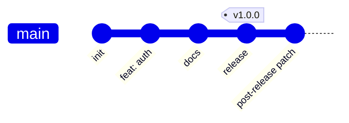

这张图可以帮助理解标签的本质：标签是贴在某个既定提交上的名字，而不是会继续向前移动的分支。

### 风险与注意事项

- 标签本身不是分支，不会随着后续提交自动向前移动。
- 发布标签建议使用附注标签，避免只留下一个过于简陋的名字引用。
- 如果某个标签已经公开给团队或用户，不要随意删除再重建，否则会造成版本混乱。
- 删除本地标签不会自动删除远程标签，它们是两件事。
- 标签命名建议尽量统一，例如使用 `v1.0.0` 这种格式。

### 参考链接

- [git-tag 官方文档](https://git-scm.com/docs/git-tag)
- [Pro Git: Tagging](https://git-scm.com/book/en/v2/Git-Basics-Tagging)

## 8. Git 原理

### 模块目标

- 建立 Git 底层模型的基础认知
- 理解工作区、暂存区、本地仓库和远程仓库之间的关系
- 理解 blob、tree、提交对象（commit）、标签对象（tag）这些核心对象的职责
- 知道 Git 为什么适合分支和分布式协作

### 专业讲解

如果只停留在“会敲命令”，很多 Git 问题会显得很抽象；但一旦理解了它的底层模型，很多现象就会更容易解释。

先抓住三个最重要的区域：

- 工作区（working tree / working directory）：你眼前正在编辑的文件
- 暂存区（index / staging area）：下一次提交准备写入的内容
- 本地仓库（repository）：已经记录下来的提交历史和对象

远程仓库并不是 Git 的“唯一大脑”，而更像是分布式协作中的共享同步点。本地仓库本身就能独立保存完整历史。

Git 中最核心的对象通常可以先理解为四种：

| 对象 | 作用 |
|------|------|
| blob | 保存文件内容 |
| tree | 保存目录结构以及目录中对象的指向关系 |
| 提交对象（commit） | 保存一次提交的元信息，并指向对应的 tree |
| 标签对象（tag） | 给某个对象起一个稳定名字，常见于版本标记 |

从用户理解层面看，Git 的版本控制更接近“快照模型”：

- 每次提交都可以理解为“当前项目状态的一次快照”
- 提交之间形成链式结构
- 分支本质上只是指向某个提交的引用

这也是为什么：

- 创建分支通常很快
- 切换分支通常也很快
- `HEAD` 可以理解为“当前你所在位置”的一个特殊指针

如果从分布式角度理解 Git，可以先记住：

- 每个本地仓库都能独立工作
- `clone` 会把历史复制到本地
- `fetch/pull/push` 只是不同形式的同步
- 没网时你依然可以本地提交、建分支、查历史

关于对象哈希，还可以知道一个基础事实：

- Git 历史上长期使用 `SHA-1`
- 新仓库或启用相关格式扩展时也可能使用 `SHA-256`
- 具体以本机仓库格式和当前 Git 版本文档为准

### 通俗解读

可以把 Git 的底层理解成“项目快照仓库”：

- blob 像一份文件内容
- tree 像一层目录清单
- 提交对象（commit）像一条带说明的快照记录
- 分支指针（branch）像贴在某条记录上的标签箭头
- HEAD 像你当前正站着的位置

这样再回头看前面的命令就会更清楚：

- `git add` 是把工作区内容准备进下一次快照
- `git commit` 是正式生成一条新的历史记录
- `git branch` 不是复制项目，而是新建一个指向历史位置的名字

### 高频示例

#### 1. 查看当前仓库使用的对象格式

```bash
git rev-parse --show-object-format
```

#### 2. 查看提交历史的图形化结构

```bash
git log --oneline --graph --decorate
```

#### 3. 查看某次提交的详细内容

```bash
git show HEAD
```

#### 4. 查看 `.git` 目录

```bash
ls .git
```

说明：

- Windows 用户如果在 PowerShell 中，可以使用 `Get-ChildItem .git`
- 这里不要求记住所有内部文件，只要知道本地仓库的大部分历史数据都在 `.git` 中

### 图示

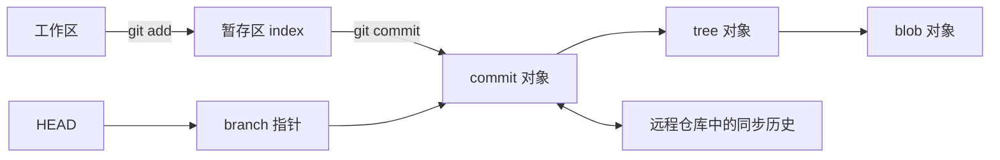

如果只看提交历史和分支指针，可以进一步把 Git 想成下面这样：

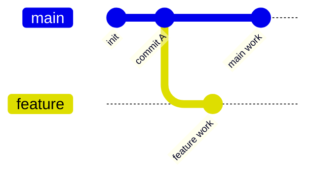

这张图能帮助理解：分支不是复制整个项目，而是在同一份历史上分出不同的提交路线。

### 风险与注意事项

- 学习 Git 原理的目标是帮助你理解使用行为，不是要求你立刻掌握所有内部对象细节。
- “Git 是快照模型”是理解层面的主线，不必纠结底层存储实现中的所有压缩细节。
- `.git` 目录非常重要，但不要随意手工修改其中内容。
- 如果你一开始觉得 blob、tree、提交对象（commit）很抽象，先建立角色分工认知就够了，后续再逐步深入。

### 参考链接

- [Pro Git: What is Git?](https://git-scm.com/book/en/v2/Getting-Started-What-is-Git%3F)
- [Pro Git: Git Objects](https://git-scm.com/book/en/v2/Git-Internals-Git-Objects)
- [Pro Git: Branches in a Nutshell](https://git-scm.com/book/en/v2/Git-Branching-Branches-in-a-Nutshell)
- [git-rev-parse 官方文档](https://git-scm.com/docs/git-rev-parse)
- [git-show 官方文档](https://git-scm.com/docs/git-show)

## 9. 常见问题排查

### 模块目标

- 帮助新手先解决最容易遇到的基础错误
- 建立“先判断问题发生在哪个阶段”的排查习惯
- 为后续更复杂的冲突与恢复章节预留入口

### 专业讲解

Git 问题通常可以先按发生阶段分类：

- 仓库初始化阶段：是否在 Git 仓库里、当前目录是否正确
- 本地提交阶段：文件有没有进入暂存区、身份配置是否齐全
- 远程交互阶段：远程地址是否正确、权限是否正常、远程历史是否领先

对新手来说，最常见的报错并不复杂，关键是不要一上来就用重命令“硬修”。先确认状态，再决定动作，通常更安全。

### 通俗解读

排查 Git 问题时，可以先问自己三个问题：

1. 我现在是在本地操作，还是在和远程交互？
2. 我的问题是“找不到仓库”、 “没提交上去”，还是“远程不同步”？
3. Git 给我的提示里，有没有直接告诉我下一步应该检查什么？

很多时候，`git status` 和 `git remote -v` 就已经能帮你定位一半问题。

### 高频示例

#### 1. `fatal: not a git repository`

常见原因：

- 当前目录不是 Git 仓库
- 你没有进入正确的项目目录

排查思路：

```bash
git status
```

如果仍提示不是仓库：

- 确认是否应该先进入项目目录
- 如果这是一个全新项目，先执行 `git init`

#### 2. `Author identity unknown` 或提交时提示缺少身份信息

常见原因：

- 没有配置 `user.name`
- 没有配置 `user.email`

解决方式：

```bash
git config --global user.name "Your Name"
git config --global user.email "you@example.com"
```

#### 3. `nothing to commit, working tree clean`

这通常不是报错，而是状态说明，表示：

- 当前没有未提交改动
- 或者你以为改了文件，但实际没有保存
- 或者你改了文件，但还没改到 Git 正在跟踪的内容

建议先执行：

```bash
git status
git diff
```

#### 4. `fatal: 'origin' does not appear to be a git repository`

常见原因：

- 远程地址写错
- 当前仓库根本还没有配置 `origin`
- 你没有访问对应远程仓库的权限

建议先检查：

```bash
git remote -v
```

如果没有 `origin`，可以重新添加：

```bash
git remote add origin git@github.com:your-name/git-demo.git
```

#### 5. `git push` 被拒绝

典型提示通常类似“rejected”或“non-fast-forward”。

常见原因：

- 远程分支已经有你本地没有的提交
- 你和其他人都在改同一分支，但你本地历史落后了

基础处理思路：

```bash
git pull
git push
```

如果 `pull` 过程中发生冲突，先不要急着强推，应该先解决冲突，再继续提交和推送。详细冲突处理会在后续章节展开。

#### 6. `git pull` 后出现冲突提示

基础版先记住处理入口：

1. 先执行 `git status`
2. 找到发生冲突的文件
3. 手动编辑冲突内容
4. 解决后重新 `git add`
5. 完成后继续提交或完成合并流程

这一块不在本轮详细展开，但你需要先知道：冲突不是“仓库坏了”，而是 Git 需要你手动决定保留哪部分修改。

### 风险与注意事项

- 遇到问题时，优先先看 `git status`，不要一上来就尝试危险命令。
- 在还没理解后果前，不要轻易使用 `git reset --hard`、强制推送等高风险操作。
- 远程地址错误和权限问题经常被误判成“Git 命令失效”，先分清是配置问题还是历史冲突问题。
- 如果问题涉及回滚、冲突、标签或底层原理，优先回到前面的对应章节定位，而不是只盯着报错文字。

### 参考链接

- [git-status 官方文档](https://git-scm.com/docs/git-status)
- [git-remote 官方文档](https://git-scm.com/docs/git-remote)
- [git-pull 官方文档](https://git-scm.com/docs/git-pull)
- [git-push 官方文档](https://git-scm.com/docs/git-push)
- [GitHub Docs: Connecting to GitHub with SSH](https://docs.github.com/en/authentication/connecting-to-github-with-ssh)

## 写作要求

- 每个核心知识点尽量包含“专业讲解 + 通俗解读 + 示例 + 图示 + 参考链接”
- 命令示例优先使用高频、可复现、接近日常工作流的场景
- 多步命令优先写成带步骤注释的 `bash` 代码块，并补齐适用场景、说明或风险提示
- 图示优先使用 Mermaid
- 涉及风险命令时必须标注注意事项

## 当前状态

- 当前已完成 Part 1 全量初稿
- 基础使用、分支管理、回滚恢复、冲突、标签和原理章节已补齐
- 后续重点转向案例深化、图示完善、参考链接核验和局部细化
