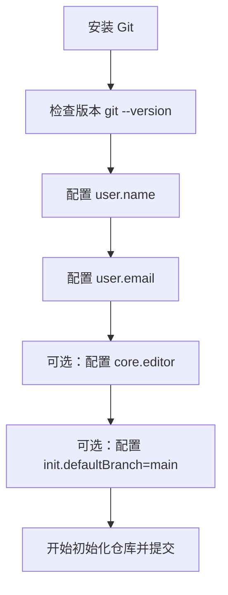
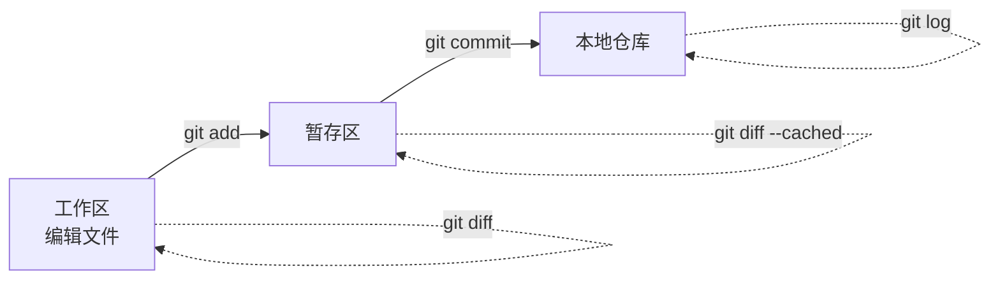
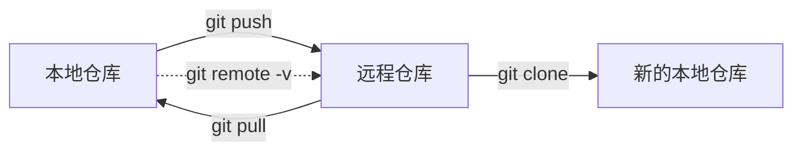

# Git学习手册

## 文档定位

本手册面向 Git 学习路径，重点解决“从入门到进阶如何建立完整认知”的问题。内容会覆盖基础命令、远程协作、分支管理、回滚恢复、冲突处理和底层原理。

## 目标读者

- 刚开始系统学习 Git 的开发者
- 已会基础命令，但缺少知识结构的人
- 希望把 Git 用法和原理真正串起来的读者

## 当前开发范围说明

本轮按照开发方案的 Phase 1 先交付基础使用闭环，优先补齐以下内容：

- Git 简介与安装配置
- 本地仓库核心操作
- 远程仓库基础交互
- 常见问题排查中的基础版内容

分支管理、回滚恢复、冲突解决、标签和原理章节暂保留稳定骨架，后续再继续补齐。

## 1. Git 简介与安装配置

### 模块目标

- 理解 Git 的核心定位与优势
- 知道 Git 与 SVN 这类集中式版本控制工具的关键差异
- 完成 Git 安装与最基础的全局配置
- 为后续“本地提交 -> 远程同步”打好环境基础

### 专业讲解

Git 是一个分布式版本控制系统。它的核心职责不是“帮你备份文件”这么简单，而是帮助你记录文件历史、管理多人修改、快速切换分支，并在需要时回到任意一个历史状态。

和传统集中式版本控制工具相比，Git 有几个特别重要的特点：

- 本地仓库是完整的，离线也能查看历史、创建提交、切换分支
- 版本记录以提交快照为核心，而不是只依赖中央服务器保存历史
- 分支创建和切换成本低，适合并行开发和功能隔离
- 与 GitHub、GitLab、Gitee 等远程平台结合后，可以形成完整协作流程

Git 与 SVN 的区别，可以先抓住这几点：

| 维度 | Git | SVN |
|------|-----|-----|
| 架构 | 分布式 | 集中式 |
| 本地历史 | 本地仓库可保留完整历史 | 主要依赖中心服务器 |
| 分支成本 | 低，适合频繁使用 | 相对更重 |
| 离线能力 | 强 | 较弱 |
| 协作方式 | 更灵活，适合现代开发流 | 更偏集中管理 |

安装 Git 时，建议先确认三件事：

1. 是否已经安装 Git
2. 命令行是否可直接执行 `git`
3. 当前 Git 版本是否满足 `2.23+`

安装完成后，最常见的基础配置有四类：

- 提交身份：`user.name`、`user.email`
- 默认编辑器：`core.editor`
- 默认初始分支名：`init.defaultBranch`
- 全局配置查看：`git config --global --list`

其中：

- `user.name` 和 `user.email` 会写入提交记录
- `core.editor` 决定 Git 在需要编辑提交信息时调用哪个编辑器
- `init.defaultBranch` 影响新仓库初始化后的默认分支名

### 通俗解读

可以把 Git 理解成一个“带时间机器的项目历史管理器”。

- `git init` 像是在项目目录里装上一套历史记录系统
- `git add` 像把准备提交的文件先放进购物车
- `git commit` 像拍下一张当前状态的快照，并写下说明
- 远程仓库像一个共享的同步中心，但你的本地仓库本身也很完整

Git 和普通网盘同步的最大区别在于：它不只是保存“最新版文件”，而是保存“每次变更的可追踪历史”。

### 高频示例

#### 1. 检查 Git 是否安装成功

```bash
git --version
```

预期结果：

- 能看到类似 `git version 2.xx.x` 的输出

#### 2. 配置提交身份

```bash
git config --global user.name "Your Name"
git config --global user.email "you@example.com"
```

#### 3. 配置默认编辑器

如果你使用 VS Code，可以这样设置：

```bash
git config --global core.editor "code --wait"
```

如果你更习惯 Vim，也可以保持默认或显式设置：

```bash
git config --global core.editor "vim"
```

#### 4. 配置新仓库默认分支名

```bash
git config --global init.defaultBranch main
```

#### 5. 查看当前全局配置

```bash
git config --global --list
```

### 图示



### 风险与注意事项

- `--global` 会影响当前用户下的所有 Git 仓库，配置前先确认你是否真的想全局生效。
- `user.email` 会进入提交历史；如果仓库会公开，请使用你愿意公开展示的邮箱。
- `init.defaultBranch` 只影响新初始化的仓库，不会自动改掉已经存在仓库的分支名。
- Windows、macOS、Linux 的安装方式不同，但安装完成后的大多数 Git 命令是一致的。
- 如果 `code --wait` 无法使用，通常说明 VS Code 命令行工具还没有加入 PATH。

### 参考链接

- [Git 官方下载页](https://git-scm.com/downloads)
- [Pro Git: What is Git?](https://git-scm.com/book/en/v2/Getting-Started-What-is-Git%3F)
- [git-config 官方文档](https://git-scm.com/docs/git-config)
- [git-init 官方文档](https://git-scm.com/docs/git-init)

## 2. 本地仓库核心操作

### 模块目标

- 理解工作区、暂存区和本地仓库的关系
- 掌握本地开发最常见的 Git 基础命令
- 能独立完成一次最小提交闭环

### 专业讲解

在 Git 的本地工作流中，最需要先建立的概念是这三个区域：

- 工作区：你实际看到和编辑的文件
- 暂存区：准备进入下一次提交的内容集合
- 本地仓库：已经写入历史的提交记录

这三个区域对应的常见命令如下：

| 命令 | 作用 |
|------|------|
| `git init` | 创建一个新的 Git 仓库 |
| `git status` | 查看当前工作区和暂存区状态 |
| `git add` | 将改动加入暂存区 |
| `git commit` | 把暂存区内容记录为一次提交 |
| `git log` | 查看提交历史 |
| `git diff` | 查看差异 |

其中有两个新手最容易混淆的点：

1. `git commit` 默认只提交已经暂存的内容
2. `git diff` 查看的是差异，但“查看工作区差异”和“查看暂存区差异”不是同一个场景

常见理解方式可以这样记：

- 改文件后，变化先出现在工作区
- `git add` 后，变化进入暂存区
- `git commit` 后，变化进入本地历史

### 通俗解读

把本地 Git 操作想成“整理要寄出的包裹”会比较容易：

- 工作区是你桌上正在改的文件
- 暂存区像你已经放进包裹箱、准备寄出的内容
- 提交记录像已经寄出的、有时间戳的包裹快照

所以 `git add` 不是“提交”，而是“把要提交的内容先装箱”；`git commit` 才是真正把这一箱内容记入历史。

### 高频示例

下面用一个最小流程演示本地提交闭环。

#### 1. 初始化仓库

```bash
git init
```

如果你希望初始化时就明确主分支名，也可以写成：

```bash
git init -b main
```

#### 2. 查看当前状态

```bash
git status
```

你通常会看到未跟踪文件、已修改文件或“nothing to commit”的状态提示。

#### 3. 把指定文件加入暂存区

```bash
git add README.md
```

如果你确认当前目录下的改动都应该进入下一次提交，也可以使用：

```bash
git add .
```

#### 4. 创建第一次提交

```bash
git commit -m "docs: add initial readme"
```

#### 5. 查看提交历史

```bash
git log --oneline --graph --decorate
```

#### 6. 查看尚未暂存的改动

```bash
git diff
```

#### 7. 查看已经暂存、但还没提交的改动

```bash
git diff --cached
```

### 图示



### 风险与注意事项

- `git add .` 很方便，但也很容易把你本来不想提交的文件一起放进暂存区。
- `git commit -m` 的提交信息应该描述这次改动的核心意图，不建议写成含糊的“update”“fix bug”。
- `git diff` 默认看的是工作区和暂存区之间的差异，不等于“所有差异”。
- Windows 下经常会遇到换行符差异问题，后续可以结合 `.gitattributes` 或 Git 配置进一步规范。
- 如果你执行了 `git commit` 却发现改动没进去，第一时间先检查是不是忘记执行 `git add`。

### 参考链接

- [git-init 官方文档](https://git-scm.com/docs/git-init)
- [git-add 官方文档](https://git-scm.com/docs/git-add)
- [git-commit 官方文档](https://git-scm.com/docs/git-commit)
- [git-status 官方文档](https://git-scm.com/docs/git-status)
- [git-log 官方文档](https://git-scm.com/docs/git-log)
- [git-diff 官方文档](https://git-scm.com/docs/git-diff)
- [Pro Git: Recording Changes to the Repository](https://git-scm.com/book/en/v2/Git-Basics-Recording-Changes-to-the-Repository)

## 3. 远程仓库基础交互

### 模块目标

- 理解远程仓库在 Git 协作中的作用
- 掌握 `clone`、`remote`、`pull`、`push` 的基础用法
- 建立 SSH 连接 GitHub 的基础认知
- 能完成一次最基本的本地与远程同步

### 专业讲解

Git 是分布式版本控制系统，但这不意味着远程仓库不重要。远程仓库的主要价值在于：

- 作为团队协作的共享同步点
- 作为备份和代码托管中心
- 承接 PR / MR、代码审查、CI 等协作流程

几个高频命令的职责可以这样理解：

| 命令 | 作用 |
|------|------|
| `git clone` | 从远程复制一个已有仓库到本地 |
| `git remote` | 查看、添加、修改远程仓库地址 |
| `git pull` | 拉取并整合远程更新 |
| `git push` | 把本地提交推送到远程 |

其中：

- `clone` 适合“从零拿到一个已有仓库”
- `remote add origin ...` 适合“本地已有仓库，后面再关联远程”
- `pull` 本质上是“获取更新 + 合并/变基”
- `push` 只会推送已经存在于本地提交历史中的内容

远程连接常见有两种方式：

- HTTPS：配置简单，但通常需要用户名和令牌
- SSH：初次配置多一步，但之后更顺手，适合长期使用

如果你长期使用 GitHub，通常更推荐 SSH 方式。

### 通俗解读

可以把远程仓库理解成一个“共享的同步中心”：

- `git clone` 是把远程项目完整拷到本地
- `git pull` 是把别人已经同步到云端的新内容拉下来
- `git push` 是把你本地已经整理好的提交同步上去

但 Git 和网盘不一样的一点在于：它同步的不是单纯的文件最新版，而是带历史结构的提交记录。

### 高频示例

#### 1. 克隆远程仓库到本地

```bash
git clone git@github.com:your-name/git-demo.git
cd git-demo
```

#### 2. 查看当前远程地址

```bash
git remote -v
```

#### 3. 为本地已有仓库添加远程

```bash
git remote add origin git@github.com:your-name/git-demo.git
```

#### 4. 首次推送当前分支并建立上游关系

```bash
git push -u origin main
```

加上 `-u` 后，后续你通常只需要执行：

```bash
git push
git pull
```

#### 5. 拉取远程最新提交

```bash
git pull
```

#### 6. GitHub SSH 基础流程

生成 SSH 密钥：

```bash
ssh-keygen -t ed25519 -C "you@example.com"
```

测试 SSH 连接：

```bash
ssh -T git@github.com
```

说明：

- Windows 用户可以在 Git Bash 中执行，也可以在启用了 OpenSSH 的 PowerShell 中执行
- 公钥通常位于 `~/.ssh/id_ed25519.pub`
- 将公钥添加到 GitHub 账号后，再测试 SSH 连接

### 图示



### 风险与注意事项

- `git push` 推送的是本地已经提交的历史，不会自动带上“尚未 commit 的改动”。
- 如果远程比你本地更新，`git push` 可能会被拒绝；这通常不是 Git 出错，而是在保护远程历史。
- `git pull` 可能触发合并或冲突，基础版先理解入口，详细冲突处理放到后续章节展开。
- 如果同一个仓库一会儿用 HTTPS、一会儿用 SSH，排查问题时容易混乱，建议固定一种方式。
- 首次使用 SSH 时，最常见的问题不是 Git 命令本身，而是密钥没生成、没添加到账号，或者没有正确加载。

### 参考链接

- [git-clone 官方文档](https://git-scm.com/docs/git-clone)
- [git-remote 官方文档](https://git-scm.com/docs/git-remote)
- [git-pull 官方文档](https://git-scm.com/docs/git-pull)
- [git-push 官方文档](https://git-scm.com/docs/git-push)
- [GitHub Docs: Connecting to GitHub with SSH](https://docs.github.com/en/authentication/connecting-to-github-with-ssh)

## 4. 分支管理与协作

本章节暂保留结构，后续将补齐 `branch`、`switch`、`checkout`、`merge`、`rebase`、`stash` 等内容，以及基础协作工作流。

## 5. 回滚、撤销与恢复

本章节暂保留结构，后续将补齐 `reset`、`revert`、`restore`、`commit --amend` 等内容，并重点说明风险边界。

## 6. 冲突解决

本章节暂保留结构，后续将补齐冲突产生原因、冲突查看、冲突处理流程和减少冲突的方法。

## 7. 标签与版本标记

本章节暂保留结构，后续将补齐 `git tag` 的基础用法与版本发布场景。

## 8. Git 原理

本章节暂保留结构，后续将补齐工作区、暂存区、本地仓库、对象模型、快照模型和分布式原理。

## 9. 常见问题排查

### 模块目标

- 帮助新手先解决最容易遇到的基础错误
- 建立“先判断问题发生在哪个阶段”的排查习惯
- 为后续更复杂的冲突与恢复章节预留入口

### 专业讲解

Git 问题通常可以先按发生阶段分类：

- 仓库初始化阶段：是否在 Git 仓库里、当前目录是否正确
- 本地提交阶段：文件有没有进入暂存区、身份配置是否齐全
- 远程交互阶段：远程地址是否正确、权限是否正常、远程历史是否领先

对新手来说，最常见的报错并不复杂，关键是不要一上来就用重命令“硬修”。先确认状态，再决定动作，通常更安全。

### 通俗解读

排查 Git 问题时，可以先问自己三个问题：

1. 我现在是在本地操作，还是在和远程交互？
2. 我的问题是“找不到仓库”、 “没提交上去”，还是“远程不同步”？
3. Git 给我的提示里，有没有直接告诉我下一步应该检查什么？

很多时候，`git status` 和 `git remote -v` 就已经能帮你定位一半问题。

### 高频示例

#### 1. `fatal: not a git repository`

常见原因：

- 当前目录不是 Git 仓库
- 你没有进入正确的项目目录

排查思路：

```bash
git status
```

如果仍提示不是仓库：

- 确认是否应该先进入项目目录
- 如果这是一个全新项目，先执行 `git init`

#### 2. `Author identity unknown` 或提交时提示缺少身份信息

常见原因：

- 没有配置 `user.name`
- 没有配置 `user.email`

解决方式：

```bash
git config --global user.name "Your Name"
git config --global user.email "you@example.com"
```

#### 3. `nothing to commit, working tree clean`

这通常不是报错，而是状态说明，表示：

- 当前没有未提交改动
- 或者你以为改了文件，但实际没有保存
- 或者你改了文件，但还没改到 Git 正在跟踪的内容

建议先执行：

```bash
git status
git diff
```

#### 4. `fatal: 'origin' does not appear to be a git repository`

常见原因：

- 远程地址写错
- 当前仓库根本还没有配置 `origin`
- 你没有访问对应远程仓库的权限

建议先检查：

```bash
git remote -v
```

如果没有 `origin`，可以重新添加：

```bash
git remote add origin git@github.com:your-name/git-demo.git
```

#### 5. `git push` 被拒绝

典型提示通常类似“rejected”或“non-fast-forward”。

常见原因：

- 远程分支已经有你本地没有的提交
- 你和其他人都在改同一分支，但你本地历史落后了

基础处理思路：

```bash
git pull
git push
```

如果 `pull` 过程中发生冲突，先不要急着强推，应该先解决冲突，再继续提交和推送。详细冲突处理会在后续章节展开。

#### 6. `git pull` 后出现冲突提示

基础版先记住处理入口：

1. 先执行 `git status`
2. 找到发生冲突的文件
3. 手动编辑冲突内容
4. 解决后重新 `git add`
5. 完成后继续提交或完成合并流程

这一块不在本轮详细展开，但你需要先知道：冲突不是“仓库坏了”，而是 Git 需要你手动决定保留哪部分修改。

### 风险与注意事项

- 遇到问题时，优先先看 `git status`，不要一上来就尝试危险命令。
- 在还没理解后果前，不要轻易使用 `git reset --hard`、强制推送等高风险操作。
- 远程地址错误和权限问题经常被误判成“Git 命令失效”，先分清是配置问题还是历史冲突问题。
- 本轮只覆盖基础排障入口，更复杂的回滚、冲突恢复和历史修复会在后续章节单独展开。

### 参考链接

- [git-status 官方文档](https://git-scm.com/docs/git-status)
- [git-remote 官方文档](https://git-scm.com/docs/git-remote)
- [git-pull 官方文档](https://git-scm.com/docs/git-pull)
- [git-push 官方文档](https://git-scm.com/docs/git-push)
- [GitHub Docs: Connecting to GitHub with SSH](https://docs.github.com/en/authentication/connecting-to-github-with-ssh)

## 写作要求

- 每个核心知识点尽量包含“专业讲解 + 通俗解读 + 示例 + 图示 + 参考链接”
- 命令示例优先使用高频、可复现的场景
- 图示优先使用 Mermaid
- 涉及风险命令时必须标注注意事项

## 当前状态

- 当前已完成 Phase 1 基础使用初稿
- 已补齐基础使用闭环所需的核心章节
- 进阶、原理、统一冲突与恢复内容待后续迭代补齐
